01\_hadley\_stat405\_rice.R
================
Mark
Mon Sep 18 19:37:13 2017

``` r
# Lecture 1 for Hadley Wickham's STAT 405 at Rice University
library(ggplot2)

## Five ways to explore the data
?mpg
head(mpg)
```

    ##   manufacturer model displ year cyl      trans drv cty hwy fl   class
    ## 1         audi    a4   1.8 1999   4   auto(l5)   f  18  29  p compact
    ## 2         audi    a4   1.8 1999   4 manual(m5)   f  21  29  p compact
    ## 3         audi    a4   2.0 2008   4 manual(m6)   f  20  31  p compact
    ## 4         audi    a4   2.0 2008   4   auto(av)   f  21  30  p compact
    ## 5         audi    a4   2.8 1999   6   auto(l5)   f  16  26  p compact
    ## 6         audi    a4   2.8 1999   6 manual(m5)   f  18  26  p compact

``` r
str(mpg)
```

    ## Classes 'tbl_df', 'tbl' and 'data.frame':    234 obs. of  11 variables:
    ##  $ manufacturer: chr  "audi" "audi" "audi" "audi" ...
    ##  $ model       : chr  "a4" "a4" "a4" "a4" ...
    ##  $ displ       : num  1.8 1.8 2 2 2.8 2.8 3.1 1.8 1.8 2 ...
    ##  $ year        : int  1999 1999 2008 2008 1999 1999 2008 1999 1999 2008 ...
    ##  $ cyl         : int  4 4 4 4 6 6 6 4 4 4 ...
    ##  $ trans       : chr  "auto(l5)" "manual(m5)" "manual(m6)" "auto(av)" ...
    ##  $ drv         : chr  "f" "f" "f" "f" ...
    ##  $ cty         : int  18 21 20 21 16 18 18 18 16 20 ...
    ##  $ hwy         : int  29 29 31 30 26 26 27 26 25 28 ...
    ##  $ fl          : chr  "p" "p" "p" "p" ...
    ##  $ class       : chr  "compact" "compact" "compact" "compact" ...

``` r
summary(mpg)
```

    ##  manufacturer          model               displ            year     
    ##  Length:234         Length:234         Min.   :1.600   Min.   :1999  
    ##  Class :character   Class :character   1st Qu.:2.400   1st Qu.:1999  
    ##  Mode  :character   Mode  :character   Median :3.300   Median :2004  
    ##                                        Mean   :3.472   Mean   :2004  
    ##                                        3rd Qu.:4.600   3rd Qu.:2008  
    ##                                        Max.   :7.000   Max.   :2008  
    ##       cyl           trans               drv                 cty       
    ##  Min.   :4.000   Length:234         Length:234         Min.   : 9.00  
    ##  1st Qu.:4.000   Class :character   Class :character   1st Qu.:14.00  
    ##  Median :6.000   Mode  :character   Mode  :character   Median :17.00  
    ##  Mean   :5.889                                         Mean   :16.86  
    ##  3rd Qu.:8.000                                         3rd Qu.:19.00  
    ##  Max.   :8.000                                         Max.   :35.00  
    ##       hwy             fl               class          
    ##  Min.   :12.00   Length:234         Length:234        
    ##  1st Qu.:18.00   Class :character   Class :character  
    ##  Median :24.00   Mode  :character   Mode  :character  
    ##  Mean   :23.44                                        
    ##  3rd Qu.:27.00                                        
    ##  Max.   :44.00

``` r
qplot(displ, hwy, data = mpg)
```

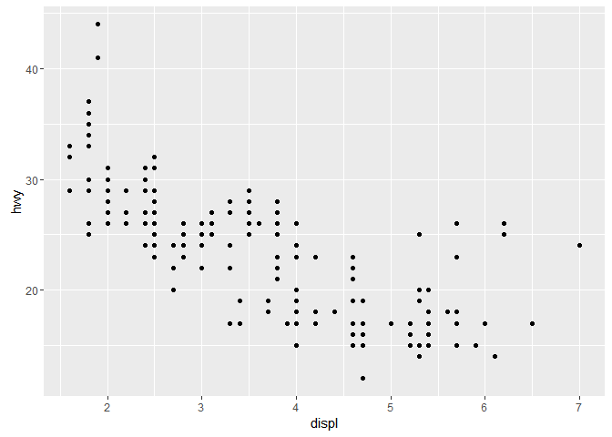

``` r
## Quick plots
qplot(displ, hwy, colour = class, data = mpg)
```

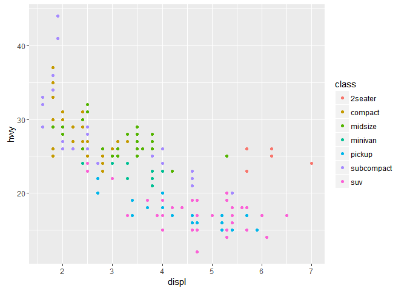

``` r
qplot(displ, hwy, data = mpg) +
  facet_grid(. ~ cyl)
```

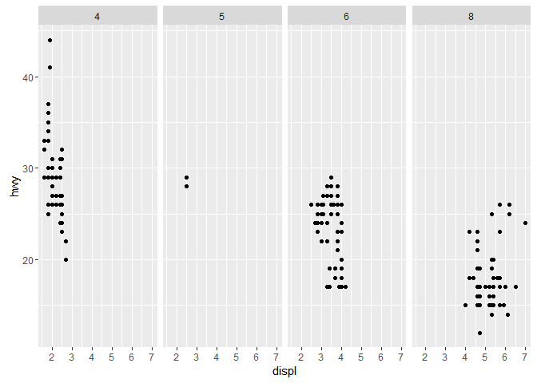

``` r
qplot(displ, hwy, data = mpg) +
  facet_grid(drv ~ .)
```

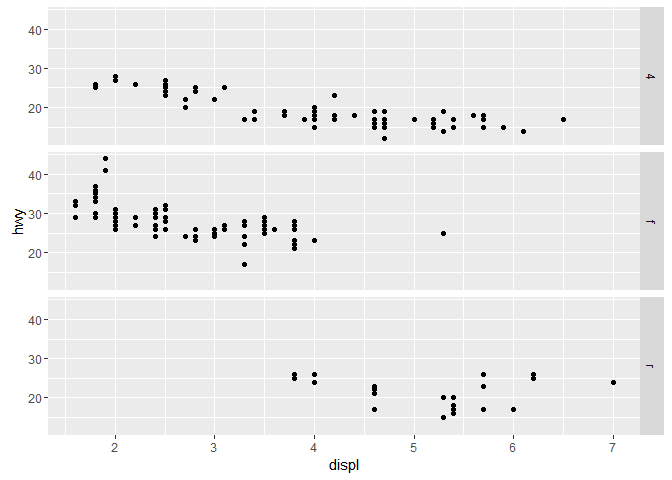

``` r
qplot(displ, hwy, data = mpg) +
  facet_grid(drv ~ cyl)
```

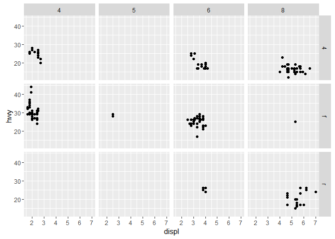

``` r
qplot(displ, hwy, data = mpg) +
  facet_wrap(~ class)
```

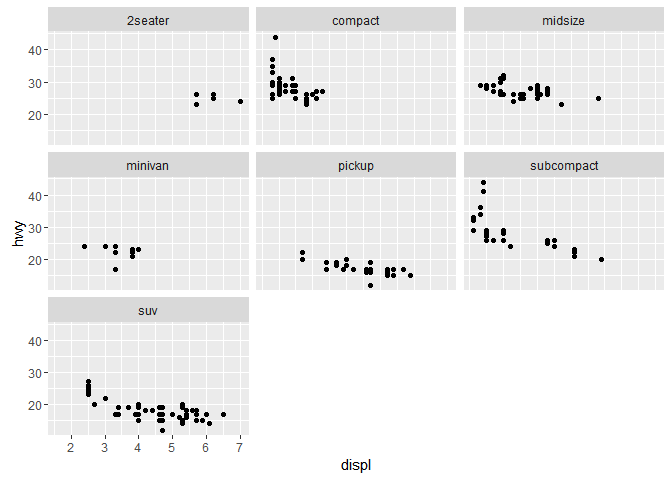

``` r
qplot(cty, hwy, data = mpg, geom = "jitter")
```

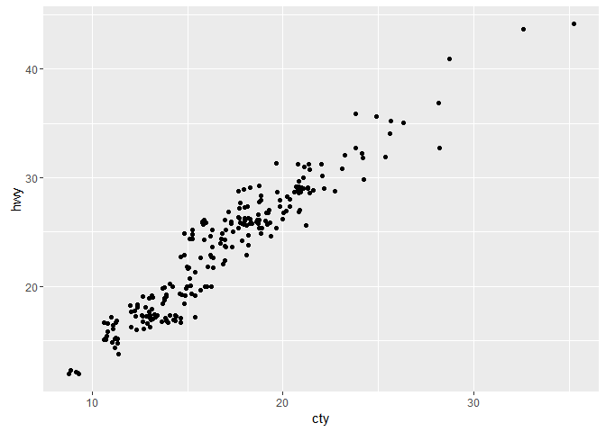

``` r
qplot(class, hwy, data = mpg)
```

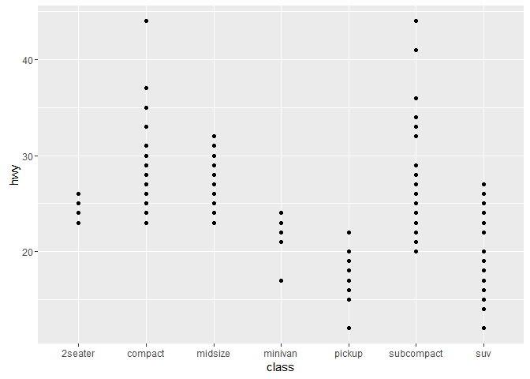

``` r
## Quick Plots - change plot order with reorder()
qplot(reorder(class, hwy), hwy, data = mpg)
```

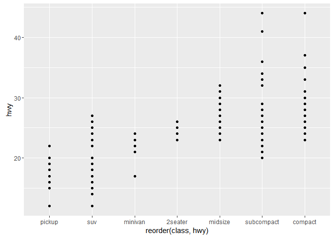

``` r
qplot(reorder(class, hwy), hwy, data = mpg, geom = "boxplot")
```

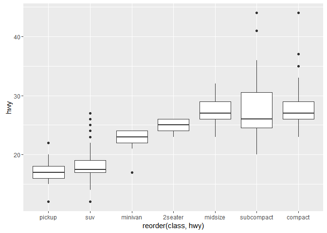

``` r
qplot(reorder(class, hwy, median), hwy, data = mpg, geom = "boxplot")
```

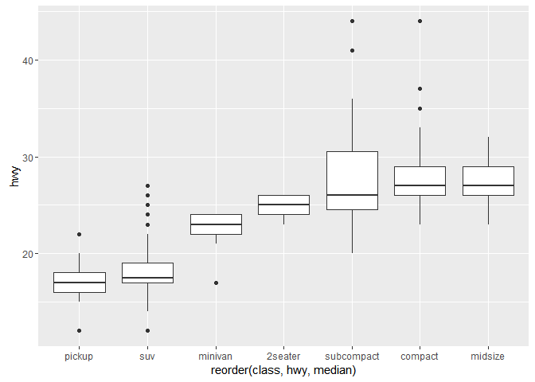

``` r
qplot(reorder(class, hwy, median), hwy, data = mpg, geom = c("boxplot", "jitter"))
```

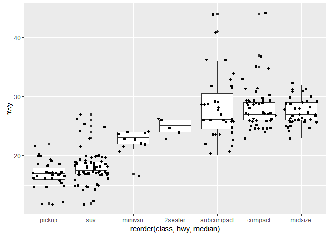
