Lecture 2 for Hadley Wickham's STAT 405 at Rice U.
================
Mark Blackmore
2017-09-19

``` r
library(ggplot2)

## Five ways to explore the data
?diamonds
head(diamonds)
```

    ##   carat       cut color clarity depth table price    x    y    z
    ## 1  0.23     Ideal     E     SI2  61.5    55   326 3.95 3.98 2.43
    ## 2  0.21   Premium     E     SI1  59.8    61   326 3.89 3.84 2.31
    ## 3  0.23      Good     E     VS1  56.9    65   327 4.05 4.07 2.31
    ## 4  0.29   Premium     I     VS2  62.4    58   334 4.20 4.23 2.63
    ## 5  0.31      Good     J     SI2  63.3    58   335 4.34 4.35 2.75
    ## 6  0.24 Very Good     J    VVS2  62.8    57   336 3.94 3.96 2.48

``` r
str(diamonds)
```

    ## Classes 'tbl_df', 'tbl' and 'data.frame':    53940 obs. of  10 variables:
    ##  $ carat  : num  0.23 0.21 0.23 0.29 0.31 0.24 0.24 0.26 0.22 0.23 ...
    ##  $ cut    : Ord.factor w/ 5 levels "Fair"<"Good"<..: 5 4 2 4 2 3 3 3 1 3 ...
    ##  $ color  : Ord.factor w/ 7 levels "D"<"E"<"F"<"G"<..: 2 2 2 6 7 7 6 5 2 5 ...
    ##  $ clarity: Ord.factor w/ 8 levels "I1"<"SI2"<"SI1"<..: 2 3 5 4 2 6 7 3 4 5 ...
    ##  $ depth  : num  61.5 59.8 56.9 62.4 63.3 62.8 62.3 61.9 65.1 59.4 ...
    ##  $ table  : num  55 61 65 58 58 57 57 55 61 61 ...
    ##  $ price  : int  326 326 327 334 335 336 336 337 337 338 ...
    ##  $ x      : num  3.95 3.89 4.05 4.2 4.34 3.94 3.95 4.07 3.87 4 ...
    ##  $ y      : num  3.98 3.84 4.07 4.23 4.35 3.96 3.98 4.11 3.78 4.05 ...
    ##  $ z      : num  2.43 2.31 2.31 2.63 2.75 2.48 2.47 2.53 2.49 2.39 ...

``` r
summary(diamonds)
```

    ##      carat               cut        color        clarity     
    ##  Min.   :0.2000   Fair     : 1610   D: 6775   SI1    :13065  
    ##  1st Qu.:0.4000   Good     : 4906   E: 9797   VS2    :12258  
    ##  Median :0.7000   Very Good:12082   F: 9542   SI2    : 9194  
    ##  Mean   :0.7979   Premium  :13791   G:11292   VS1    : 8171  
    ##  3rd Qu.:1.0400   Ideal    :21551   H: 8304   VVS2   : 5066  
    ##  Max.   :5.0100                     I: 5422   VVS1   : 3655  
    ##                                     J: 2808   (Other): 2531  
    ##      depth           table           price             x         
    ##  Min.   :43.00   Min.   :43.00   Min.   :  326   Min.   : 0.000  
    ##  1st Qu.:61.00   1st Qu.:56.00   1st Qu.:  950   1st Qu.: 4.710  
    ##  Median :61.80   Median :57.00   Median : 2401   Median : 5.700  
    ##  Mean   :61.75   Mean   :57.46   Mean   : 3933   Mean   : 5.731  
    ##  3rd Qu.:62.50   3rd Qu.:59.00   3rd Qu.: 5324   3rd Qu.: 6.540  
    ##  Max.   :79.00   Max.   :95.00   Max.   :18823   Max.   :10.740  
    ##                                                                  
    ##        y                z         
    ##  Min.   : 0.000   Min.   : 0.000  
    ##  1st Qu.: 4.720   1st Qu.: 2.910  
    ##  Median : 5.710   Median : 3.530  
    ##  Mean   : 5.735   Mean   : 3.539  
    ##  3rd Qu.: 6.540   3rd Qu.: 4.040  
    ##  Max.   :58.900   Max.   :31.800  
    ## 

``` r
qplot(reorder(cut, price, median), log(price), data = diamonds, geom = "boxplot")
```

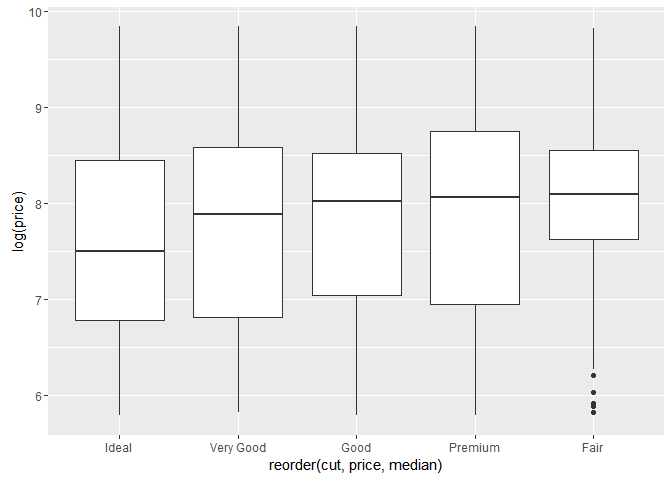

``` r
## Examine distributions 
### Categorical variable generates barplot 
qplot(cut, data = diamonds)
```

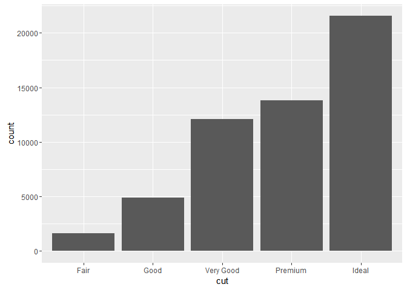

``` r
### Continuous variable generates histogram
qplot(carat, data = diamonds)
```

    ## `stat_bin()` using `bins = 30`. Pick better value with `binwidth`.

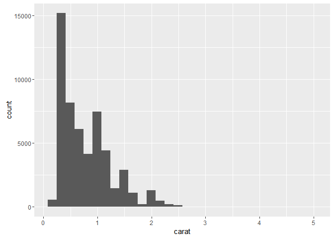

``` r
qplot(carat, data = diamonds, binwidth = 1)
```

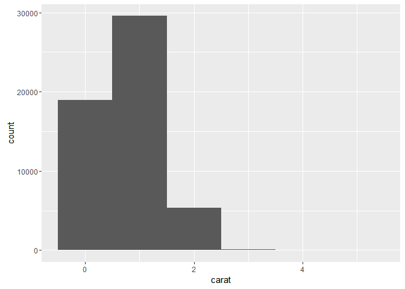

``` r
qplot(carat, data = diamonds, binwidth = 0.1)
```

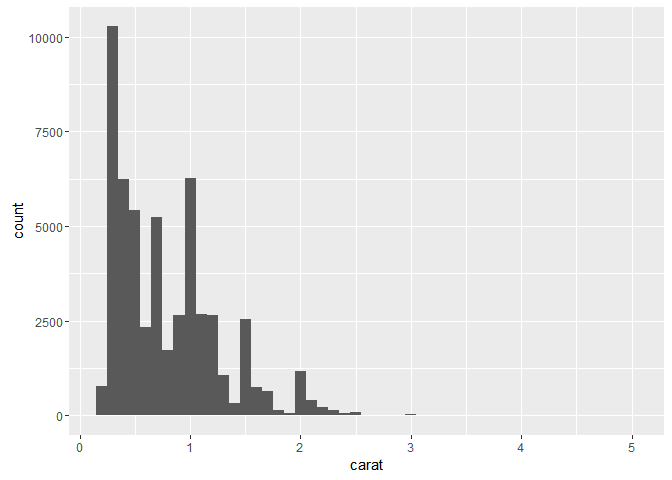

``` r
qplot(carat, data = diamonds, binwidth = 0.01)
```

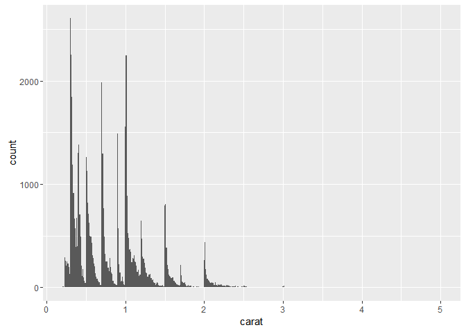

``` r
resolution(diamonds$carat)
```

    ## [1] 0.01

``` r
last_plot() + xlim(0, 3)
```

    ## Warning: Removed 32 rows containing non-finite values (stat_bin).

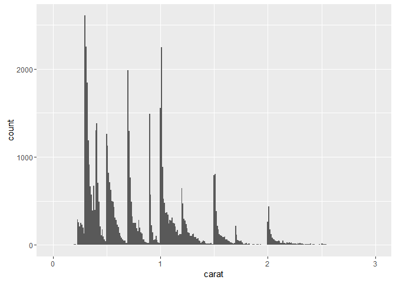

``` r
### Always play with binwidth
qplot(table, data = diamonds, binwidth = 1)
```

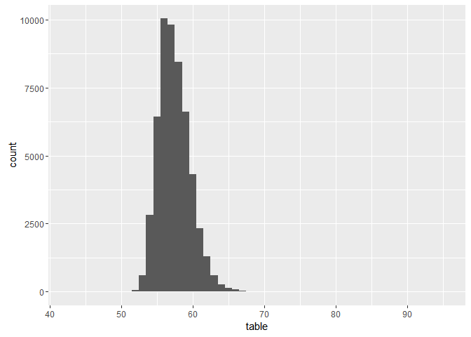

``` r
qplot(table, data = diamonds, binwidth = 1) +
  xlim(50, 70)
```

    ## Warning: Removed 12 rows containing non-finite values (stat_bin).

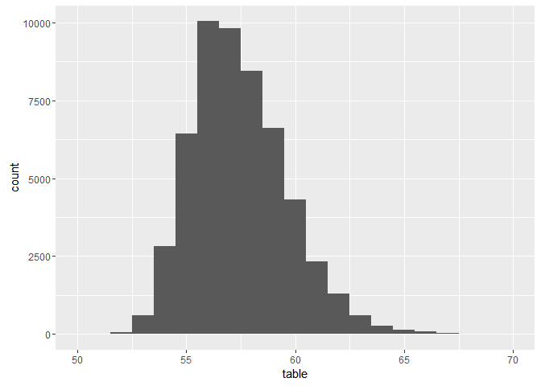

``` r
qplot(table, data = diamonds, binwidth = 0.1) +
  xlim(50, 70)
```

    ## Warning: Removed 12 rows containing non-finite values (stat_bin).

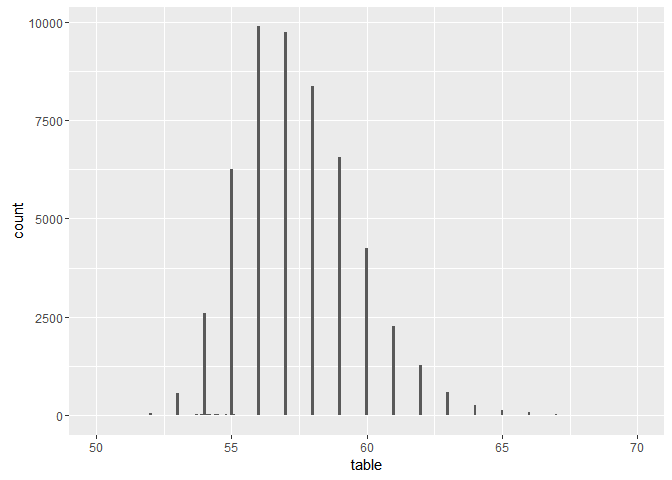

``` r
qplot(table, data = diamonds, binwidth = 0.1) +
  xlim(50, 70) + ylim(0, 50)
```

    ## Warning: Removed 12 rows containing non-finite values (stat_bin).

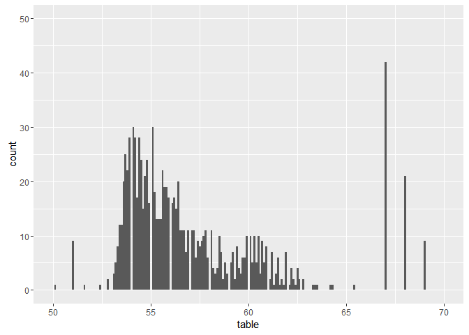

``` r
?coord_cartesian
d <- ggplot(diamonds, aes(carat, price)) +
  stat_bin2d(bins = 25, colour = "white")
d
```

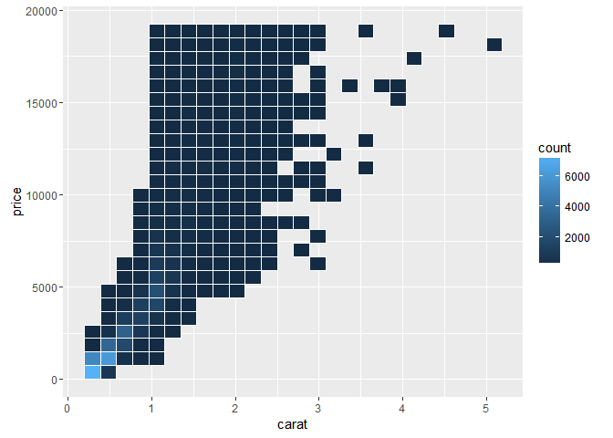

``` r
d + scale_x_continuous(limits = c(0, 1))
```

    ## Warning: Removed 17502 rows containing non-finite values (stat_bin2d).

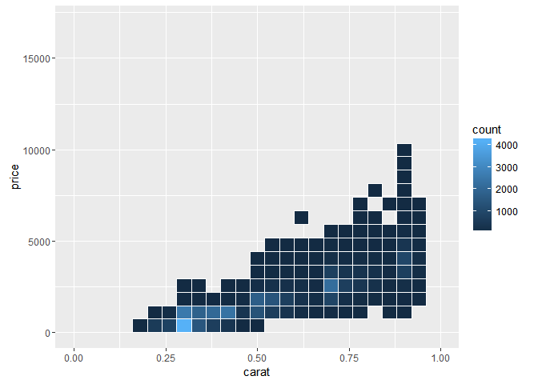

``` r
d + coord_cartesian(xlim = c(0, 1))
```

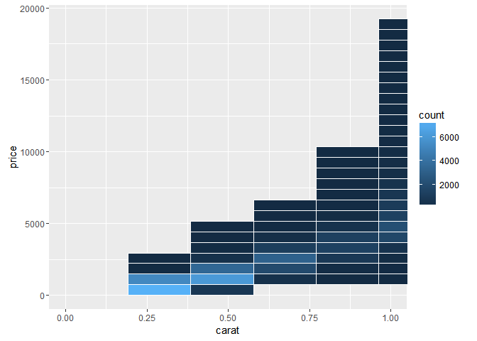

``` r
### Using Aesthetics
qplot(depth, data = diamonds, binwidth = 0.2)
```

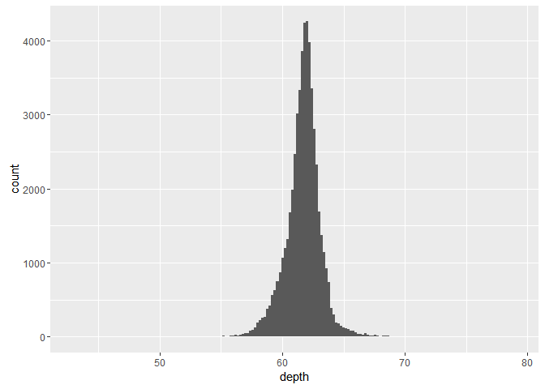

``` r
qplot(depth, data = diamonds, binwidth = 0.2,
      fill = cut) + xlim(55, 70)
```

    ## Warning: Removed 45 rows containing non-finite values (stat_bin).

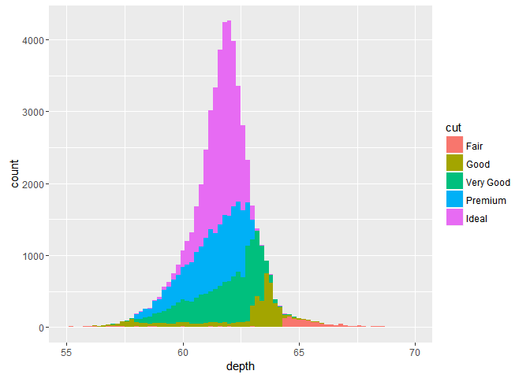

``` r
qplot(depth, data = diamonds, binwidth = 0.2) + 
  xlim(55, 70) + facet_wrap(~ cut)
```

    ## Warning: Removed 45 rows containing non-finite values (stat_bin).

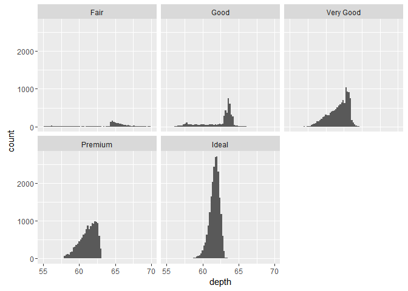

``` r
### Exercise: Expriment with binwidth and aesthetics
qplot(price, data = diamonds)
```

    ## `stat_bin()` using `bins = 30`. Pick better value with `binwidth`.

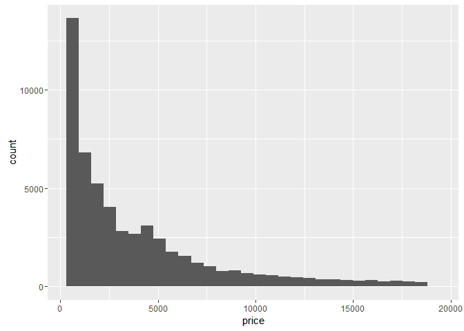

``` r
resolution(diamonds$price)
```

    ## [1] 1

``` r
qplot(price, data = diamonds, binwidth = 1)
```

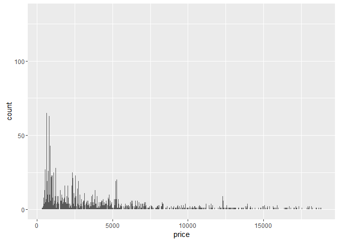

``` r
qplot(price, data = diamonds, binwidth = 10)
```

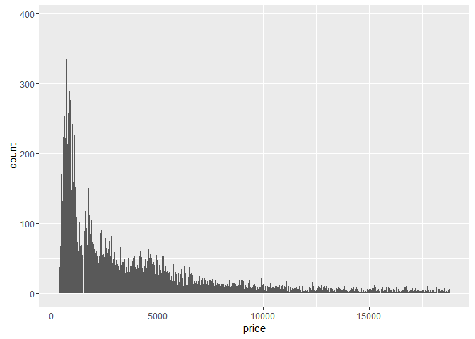

``` r
qplot(price, data = diamonds, binwidth = 100)
```

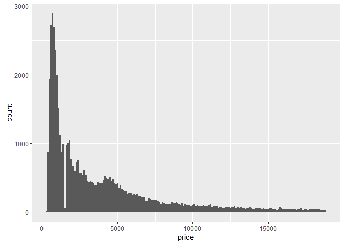

``` r
qplot(price, data = diamonds, binwidth = 1000)
```

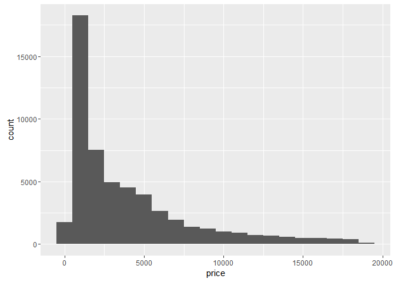

``` r
qplot(price, data = diamonds, binwidth = 100) + 
  coord_cartesian(xlim = c(0, 5000))
```

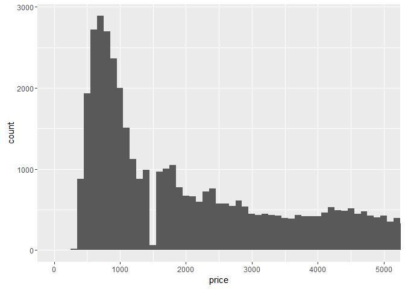

``` r
qplot(price, data = diamonds, binwidth = 500) + 
  scale_x_continuous(limits = c(0, 5000))
```

    ## Warning: Removed 14714 rows containing non-finite values (stat_bin).

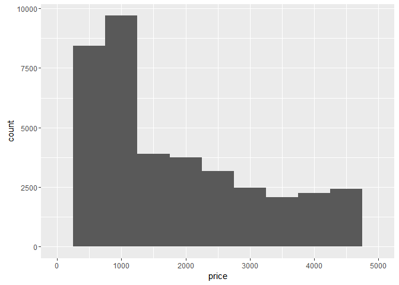

``` r
qplot(price, data = diamonds, binwidth = 500) + facet_wrap(~ color)
```

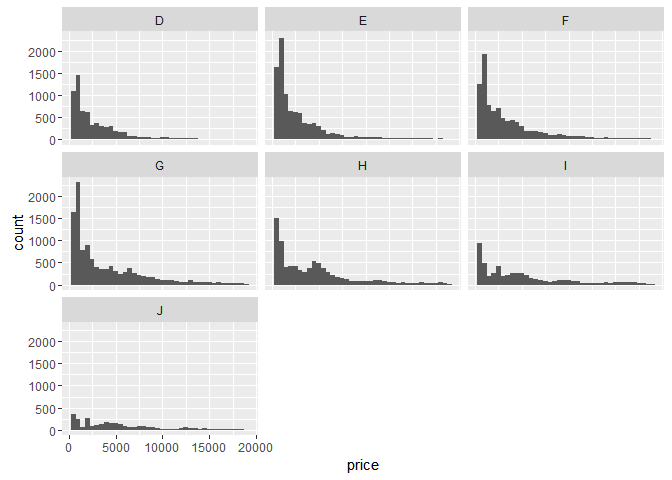

``` r
qplot(price, data = diamonds, binwidth = 100) + facet_wrap(~ cut)
```

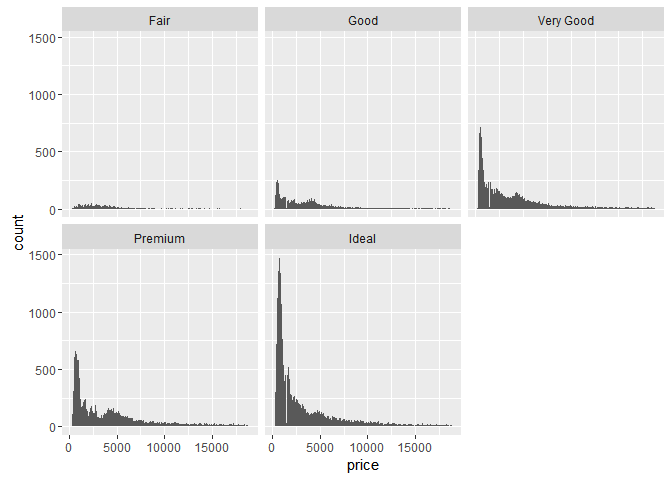

``` r
qplot(price, data = diamonds, binwidth = 100) + facet_wrap(~ clarity)
```

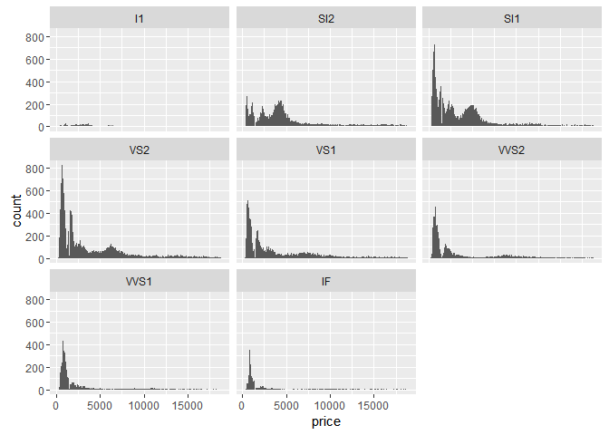

``` r
### Preferable to use density for comparions vs count
qplot(price, data = diamonds, binwidth = 500) + facet_wrap(~ cut)
```

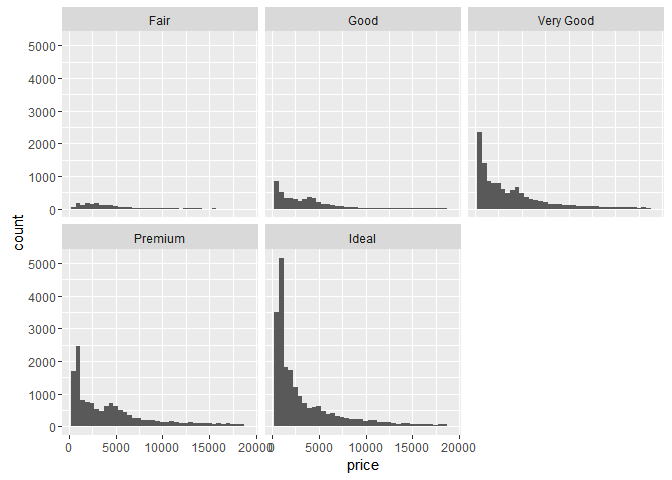

``` r
qplot(price, ..density.., data = diamonds, binwidth = 500,
      geom = "freqpoly", colour = cut)
```

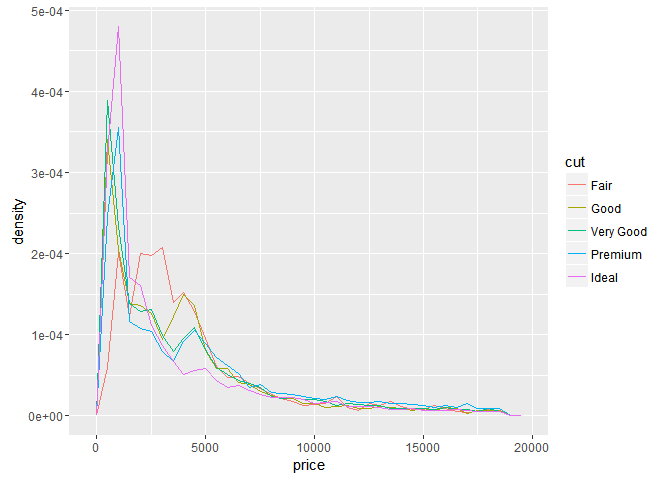

``` r
qplot(price, ..density.., data = diamonds, binwidth = 500,
      geom = "histogram") + facet_wrap(~ cut)
```

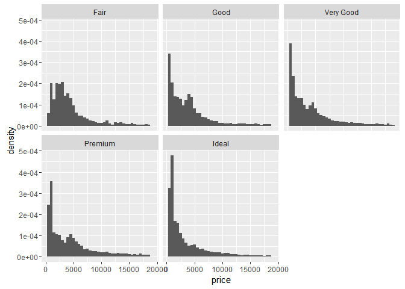
