03\_hadley\_stat405\_rice.R
================
Mark
Mon Sep 18 19:39:47 2017

``` r
# Lecture 3 for Hadley Wickham's STAT 405 at Rice University
library(ggplot2)
library(plyr)
summary(diamonds)
```

    ##      carat               cut        color        clarity     
    ##  Min.   :0.2000   Fair     : 1610   D: 6775   SI1    :13065  
    ##  1st Qu.:0.4000   Good     : 4906   E: 9797   VS2    :12258  
    ##  Median :0.7000   Very Good:12082   F: 9542   SI2    : 9194  
    ##  Mean   :0.7979   Premium  :13791   G:11292   VS1    : 8171  
    ##  3rd Qu.:1.0400   Ideal    :21551   H: 8304   VVS2   : 5066  
    ##  Max.   :5.0100                     I: 5422   VVS1   : 3655  
    ##                                     J: 2808   (Other): 2531  
    ##      depth           table           price             x         
    ##  Min.   :43.00   Min.   :43.00   Min.   :  326   Min.   : 0.000  
    ##  1st Qu.:61.00   1st Qu.:56.00   1st Qu.:  950   1st Qu.: 4.710  
    ##  Median :61.80   Median :57.00   Median : 2401   Median : 5.700  
    ##  Mean   :61.75   Mean   :57.46   Mean   : 3933   Mean   : 5.731  
    ##  3rd Qu.:62.50   3rd Qu.:59.00   3rd Qu.: 5324   3rd Qu.: 6.540  
    ##  Max.   :79.00   Max.   :95.00   Max.   :18823   Max.   :10.740  
    ##                                                                  
    ##        y                z         
    ##  Min.   : 0.000   Min.   : 0.000  
    ##  1st Qu.: 4.720   1st Qu.: 2.910  
    ##  Median : 5.710   Median : 3.530  
    ##  Mean   : 5.735   Mean   : 3.539  
    ##  3rd Qu.: 6.540   3rd Qu.: 4.040  
    ##  Max.   :58.900   Max.   :31.800  
    ## 

``` r
## Why are poorer cuts more expensive
qplot(price, ..density.., data = diamonds, binwidth = 500,
      geom = "freqpoly", colour = cut)
```

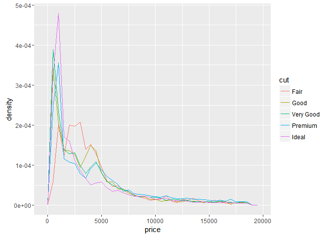

``` r
## What variable is most important for price
qplot(carat, price, data= diamonds, color = cut)
```

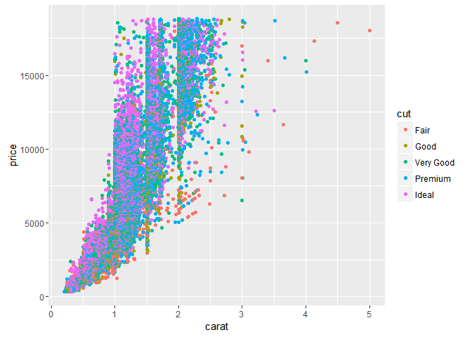

``` r
### Two ways to add a smoothed cinditional mean
qplot(carat, price, data= diamonds, color = cut, geom = c("point", "smooth"))
```

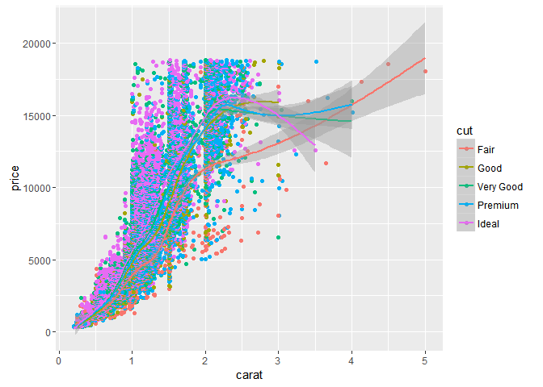

``` r
qplot(carat, price, data= diamonds, color = cut) + geom_smooth()
```


``` r
### To set aesthetics to a particular value, you need to wrap that value in I()
qplot(price, carat, data = diamonds, colour = "blue")
```

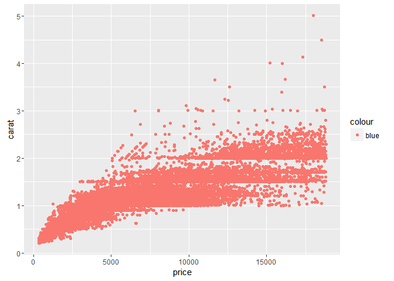

``` r
qplot(price, carat, data = diamonds, colour = I("blue"))
```

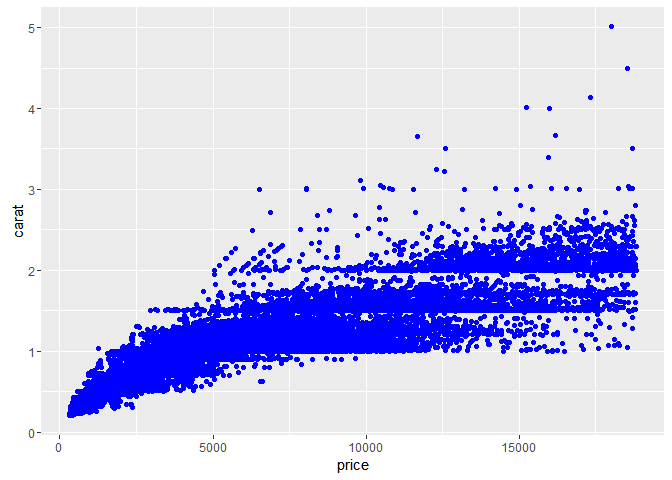

``` r
### Practical application: varying alpha
qplot(carat, price, data = diamonds, alpha = I(1/10))
```

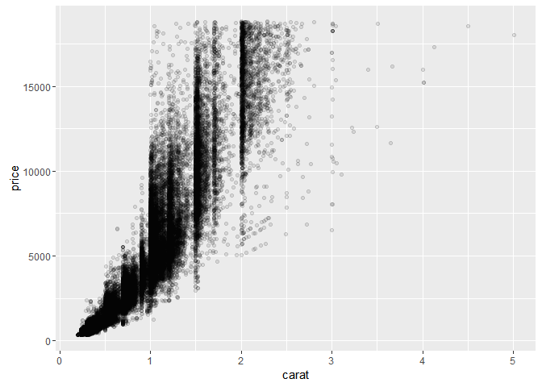

``` r
qplot(carat, price, data = diamonds, alpha = I(1/50))
```

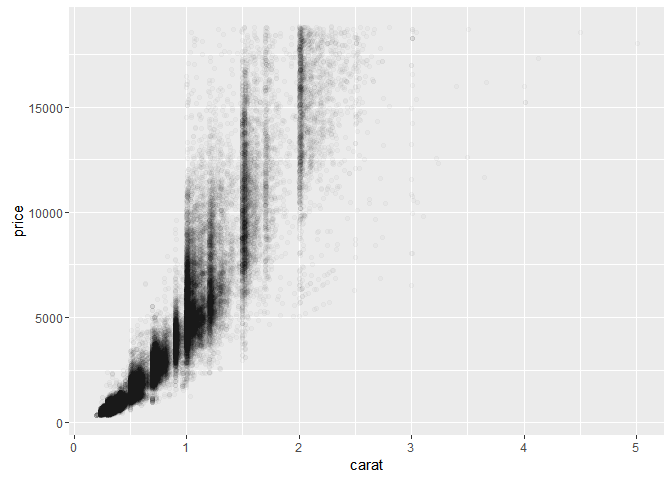

``` r
qplot(carat, price, data = diamonds, alpha = I(1/100))
```

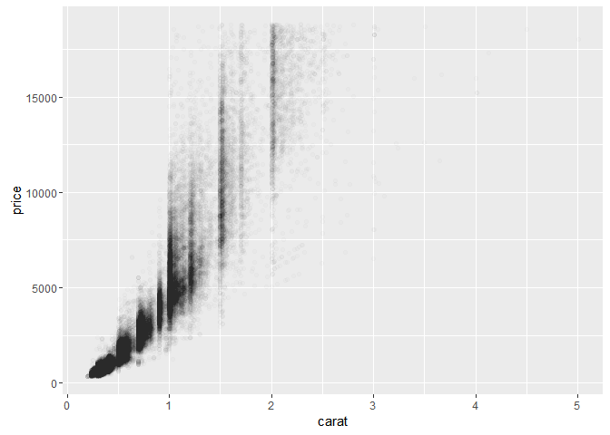

``` r
qplot(carat, price, data = diamonds, alpha = I(1/250))
```

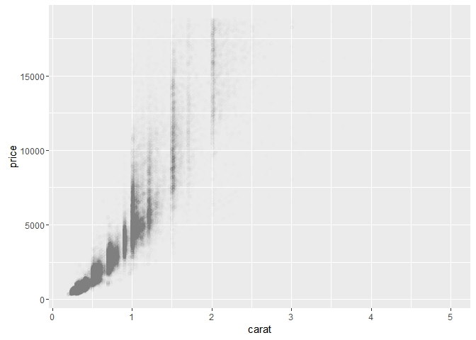

``` r
qplot(table, price, data = diamonds)
```

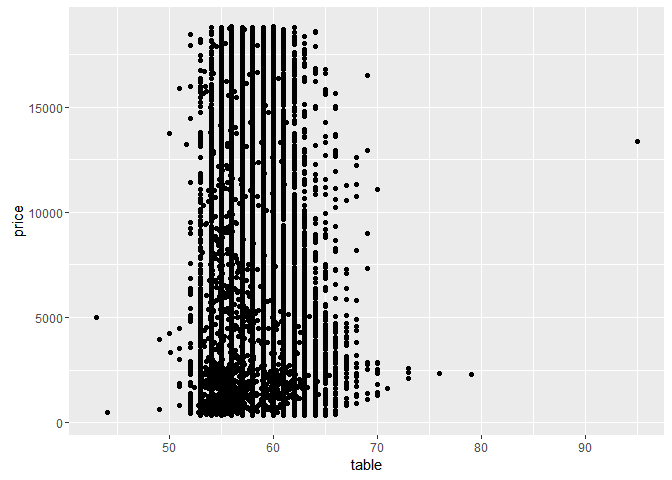

``` r
qplot(table, price, data = diamonds,
      geom = "boxplot")
```

    ## Warning: Continuous x aesthetic -- did you forget aes(group=...)?

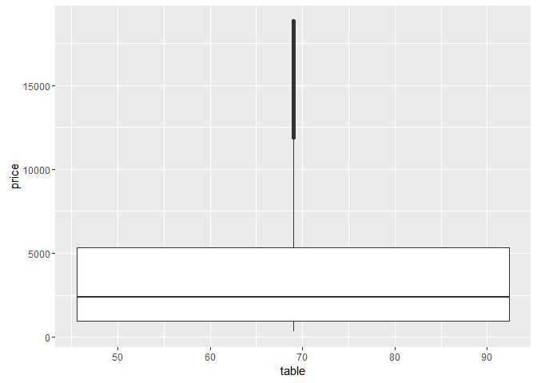

``` r
### Need to specify grouping variable: what determines which observations go into each boxplot
qplot(table, price, data = diamonds,
      geom = "boxplot", group = round_any(table, 1))
```

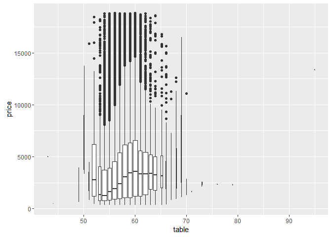

``` r
qplot(table, price, data = diamonds,
      geom = "boxplot", group = round_any(table, 1)) + xlim(50, 70)
```

    ## Warning: Removed 12 rows containing non-finite values (stat_boxplot).

    ## Warning: Removed 1 rows containing missing values (geom_segment).

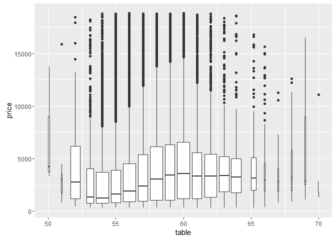

``` r
## Subsetting
x <- sample(1:10)
y <- setNames(x, letters[1:10])

### Subsetting: How
x[1:4]
```

    ## [1]  3  2  5 10

``` r
x[x == 5]
```

    ## [1] 5

``` r
y[order(y)]
```

    ##  h  b  a  i  c  f  e  j  g  d 
    ##  1  2  3  4  5  6  7  8  9 10

``` r
x[]
```

    ##  [1]  3  2  5 10  7  6  9  1  4  8

``` r
x[-1]
```

    ## [1]  2  5 10  7  6  9  1  4  8

``` r
y["a"]
```

    ## a 
    ## 3

``` r
x[x]
```

    ##  [1]  5  2  7  8  9  6  4  3 10  1

``` r
x[x > 2 & x < 9]
```

    ## [1] 3 5 7 6 4 8

``` r
x[sample(10)]
```

    ##  [1]  1  2  3  9 10  4  7  8  6  5

``` r
x[order(x)]
```

    ##  [1]  1  2  3  4  5  6  7  8  9 10

``` r
x[-(1:5)]
```

    ## [1] 6 9 1 4 8

``` r
x["a"]
```

    ## [1] NA

``` r
y[letters[10:1]]
```

    ##  j  i  h  g  f  e  d  c  b  a 
    ##  8  4  1  9  6  7 10  5  2  3

``` r
x[x < 2 | x >= 8]
```

    ## [1] 10  9  1  8

``` r
# x[-1:5]
x[0]
```

    ## integer(0)

``` r
### Everything
str(diamonds[, ])
```

    ## Classes 'tbl_df', 'tbl' and 'data.frame':    53940 obs. of  10 variables:
    ##  $ carat  : num  0.23 0.21 0.23 0.29 0.31 0.24 0.24 0.26 0.22 0.23 ...
    ##  $ cut    : Ord.factor w/ 5 levels "Fair"<"Good"<..: 5 4 2 4 2 3 3 3 1 3 ...
    ##  $ color  : Ord.factor w/ 7 levels "D"<"E"<"F"<"G"<..: 2 2 2 6 7 7 6 5 2 5 ...
    ##  $ clarity: Ord.factor w/ 8 levels "I1"<"SI2"<"SI1"<..: 2 3 5 4 2 6 7 3 4 5 ...
    ##  $ depth  : num  61.5 59.8 56.9 62.4 63.3 62.8 62.3 61.9 65.1 59.4 ...
    ##  $ table  : num  55 61 65 58 58 57 57 55 61 61 ...
    ##  $ price  : int  326 326 327 334 335 336 336 337 337 338 ...
    ##  $ x      : num  3.95 3.89 4.05 4.2 4.34 3.94 3.95 4.07 3.87 4 ...
    ##  $ y      : num  3.98 3.84 4.07 4.23 4.35 3.96 3.98 4.11 3.78 4.05 ...
    ##  $ z      : num  2.43 2.31 2.31 2.63 2.75 2.48 2.47 2.53 2.49 2.39 ...

``` r
### Positive integers & nothing
diamonds[1:6, ] # same as head(diamonds)
```

    ##   carat       cut color clarity depth table price    x    y    z
    ## 1  0.23     Ideal     E     SI2  61.5    55   326 3.95 3.98 2.43
    ## 2  0.21   Premium     E     SI1  59.8    61   326 3.89 3.84 2.31
    ## 3  0.23      Good     E     VS1  56.9    65   327 4.05 4.07 2.31
    ## 4  0.29   Premium     I     VS2  62.4    58   334 4.20 4.23 2.63
    ## 5  0.31      Good     J     SI2  63.3    58   335 4.34 4.35 2.75
    ## 6  0.24 Very Good     J    VVS2  62.8    57   336 3.94 3.96 2.48

``` r
diamonds[, 1:4] # watch out!
```

    ##       carat       cut color clarity
    ## 1      0.23     Ideal     E     SI2
    ## 2      0.21   Premium     E     SI1
    ## 3      0.23      Good     E     VS1
    ## 4      0.29   Premium     I     VS2
    ## 5      0.31      Good     J     SI2
    ## 6      0.24 Very Good     J    VVS2
    ## 7      0.24 Very Good     I    VVS1
    ## 8      0.26 Very Good     H     SI1
    ## 9      0.22      Fair     E     VS2
    ## 10     0.23 Very Good     H     VS1
    ## 11     0.30      Good     J     SI1
    ## 12     0.23     Ideal     J     VS1
    ## 13     0.22   Premium     F     SI1
    ## 14     0.31     Ideal     J     SI2
    ## 15     0.20   Premium     E     SI2
    ## 16     0.32   Premium     E      I1
    ## 17     0.30     Ideal     I     SI2
    ## 18     0.30      Good     J     SI1
    ## 19     0.30      Good     J     SI1
    ## 20     0.30 Very Good     J     SI1
    ## 21     0.30      Good     I     SI2
    ## 22     0.23 Very Good     E     VS2
    ## 23     0.23 Very Good     H     VS1
    ## 24     0.31 Very Good     J     SI1
    ## 25     0.31 Very Good     J     SI1
    ## 26     0.23 Very Good     G    VVS2
    ## 27     0.24   Premium     I     VS1
    ## 28     0.30 Very Good     J     VS2
    ## 29     0.23 Very Good     D     VS2
    ## 30     0.23 Very Good     F     VS1
    ## 31     0.23 Very Good     F     VS1
    ## 32     0.23 Very Good     F     VS1
    ## 33     0.23 Very Good     E     VS1
    ## 34     0.23 Very Good     E     VS1
    ## 35     0.23 Very Good     D     VS1
    ## 36     0.23      Good     F     VS1
    ## 37     0.23      Good     E     VS1
    ## 38     0.31      Good     H     SI1
    ## 39     0.26 Very Good     D     VS2
    ## 40     0.33     Ideal     I     SI2
    ## 41     0.33     Ideal     I     SI2
    ## 42     0.33     Ideal     J     SI1
    ## 43     0.26      Good     D     VS2
    ## 44     0.26      Good     D     VS1
    ## 45     0.32      Good     H     SI2
    ## 46     0.29   Premium     F     SI1
    ## 47     0.32 Very Good     H     SI2
    ## 48     0.32      Good     H     SI2
    ## 49     0.25 Very Good     E     VS2
    ## 50     0.29 Very Good     H     SI2
    ## 51     0.24 Very Good     F     SI1
    ## 52     0.23     Ideal     G     VS1
    ## 53     0.32     Ideal     I     SI1
    ## 54     0.22   Premium     E     VS2
    ## 55     0.22   Premium     D     VS2
    ## 56     0.30     Ideal     I     SI2
    ## 57     0.30   Premium     J     SI2
    ## 58     0.30 Very Good     I     SI1
    ## 59     0.30 Very Good     I     SI1
    ## 60     0.30      Good     I     SI1
    ## 61     0.35     Ideal     I     VS1
    ## 62     0.30   Premium     D     SI1
    ## 63     0.30     Ideal     D     SI1
    ## 64     0.30     Ideal     D     SI1
    ## 65     0.42   Premium     I     SI2
    ## 66     0.28     Ideal     G    VVS2
    ## 67     0.32     Ideal     I    VVS1
    ## 68     0.31 Very Good     G     SI1
    ## 69     0.31   Premium     G     SI1
    ## 70     0.24   Premium     E    VVS1
    ## 71     0.24 Very Good     D    VVS1
    ## 72     0.30 Very Good     H     SI1
    ## 73     0.30   Premium     H     SI1
    ## 74     0.30   Premium     H     SI1
    ## 75     0.30      Good     H     SI1
    ## 76     0.26 Very Good     F    VVS2
    ## 77     0.26 Very Good     E    VVS2
    ## 78     0.26 Very Good     D    VVS2
    ## 79     0.26 Very Good     D    VVS2
    ## 80     0.26 Very Good     E    VVS1
    ## 81     0.26 Very Good     E    VVS1
    ## 82     0.26 Very Good     D    VVS1
    ## 83     0.26     Ideal     E    VVS2
    ## 84     0.38     Ideal     I     SI2
    ## 85     0.26      Good     E    VVS1
    ## 86     0.24   Premium     G    VVS1
    ## 87     0.24   Premium     H    VVS1
    ## 88     0.24   Premium     H    VVS1
    ## 89     0.24   Premium     H    VVS2
    ## 90     0.32   Premium     I     SI1
    ## 91     0.70     Ideal     E     SI1
    ## 92     0.86      Fair     E     SI2
    ## 93     0.70     Ideal     G     VS2
    ## 94     0.71 Very Good     E     VS2
    ## 95     0.78 Very Good     G     SI2
    ## 96     0.70      Good     E     VS2
    ## 97     0.70      Good     F     VS1
    ## 98     0.96      Fair     F     SI2
    ## 99     0.73 Very Good     E     SI1
    ## 100    0.80   Premium     H     SI1
    ## 101    0.75 Very Good     D     SI1
    ## 102    0.75   Premium     E     SI1
    ## 103    0.74     Ideal     G     SI1
    ## 104    0.75   Premium     G     VS2
    ## 105    0.80     Ideal     I     VS1
    ## 106    0.75     Ideal     G     SI1
    ## 107    0.80   Premium     G     SI1
    ## 108    0.74     Ideal     I    VVS2
    ## 109    0.81     Ideal     F     SI2
    ## 110    0.59     Ideal     E    VVS2
    ## 111    0.80     Ideal     F     SI2
    ## 112    0.74     Ideal     E     SI2
    ## 113    0.90   Premium     I     VS2
    ## 114    0.74 Very Good     G     SI1
    ## 115    0.73     Ideal     F     VS2
    ## 116    0.73     Ideal     F     VS2
    ## 117    0.80   Premium     F     SI2
    ## 118    0.71     Ideal     G     VS2
    ## 119    0.70     Ideal     E     VS2
    ## 120    0.80     Ideal     F     SI2
    ## 121    0.71     Ideal     D     SI2
    ## 122    0.74     Ideal     E     SI1
    ## 123    0.70 Very Good     F     VS2
    ## 124    0.70      Fair     F     VS2
    ## 125    0.70      Fair     F     VS2
    ## 126    0.70   Premium     F     VS2
    ## 127    0.91   Premium     H     SI1
    ## 128    0.61 Very Good     D    VVS2
    ## 129    0.91      Fair     H     SI2
    ## 130    0.91      Fair     H     SI2
    ## 131    0.77     Ideal     H     VS2
    ## 132    0.71 Very Good     D     SI1
    ## 133    0.71     Ideal     D     SI1
    ## 134    0.70 Very Good     E     VS2
    ## 135    0.77 Very Good     H     VS1
    ## 136    0.63   Premium     E    VVS1
    ## 137    0.71 Very Good     F     VS1
    ## 138    0.71   Premium     F     VS1
    ## 139    0.76     Ideal     H     SI1
    ## 140    0.64     Ideal     G    VVS1
    ## 141    0.71   Premium     G     VS2
    ## 142    0.71   Premium     G     VS2
    ## 143    0.70 Very Good     D     VS2
    ## 144    0.70 Very Good     F     VS1
    ## 145    0.71     Ideal     D     SI2
    ## 146    0.70      Good     H    VVS2
    ## 147    0.71 Very Good     G     VS1
    ## 148    0.73 Very Good     D     SI1
    ## 149    0.70 Very Good     D     SI1
    ## 150    0.70     Ideal     E     SI1
    ## 151    0.71   Premium     D     SI2
    ## 152    0.74     Ideal     I     SI1
    ## 153    0.71   Premium     D     VS2
    ## 154    0.73   Premium     G     VS2
    ## 155    0.76 Very Good     F     SI1
    ## 156    0.76     Ideal     D     SI2
    ## 157    0.71     Ideal     F     SI1
    ## 158    0.73   Premium     G     VS2
    ## 159    0.73   Premium     G     VS1
    ## 160    0.73     Ideal     D     SI2
    ## 161    0.73   Premium     G     VS2
    ## 162    0.72 Very Good     H    VVS2
    ## 163    0.73 Very Good     F     SI1
    ## 164    0.71     Ideal     G     VS2
    ## 165    0.79     Ideal     F     SI2
    ## 166    0.73 Very Good     H    VVS1
    ## 167    0.80 Very Good     F     SI2
    ## 168    0.58     Ideal     G    VVS1
    ## 169    0.58     Ideal     F    VVS1
    ## 170    0.71      Good     E     VS2
    ## 171    0.75     Ideal     D     SI2
    ## 172    0.70   Premium     D     VS2
    ## 173    1.17 Very Good     J      I1
    ## 174    0.60     Ideal     E     VS1
    ## 175    0.70     Ideal     E     SI1
    ## 176    0.83      Good     I     VS2
    ## 177    0.74 Very Good     F     VS2
    ## 178    0.72 Very Good     G     VS2
    ## 179    0.71   Premium     E     VS2
    ## 180    0.71     Ideal     E     VS2
    ## 181    0.54     Ideal     E    VVS2
    ## 182    0.54     Ideal     E    VVS2
    ## 183    0.72     Ideal     G     SI1
    ## 184    0.72     Ideal     G     SI1
    ## 185    0.72      Good     G     VS2
    ## 186    0.71     Ideal     G     SI1
    ## 187    0.70 Very Good     D     VS1
    ## 188    0.71   Premium     F     VS2
    ## 189    0.71 Very Good     F     VS2
    ## 190    0.71      Good     F     VS2
    ## 191    0.71      Good     F     VS2
    ## 192    0.70     Ideal     E     VS2
    ## 193    0.70   Premium     E     VS2
    ## 194    0.70   Premium     E     SI1
    ## 195    0.70   Premium     E     SI1
    ## 196    0.70   Premium     E     SI1
    ## 197    0.70   Premium     E     SI1
    ## 198    0.70   Premium     E     SI1
    ## 199    0.70     Ideal     E     SI1
    ## 200    0.72   Premium     F     SI1
    ## 201    0.70 Very Good     E     SI1
    ## 202    0.70   Premium     E     SI1
    ## 203    0.70   Premium     E     SI1
    ## 204    0.70      Good     E     VS2
    ## 205    0.98      Fair     H     SI2
    ## 206    0.78   Premium     F     SI1
    ## 207    0.70 Very Good     E     SI1
    ## 208    0.52     Ideal     F    VVS1
    ## 209    0.73 Very Good     H     VS2
    ## 210    0.74     Ideal     E     SI1
    ## 211    0.70 Very Good     F     VS2
    ## 212    0.77   Premium     G     VS2
    ## 213    0.71     Ideal     F     VS2
    ## 214    0.74     Ideal     G     VS1
    ## 215    0.70     Ideal     G     VS1
    ## 216    1.01   Premium     F      I1
    ## 217    0.77     Ideal     H     SI1
    ## 218    0.78     Ideal     H     SI1
    ## 219    0.72 Very Good     H     VS1
    ## 220    0.53 Very Good     D    VVS2
    ## 221    0.76     Ideal     G     VS2
    ## 222    0.70      Good     E     VS1
    ## 223    0.70   Premium     E     VS1
    ## 224    0.75 Very Good     D     SI2
    ## 225    0.72     Ideal     D     SI1
    ## 226    0.72   Premium     D     SI1
    ## 227    0.70   Premium     D     SI1
    ## 228    0.84      Fair     G     SI1
    ## 229    0.75   Premium     F     SI1
    ## 230    0.52     Ideal     F      IF
    ## 231    0.72 Very Good     F     VS2
    ## 232    0.79 Very Good     H     VS1
    ## 233    0.72 Very Good     F     VS2
    ## 234    0.51     Ideal     F    VVS1
    ## 235    0.64     Ideal     D     VS1
    ## 236    0.70 Very Good     H    VVS1
    ## 237    0.83 Very Good     I     VS1
    ## 238    0.76     Ideal     I    VVS2
    ## 239    0.71      Good     D     VS2
    ## 240    0.77      Good     G     VS1
    ## 241    0.71     Ideal     F     SI1
    ## 242    1.01      Fair     E      I1
    ## 243    1.01   Premium     H     SI2
    ## 244    0.77      Good     F     SI1
    ## 245    0.76      Good     E     SI1
    ## 246    0.76   Premium     E     SI1
    ## 247    0.76   Premium     E     SI1
    ## 248    1.05 Very Good     J     SI2
    ## 249    0.81     Ideal     G     SI2
    ## 250    0.70     Ideal     E     SI1
    ##  [ reached getOption("max.print") -- omitted 53690 rows ]

``` r
### Two positive integers in rows & columns
diamonds[1:10, 1:4]
```

    ##    carat       cut color clarity
    ## 1   0.23     Ideal     E     SI2
    ## 2   0.21   Premium     E     SI1
    ## 3   0.23      Good     E     VS1
    ## 4   0.29   Premium     I     VS2
    ## 5   0.31      Good     J     SI2
    ## 6   0.24 Very Good     J    VVS2
    ## 7   0.24 Very Good     I    VVS1
    ## 8   0.26 Very Good     H     SI1
    ## 9   0.22      Fair     E     VS2
    ## 10  0.23 Very Good     H     VS1

``` r
### Repeating input repeats output
diamonds[c(1,1,1,2,2), 1:4]
```

    ##     carat     cut color clarity
    ## 1    0.23   Ideal     E     SI2
    ## 1.1  0.23   Ideal     E     SI2
    ## 1.2  0.23   Ideal     E     SI2
    ## 2    0.21 Premium     E     SI1
    ## 2.1  0.21 Premium     E     SI1

``` r
### Negative integers drop values
diamonds[-(1:53900), -1]
```

    ##             cut color clarity depth table price    x    y    z
    ## 53901     Ideal     H     VS2  62.5    58  2752 5.71 5.75 3.58
    ## 53902   Premium     E     VS1  61.6    58  2753 5.36 5.33 3.29
    ## 53903 Very Good     E     SI2  59.9    61  2753 5.98 6.01 3.59
    ## 53904 Very Good     E     SI1  62.9    57  2753 5.79 5.84 3.66
    ## 53905   Premium     E     SI1  61.3    58  2753 5.68 5.71 3.49
    ## 53906   Premium     E     SI1  60.0    59  2753 5.75 5.79 3.46
    ## 53907 Very Good     E     SI1  63.0    55  2753 5.76 5.79 3.64
    ## 53908 Very Good     E     SI1  61.0    57  2753 5.68 5.73 3.48
    ## 53909 Very Good     E     SI1  61.2    57  2753 5.68 5.73 3.49
    ## 53910 Very Good     E     SI1  62.7    59  2753 5.63 5.67 3.54
    ## 53911   Premium     E     SI1  60.5    58  2753 5.74 5.77 3.48
    ## 53912   Premium     E      IF  59.8    60  2753 5.43 5.38 3.23
    ## 53913   Premium     F    VVS1  61.8    59  2753 5.48 5.40 3.36
    ## 53914      Good     G     VS2  64.2    58  2753 5.84 5.81 3.74
    ## 53915      Good     I     VS1  63.7    59  2753 5.94 5.90 3.77
    ## 53916     Ideal     E     SI2  62.1    56  2753 5.84 5.86 3.63
    ## 53917      Good     D     SI1  63.1    59  2753 5.71 5.74 3.61
    ## 53918 Very Good     J     SI1  63.2    60  2753 6.12 6.09 3.86
    ## 53919   Premium     I     VS1  59.3    62  2753 5.93 5.85 3.49
    ## 53920     Ideal     I    VVS1  62.2    55  2753 5.89 5.87 3.66
    ## 53921 Very Good     E     VS2  62.4    60  2755 5.57 5.61 3.49
    ## 53922 Very Good     E     VS2  62.8    60  2755 5.59 5.65 3.53
    ## 53923 Very Good     D     VS1  63.1    59  2755 5.67 5.58 3.55
    ## 53924     Ideal     I     VS2  61.3    56  2756 5.80 5.84 3.57
    ## 53925     Ideal     I     VS2  61.6    55  2756 5.82 5.84 3.59
    ## 53926     Ideal     I     SI1  61.6    56  2756 5.95 5.97 3.67
    ## 53927     Ideal     E     SI1  61.9    56  2756 5.71 5.73 3.54
    ## 53928      Good     F     SI1  58.1    59  2756 6.06 6.13 3.54
    ## 53929   Premium     E     SI2  61.4    58  2756 6.03 5.96 3.68
    ## 53930     Ideal     G     VS1  61.4    56  2756 5.76 5.73 3.53
    ## 53931   Premium     E     SI1  60.5    55  2756 5.79 5.74 3.49
    ## 53932   Premium     F     SI1  59.8    62  2756 5.74 5.73 3.43
    ## 53933 Very Good     E     VS2  60.5    59  2757 5.71 5.76 3.47
    ## 53934 Very Good     E     VS2  61.2    59  2757 5.69 5.72 3.49
    ## 53935   Premium     D     SI1  62.7    59  2757 5.69 5.73 3.58
    ## 53936     Ideal     D     SI1  60.8    57  2757 5.75 5.76 3.50
    ## 53937      Good     D     SI1  63.1    55  2757 5.69 5.75 3.61
    ## 53938 Very Good     D     SI1  62.8    60  2757 5.66 5.68 3.56
    ## 53939   Premium     H     SI2  61.0    58  2757 6.15 6.12 3.74
    ## 53940     Ideal     D     SI2  62.2    55  2757 5.83 5.87 3.64

``` r
### Using logicals
x_big <- diamonds$x > 10
head(x_big)
```

    ## [1] FALSE FALSE FALSE FALSE FALSE FALSE

``` r
sum(x_big)
```

    ## [1] 5

``` r
mean(x_big)
```

    ## [1] 9.269559e-05

``` r
table(x_big)
```

    ## x_big
    ## FALSE  TRUE 
    ## 53935     5

``` r
diamonds$x[x_big]
```

    ## [1] 10.14 10.02 10.01 10.74 10.23

``` r
diamonds[x_big, ]
```

    ##       carat       cut color clarity depth table price     x     y    z
    ## 25999  4.01   Premium     I      I1  61.0    61 15223 10.14 10.10 6.17
    ## 26000  4.01   Premium     J      I1  62.5    62 15223 10.02  9.94 6.24
    ## 26445  4.00 Very Good     I      I1  63.3    58 15984 10.01  9.94 6.31
    ## 27416  5.01      Fair     J      I1  65.5    59 18018 10.74 10.54 6.98
    ## 27631  4.50      Fair     J      I1  65.8    58 18531 10.23 10.16 6.72

``` r
small <- diamonds[diamonds$carat < 1, ]
lowqual <- diamonds[diamonds$clarity %in% c("I1", "SI2", "SI1"), ]
small <- diamonds$carat < 1 &
  diamonds$price > 500

### Exercise
logical_answer <- diamonds$x == diamonds$y & diamonds$depth > 55 & 
  diamonds$depth < 70 & diamonds$carat < mean(diamonds$carat) & 
  diamonds$cut %in% c("Good", "Very Good", "Premium", "Ideal")
diamonds[logical_answer,]
```

    ##       carat       cut color clarity depth table price    x    y    z
    ## 3398   0.30     Ideal     H    VVS2  62.5    54   567 4.30 4.30 2.70
    ## 10056  0.27 Very Good     F    VVS1  62.0    55   591 4.16 4.16 2.59
    ## 34303  0.32     Ideal     D    VVS2  62.1    54   858 4.40 4.40 2.74
    ## 40017  0.42     Ideal     H    VVS1  62.8    57  1108 4.79 4.79 3.01
    ## 41856  0.61   Premium     G     SI1  60.8    60  1255 5.42 5.42 3.31
    ## 42128  0.48     Ideal     F     VS2  62.4    54  1279 5.03 5.03 3.15
    ## 43491  0.51   Premium     F     SI1  61.4    59  1421 5.13 5.13 3.16
    ## 49557  0.71      Good     F     SI2  64.1    60  2130 0.00 0.00 0.00
    ## 49558  0.71      Good     F     SI2  64.1    60  2130 0.00 0.00 0.00
