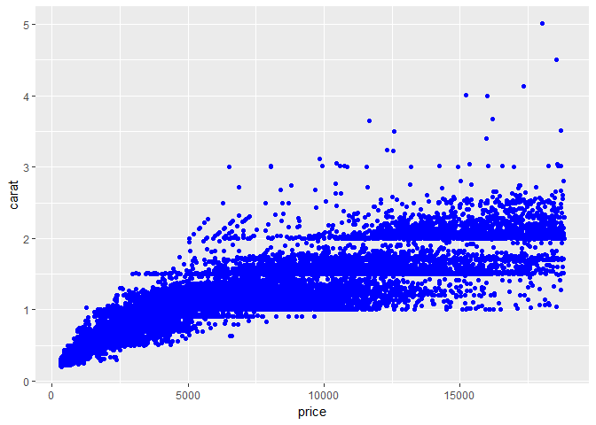
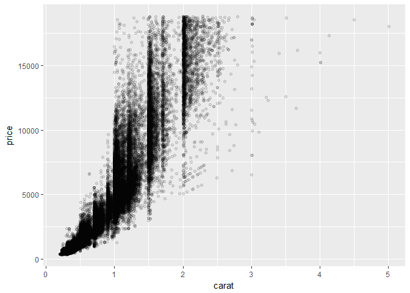
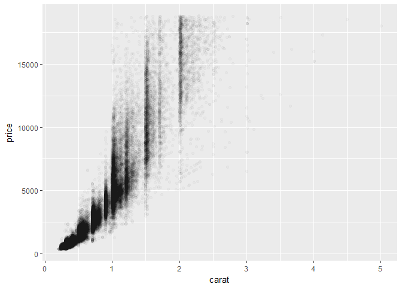
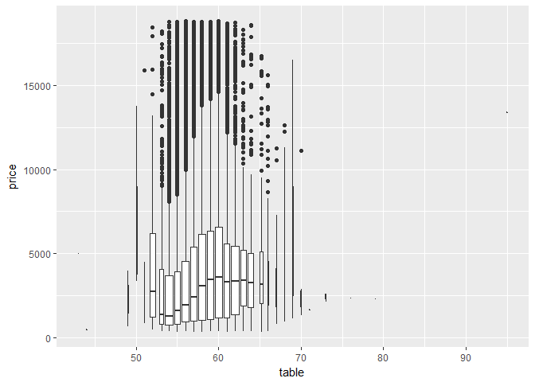

Lecture 3 for Hadley Wickham's STAT 405 at Rice U. Scatterplots for Big Data, Subsetting
================
Mark Blackmore
2017-09-20

``` r
library(ggplot2)
library(plyr)
```

Why are poorer cuts more expensive?
-----------------------------------

``` r
qplot(price, ..density.., data = diamonds, binwidth = 500,
      geom = "freqpoly", colour = cut)
```


What variable is most important for price?
------------------------------------------

``` r
qplot(carat, price, data= diamonds, color = cut)
```


### Two ways to add a smoothed conditional mean

``` r
qplot(carat, price, data= diamonds, color = cut, geom = c("point", "smooth"))
```


``` r
qplot(carat, price, data= diamonds, color = cut) + geom_smooth()
```


### To set aesthetics to a particular value, you need to wrap that value in I()

``` r
qplot(price, carat, data = diamonds, colour = "blue")
```


``` r
qplot(price, carat, data = diamonds, colour = I("blue"))
```



### Practical application: varying alpha

``` r
qplot(carat, price, data = diamonds, alpha = I(1/10))
```



``` r
qplot(carat, price, data = diamonds, alpha = I(1/50))
```



``` r
qplot(carat, price, data = diamonds, alpha = I(1/100))
```


``` r
qplot(carat, price, data = diamonds, alpha = I(1/250))
```


### Need to specify grouping variable: what determines which observations go into each boxplot

``` r
qplot(table, price, data = diamonds)
```


``` r
qplot(table, price, data = diamonds,
      geom = "boxplot")
```

    ## Warning: Continuous x aesthetic -- did you forget aes(group=...)?


``` r
qplot(table, price, data = diamonds,
      geom = "boxplot", group = round_any(table, 1))
```



``` r
qplot(table, price, data = diamonds,
      geom = "boxplot", group = round_any(table, 1)) + xlim(50, 70)
```

    ## Warning: Removed 12 rows containing non-finite values (stat_boxplot).

    ## Warning: Removed 1 rows containing missing values (geom_segment).


Subsetting
----------

### Example Data

``` r
x <- sample(1:10)
y <- setNames(x, letters[1:10])
```

### Subsetting: How

``` r
x[1:4]
```

    ## [1] 2 1 6 4

``` r
x[x == 5]
```

    ## [1] 5

``` r
y[order(y)]
```

    ##  b  a  g  d  i  c  e  j  f  h 
    ##  1  2  3  4  5  6  7  8  9 10

``` r
x[]
```

    ##  [1]  2  1  6  4  7  9  3 10  5  8

``` r
x[-1]
```

    ## [1]  1  6  4  7  9  3 10  5  8

``` r
y["a"]
```

    ## a 
    ## 2

``` r
x[x]
```

    ##  [1]  1  2  9  4  3  5  6  8  7 10

``` r
x[x > 2 & x < 9]
```

    ## [1] 6 4 7 3 5 8

``` r
x[sample(10)]
```

    ##  [1]  6  8  3  2  4 10  5  9  1  7

``` r
x[order(x)]
```

    ##  [1]  1  2  3  4  5  6  7  8  9 10

``` r
x[-(1:5)]
```

    ## [1]  9  3 10  5  8

``` r
x["a"]
```

    ## [1] NA

``` r
y[letters[10:1]]
```

    ##  j  i  h  g  f  e  d  c  b  a 
    ##  8  5 10  3  9  7  4  6  1  2

``` r
x[x < 2 | x >= 8]
```

    ## [1]  1  9 10  8

``` r
# x[-1:5]
x[0]
```

    ## integer(0)

#### Everything

``` r
str(diamonds[, ])
```

    ## Classes 'tbl_df', 'tbl' and 'data.frame':    53940 obs. of  10 variables:
    ##  $ carat  : num  0.23 0.21 0.23 0.29 0.31 0.24 0.24 0.26 0.22 0.23 ...
    ##  $ cut    : Ord.factor w/ 5 levels "Fair"<"Good"<..: 5 4 2 4 2 3 3 3 1 3 ...
    ##  $ color  : Ord.factor w/ 7 levels "D"<"E"<"F"<"G"<..: 2 2 2 6 7 7 6 5 2 5 ...
    ##  $ clarity: Ord.factor w/ 8 levels "I1"<"SI2"<"SI1"<..: 2 3 5 4 2 6 7 3 4 5 ...
    ##  $ depth  : num  61.5 59.8 56.9 62.4 63.3 62.8 62.3 61.9 65.1 59.4 ...
    ##  $ table  : num  55 61 65 58 58 57 57 55 61 61 ...
    ##  $ price  : int  326 326 327 334 335 336 336 337 337 338 ...
    ##  $ x      : num  3.95 3.89 4.05 4.2 4.34 3.94 3.95 4.07 3.87 4 ...
    ##  $ y      : num  3.98 3.84 4.07 4.23 4.35 3.96 3.98 4.11 3.78 4.05 ...
    ##  $ z      : num  2.43 2.31 2.31 2.63 2.75 2.48 2.47 2.53 2.49 2.39 ...

#### Positive integers & nothing

``` r
diamonds[1:6, ] # same as head(diamonds)
```

    ##   carat       cut color clarity depth table price    x    y    z
    ## 1  0.23     Ideal     E     SI2  61.5    55   326 3.95 3.98 2.43
    ## 2  0.21   Premium     E     SI1  59.8    61   326 3.89 3.84 2.31
    ## 3  0.23      Good     E     VS1  56.9    65   327 4.05 4.07 2.31
    ## 4  0.29   Premium     I     VS2  62.4    58   334 4.20 4.23 2.63
    ## 5  0.31      Good     J     SI2  63.3    58   335 4.34 4.35 2.75
    ## 6  0.24 Very Good     J    VVS2  62.8    57   336 3.94 3.96 2.48

``` r
# diamonds[, 1:4] # watch out!
```

#### Two positive integers in rows & columns

``` r
diamonds[1:10, 1:4]
```

    ##    carat       cut color clarity
    ## 1   0.23     Ideal     E     SI2
    ## 2   0.21   Premium     E     SI1
    ## 3   0.23      Good     E     VS1
    ## 4   0.29   Premium     I     VS2
    ## 5   0.31      Good     J     SI2
    ## 6   0.24 Very Good     J    VVS2
    ## 7   0.24 Very Good     I    VVS1
    ## 8   0.26 Very Good     H     SI1
    ## 9   0.22      Fair     E     VS2
    ## 10  0.23 Very Good     H     VS1

#### Repeating input repeats output

``` r
diamonds[c(1,1,1,2,2), 1:4]
```

    ##     carat     cut color clarity
    ## 1    0.23   Ideal     E     SI2
    ## 1.1  0.23   Ideal     E     SI2
    ## 1.2  0.23   Ideal     E     SI2
    ## 2    0.21 Premium     E     SI1
    ## 2.1  0.21 Premium     E     SI1

#### Negative integers drop values

``` r
diamonds[-(1:53900), -1]
```

    ##             cut color clarity depth table price    x    y    z
    ## 53901     Ideal     H     VS2  62.5    58  2752 5.71 5.75 3.58
    ## 53902   Premium     E     VS1  61.6    58  2753 5.36 5.33 3.29
    ## 53903 Very Good     E     SI2  59.9    61  2753 5.98 6.01 3.59
    ## 53904 Very Good     E     SI1  62.9    57  2753 5.79 5.84 3.66
    ## 53905   Premium     E     SI1  61.3    58  2753 5.68 5.71 3.49
    ## 53906   Premium     E     SI1  60.0    59  2753 5.75 5.79 3.46
    ## 53907 Very Good     E     SI1  63.0    55  2753 5.76 5.79 3.64
    ## 53908 Very Good     E     SI1  61.0    57  2753 5.68 5.73 3.48
    ## 53909 Very Good     E     SI1  61.2    57  2753 5.68 5.73 3.49
    ## 53910 Very Good     E     SI1  62.7    59  2753 5.63 5.67 3.54
    ## 53911   Premium     E     SI1  60.5    58  2753 5.74 5.77 3.48
    ## 53912   Premium     E      IF  59.8    60  2753 5.43 5.38 3.23
    ## 53913   Premium     F    VVS1  61.8    59  2753 5.48 5.40 3.36
    ## 53914      Good     G     VS2  64.2    58  2753 5.84 5.81 3.74
    ## 53915      Good     I     VS1  63.7    59  2753 5.94 5.90 3.77
    ## 53916     Ideal     E     SI2  62.1    56  2753 5.84 5.86 3.63
    ## 53917      Good     D     SI1  63.1    59  2753 5.71 5.74 3.61
    ## 53918 Very Good     J     SI1  63.2    60  2753 6.12 6.09 3.86
    ## 53919   Premium     I     VS1  59.3    62  2753 5.93 5.85 3.49
    ## 53920     Ideal     I    VVS1  62.2    55  2753 5.89 5.87 3.66
    ## 53921 Very Good     E     VS2  62.4    60  2755 5.57 5.61 3.49
    ## 53922 Very Good     E     VS2  62.8    60  2755 5.59 5.65 3.53
    ## 53923 Very Good     D     VS1  63.1    59  2755 5.67 5.58 3.55
    ## 53924     Ideal     I     VS2  61.3    56  2756 5.80 5.84 3.57
    ## 53925     Ideal     I     VS2  61.6    55  2756 5.82 5.84 3.59
    ## 53926     Ideal     I     SI1  61.6    56  2756 5.95 5.97 3.67
    ## 53927     Ideal     E     SI1  61.9    56  2756 5.71 5.73 3.54
    ## 53928      Good     F     SI1  58.1    59  2756 6.06 6.13 3.54
    ## 53929   Premium     E     SI2  61.4    58  2756 6.03 5.96 3.68
    ## 53930     Ideal     G     VS1  61.4    56  2756 5.76 5.73 3.53
    ## 53931   Premium     E     SI1  60.5    55  2756 5.79 5.74 3.49
    ## 53932   Premium     F     SI1  59.8    62  2756 5.74 5.73 3.43
    ## 53933 Very Good     E     VS2  60.5    59  2757 5.71 5.76 3.47
    ## 53934 Very Good     E     VS2  61.2    59  2757 5.69 5.72 3.49
    ## 53935   Premium     D     SI1  62.7    59  2757 5.69 5.73 3.58
    ## 53936     Ideal     D     SI1  60.8    57  2757 5.75 5.76 3.50
    ## 53937      Good     D     SI1  63.1    55  2757 5.69 5.75 3.61
    ## 53938 Very Good     D     SI1  62.8    60  2757 5.66 5.68 3.56
    ## 53939   Premium     H     SI2  61.0    58  2757 6.15 6.12 3.74
    ## 53940     Ideal     D     SI2  62.2    55  2757 5.83 5.87 3.64

### Using logicals

``` r
x_big <- diamonds$x > 10
head(x_big)
```

    ## [1] FALSE FALSE FALSE FALSE FALSE FALSE

``` r
sum(x_big)
```

    ## [1] 5

``` r
mean(x_big)
```

    ## [1] 9.269559e-05

``` r
table(x_big)
```

    ## x_big
    ## FALSE  TRUE 
    ## 53935     5

``` r
diamonds$x[x_big]
```

    ## [1] 10.14 10.02 10.01 10.74 10.23

``` r
diamonds[x_big, ]
```

    ##       carat       cut color clarity depth table price     x     y    z
    ## 25999  4.01   Premium     I      I1  61.0    61 15223 10.14 10.10 6.17
    ## 26000  4.01   Premium     J      I1  62.5    62 15223 10.02  9.94 6.24
    ## 26445  4.00 Very Good     I      I1  63.3    58 15984 10.01  9.94 6.31
    ## 27416  5.01      Fair     J      I1  65.5    59 18018 10.74 10.54 6.98
    ## 27631  4.50      Fair     J      I1  65.8    58 18531 10.23 10.16 6.72

``` r
small <- diamonds[diamonds$carat < 1, ]
lowqual <- diamonds[diamonds$clarity %in% c("I1", "SI2", "SI1"), ]
small <- diamonds$carat < 1 &
  diamonds$price > 500
```

### Exercise

``` r
logical_answer <- diamonds$x == diamonds$y & diamonds$depth > 55 & 
  diamonds$depth < 70 & diamonds$carat < mean(diamonds$carat) & 
  diamonds$cut %in% c("Good", "Very Good", "Premium", "Ideal")
diamonds[logical_answer,]
```

    ##       carat       cut color clarity depth table price    x    y    z
    ## 3398   0.30     Ideal     H    VVS2  62.5    54   567 4.30 4.30 2.70
    ## 10056  0.27 Very Good     F    VVS1  62.0    55   591 4.16 4.16 2.59
    ## 34303  0.32     Ideal     D    VVS2  62.1    54   858 4.40 4.40 2.74
    ## 40017  0.42     Ideal     H    VVS1  62.8    57  1108 4.79 4.79 3.01
    ## 41856  0.61   Premium     G     SI1  60.8    60  1255 5.42 5.42 3.31
    ## 42128  0.48     Ideal     F     VS2  62.4    54  1279 5.03 5.03 3.15
    ## 43491  0.51   Premium     F     SI1  61.4    59  1421 5.13 5.13 3.16
    ## 49557  0.71      Good     F     SI2  64.1    60  2130 0.00 0.00 0.00
    ## 49558  0.71      Good     F     SI2  64.1    60  2130 0.00 0.00 0.00
