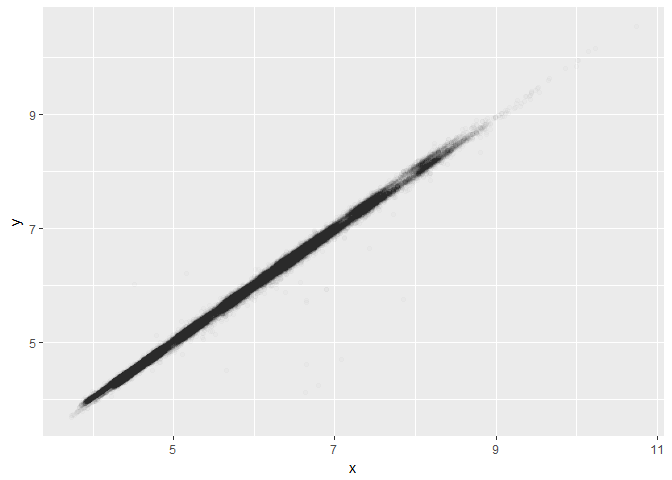

Lecture 4: Subsetting
================
Mark Blackmore
2017-11-20

``` r
library(ggplot2)
```

Subsetting
----------

``` r
diamonds[diamonds$x > 10, ]
```

    ## # A tibble: 5 x 10
    ##   carat       cut color clarity depth table price     x     y     z
    ##   <dbl>     <ord> <ord>   <ord> <dbl> <dbl> <int> <dbl> <dbl> <dbl>
    ## 1  4.01   Premium     I      I1  61.0    61 15223 10.14 10.10  6.17
    ## 2  4.01   Premium     J      I1  62.5    62 15223 10.02  9.94  6.24
    ## 3  4.00 Very Good     I      I1  63.3    58 15984 10.01  9.94  6.31
    ## 4  5.01      Fair     J      I1  65.5    59 18018 10.74 10.54  6.98
    ## 5  4.50      Fair     J      I1  65.8    58 18531 10.23 10.16  6.72

``` r
diamonds[1:10, c("carat", "cut")]
```

    ## # A tibble: 10 x 2
    ##    carat       cut
    ##    <dbl>     <ord>
    ##  1  0.23     Ideal
    ##  2  0.21   Premium
    ##  3  0.23      Good
    ##  4  0.29   Premium
    ##  5  0.31      Good
    ##  6  0.24 Very Good
    ##  7  0.24 Very Good
    ##  8  0.26 Very Good
    ##  9  0.22      Fair
    ## 10  0.23 Very Good

### Blank

``` r
str(diamonds[, ])
```

    ## Classes 'tbl_df', 'tbl' and 'data.frame':    53940 obs. of  10 variables:
    ##  $ carat  : num  0.23 0.21 0.23 0.29 0.31 0.24 0.24 0.26 0.22 0.23 ...
    ##  $ cut    : Ord.factor w/ 5 levels "Fair"<"Good"<..: 5 4 2 4 2 3 3 3 1 3 ...
    ##  $ color  : Ord.factor w/ 7 levels "D"<"E"<"F"<"G"<..: 2 2 2 6 7 7 6 5 2 5 ...
    ##  $ clarity: Ord.factor w/ 8 levels "I1"<"SI2"<"SI1"<..: 2 3 5 4 2 6 7 3 4 5 ...
    ##  $ depth  : num  61.5 59.8 56.9 62.4 63.3 62.8 62.3 61.9 65.1 59.4 ...
    ##  $ table  : num  55 61 65 58 58 57 57 55 61 61 ...
    ##  $ price  : int  326 326 327 334 335 336 336 337 337 338 ...
    ##  $ x      : num  3.95 3.89 4.05 4.2 4.34 3.94 3.95 4.07 3.87 4 ...
    ##  $ y      : num  3.98 3.84 4.07 4.23 4.35 3.96 3.98 4.11 3.78 4.05 ...
    ##  $ z      : num  2.43 2.31 2.31 2.63 2.75 2.48 2.47 2.53 2.49 2.39 ...

### Positive integers & nothing

``` r
diamonds[1:6, ] # same as head(diamonds)
```

    ## # A tibble: 6 x 10
    ##   carat       cut color clarity depth table price     x     y     z
    ##   <dbl>     <ord> <ord>   <ord> <dbl> <dbl> <int> <dbl> <dbl> <dbl>
    ## 1  0.23     Ideal     E     SI2  61.5    55   326  3.95  3.98  2.43
    ## 2  0.21   Premium     E     SI1  59.8    61   326  3.89  3.84  2.31
    ## 3  0.23      Good     E     VS1  56.9    65   327  4.05  4.07  2.31
    ## 4  0.29   Premium     I     VS2  62.4    58   334  4.20  4.23  2.63
    ## 5  0.31      Good     J     SI2  63.3    58   335  4.34  4.35  2.75
    ## 6  0.24 Very Good     J    VVS2  62.8    57   336  3.94  3.96  2.48

``` r
# diamonds[, 1:4] # watch out!
```

### Two positive integers in rows & columns

``` r
diamonds[1:10, 1:4]
```

    ## # A tibble: 10 x 4
    ##    carat       cut color clarity
    ##    <dbl>     <ord> <ord>   <ord>
    ##  1  0.23     Ideal     E     SI2
    ##  2  0.21   Premium     E     SI1
    ##  3  0.23      Good     E     VS1
    ##  4  0.29   Premium     I     VS2
    ##  5  0.31      Good     J     SI2
    ##  6  0.24 Very Good     J    VVS2
    ##  7  0.24 Very Good     I    VVS1
    ##  8  0.26 Very Good     H     SI1
    ##  9  0.22      Fair     E     VS2
    ## 10  0.23 Very Good     H     VS1

### Repeating input repeats output

``` r
diamonds[c(1,1,1,2,2), 1:4]
```

    ## # A tibble: 5 x 4
    ##   carat     cut color clarity
    ##   <dbl>   <ord> <ord>   <ord>
    ## 1  0.23   Ideal     E     SI2
    ## 2  0.23   Ideal     E     SI2
    ## 3  0.23   Ideal     E     SI2
    ## 4  0.21 Premium     E     SI1
    ## 5  0.21 Premium     E     SI1

### Negative integers

``` r
diamonds[-(1:53900), -1]
```

    ## # A tibble: 40 x 9
    ##          cut color clarity depth table price     x     y     z
    ##        <ord> <ord>   <ord> <dbl> <dbl> <int> <dbl> <dbl> <dbl>
    ##  1     Ideal     H     VS2  62.5    58  2752  5.71  5.75  3.58
    ##  2   Premium     E     VS1  61.6    58  2753  5.36  5.33  3.29
    ##  3 Very Good     E     SI2  59.9    61  2753  5.98  6.01  3.59
    ##  4 Very Good     E     SI1  62.9    57  2753  5.79  5.84  3.66
    ##  5   Premium     E     SI1  61.3    58  2753  5.68  5.71  3.49
    ##  6   Premium     E     SI1  60.0    59  2753  5.75  5.79  3.46
    ##  7 Very Good     E     SI1  63.0    55  2753  5.76  5.79  3.64
    ##  8 Very Good     E     SI1  61.0    57  2753  5.68  5.73  3.48
    ##  9 Very Good     E     SI1  61.2    57  2753  5.68  5.73  3.49
    ## 10 Very Good     E     SI1  62.7    59  2753  5.63  5.67  3.54
    ## # ... with 30 more rows

### Logical

``` r
x_big <- diamonds$x > 10
head(x_big)
```

    ## [1] FALSE FALSE FALSE FALSE FALSE FALSE

``` r
sum(x_big)
```

    ## [1] 5

``` r
mean(x_big)
```

    ## [1] 9.269559e-05

``` r
table(x_big)
```

    ## x_big
    ## FALSE  TRUE 
    ## 53935     5

``` r
diamonds$x[x_big]
```

    ## [1] 10.14 10.02 10.01 10.74 10.23

``` r
diamonds[x_big, ]
```

    ## # A tibble: 5 x 10
    ##   carat       cut color clarity depth table price     x     y     z
    ##   <dbl>     <ord> <ord>   <ord> <dbl> <dbl> <int> <dbl> <dbl> <dbl>
    ## 1  4.01   Premium     I      I1  61.0    61 15223 10.14 10.10  6.17
    ## 2  4.01   Premium     J      I1  62.5    62 15223 10.02  9.94  6.24
    ## 3  4.00 Very Good     I      I1  63.3    58 15984 10.01  9.94  6.31
    ## 4  5.01      Fair     J      I1  65.5    59 18018 10.74 10.54  6.98
    ## 5  4.50      Fair     J      I1  65.8    58 18531 10.23 10.16  6.72

### Logical vectors

``` r
small <- diamonds[diamonds$carat < 1, ]
lowqual <- diamonds[diamonds$clarity
                    %in% c("I1", "SI2", "SI1"), ]
```

### Boolean operators: & | !

``` r
small <- diamonds$carat < 1 & diamonds$price > 500
lowqual  <- diamonds$color == "D" | diamonds$cut == "Fair"
notcolor <- diamonds[!diamonds$color %in% c("D", "E", "F"), ]
```

### Character subsetting

``` r
diamonds[1:5, c("carat", "cut", "color")]
```

    ## # A tibble: 5 x 3
    ##   carat     cut color
    ##   <dbl>   <ord> <ord>
    ## 1  0.23   Ideal     E
    ## 2  0.21 Premium     E
    ## 3  0.23    Good     E
    ## 4  0.29 Premium     I
    ## 5  0.31    Good     J

``` r
diamonds[1:5, c(4, 9, 3)]
```

    ## # A tibble: 5 x 3
    ##   clarity     y color
    ##     <ord> <dbl> <ord>
    ## 1     SI2  3.98     E
    ## 2     SI1  3.84     E
    ## 3     VS1  4.07     E
    ## 4     VS2  4.23     I
    ## 5     SI2  4.35     J

### Useful technique: change labelling

``` r
labels <- c("Fair" = "C", "Good" = "B", "Very Good" = "B+", "Premium" = "A",
            "Ideal" = "A+")
labels
```

    ##      Fair      Good Very Good   Premium     Ideal 
    ##       "C"       "B"      "B+"       "A"      "A+"

``` r
labels["Fair"]
```

    ## Fair 
    ##  "C"

``` r
labels["Very Good"]
```

    ## Very Good 
    ##      "B+"

``` r
first_10 <- diamonds$cut[1:10]
first_10
```

    ##  [1] Ideal     Premium   Good      Premium   Good      Very Good Very Good
    ##  [8] Very Good Fair      Very Good
    ## Levels: Fair < Good < Very Good < Premium < Ideal

``` r
labels[first_10]
```

    ##     Ideal   Premium      Good   Premium      Good Very Good Very Good 
    ##      "A+"       "A"       "B"       "A"       "B"      "B+"      "B+" 
    ## Very Good      Fair Very Good 
    ##      "B+"       "C"      "B+"

``` r
all <- labels[diamonds$cut]
table(all)
```

    ## all
    ##     A    A+     B    B+     C 
    ## 13791 21551  4906 12082  1610

``` r
table(diamonds$cut)
```

    ## 
    ##      Fair      Good Very Good   Premium     Ideal 
    ##      1610      4906     12082     13791     21551

### Can also be used to collapse levels

``` r
table(c("Fair" = "C", "Good" = "B", "Very Good" =
          "B", "Premium" = "A", "Ideal" = "A")[diamonds$cut])
```

    ## 
    ##     A     B     C 
    ## 35342 16988  1610

#### If you're confused by a big statement, break it up in to smaller pieces

``` r
grades <- c("Fair" = "C", "Good" = "B", "Very Good"
            = "B", "Premium" = "A", "Ideal" = "A")
grades
```

    ##      Fair      Good Very Good   Premium     Ideal 
    ##       "C"       "B"       "B"       "A"       "A"

``` r
cuts <- diamonds$cut
head(grades[cuts])
```

    ##     Ideal   Premium      Good   Premium      Good Very Good 
    ##       "A"       "A"       "B"       "A"       "B"       "B"

``` r
table(grades[cuts])
```

    ## 
    ##     A     B     C 
    ## 35342 16988  1610

``` r
# ?cut # continuous equivalent
```

### Exercise

``` r
head(mpg)
```

    ## # A tibble: 6 x 11
    ##   manufacturer model displ  year   cyl      trans   drv   cty   hwy    fl
    ##          <chr> <chr> <dbl> <int> <int>      <chr> <chr> <int> <int> <chr>
    ## 1         audi    a4   1.8  1999     4   auto(l5)     f    18    29     p
    ## 2         audi    a4   1.8  1999     4 manual(m5)     f    21    29     p
    ## 3         audi    a4   2.0  2008     4 manual(m6)     f    20    31     p
    ## 4         audi    a4   2.0  2008     4   auto(av)     f    21    30     p
    ## 5         audi    a4   2.8  1999     6   auto(l5)     f    16    26     p
    ## 6         audi    a4   2.8  1999     6 manual(m5)     f    18    26     p
    ## # ... with 1 more variables: class <chr>

``` r
str(mpg)
```

    ## Classes 'tbl_df', 'tbl' and 'data.frame':    234 obs. of  11 variables:
    ##  $ manufacturer: chr  "audi" "audi" "audi" "audi" ...
    ##  $ model       : chr  "a4" "a4" "a4" "a4" ...
    ##  $ displ       : num  1.8 1.8 2 2 2.8 2.8 3.1 1.8 1.8 2 ...
    ##  $ year        : int  1999 1999 2008 2008 1999 1999 2008 1999 1999 2008 ...
    ##  $ cyl         : int  4 4 4 4 6 6 6 4 4 4 ...
    ##  $ trans       : chr  "auto(l5)" "manual(m5)" "manual(m6)" "auto(av)" ...
    ##  $ drv         : chr  "f" "f" "f" "f" ...
    ##  $ cty         : int  18 21 20 21 16 18 18 18 16 20 ...
    ##  $ hwy         : int  29 29 31 30 26 26 27 26 25 28 ...
    ##  $ fl          : chr  "p" "p" "p" "p" ...
    ##  $ class       : chr  "compact" "compact" "compact" "compact" ...

``` r
mpg$fl <- as.character(mpg$fl) 

fueltype <- c("r" = "regular", "d" = "other", "p" = "premium", "c" = "other",
              "e" = "other")
table(fueltype[mpg$fl])
```

    ## 
    ##   other premium regular 
    ##      14      52     168

Missing Values & Outliers
-------------------------

``` r
qplot(x, y, data = diamonds)
```


``` r
qplot(x, z, data = diamonds)
```


``` r
y_big <- diamonds$y > 20
z_big <- diamonds$z > 20
x_zero <- diamonds$x == 0
y_zero <- diamonds$y == 0
z_zero <- diamonds$z == 0
zeros <- x_zero | y_zero | z_zero
bad <- y_big | z_big | zeros
good <- diamonds[!bad, ]

qplot(x, y, data = good)
```


``` r
qplot(x, y, data = good, alpha = I(1/100))
```



### Guess what happens

``` r
5 + NA
```

    ## [1] NA

``` r
NA / 2
```

    ## [1] NA

``` r
sum(c(5, NA))
```

    ## [1] NA

``` r
mean(c(5, NA))
```

    ## [1] NA

``` r
NA < 3
```

    ## [1] NA

``` r
NA == 3
```

    ## [1] NA

``` r
NA == NA # uses is.na() to check for missing values
```

    ## [1] NA

### Can use subsetting + &lt;- to change individual values

``` r
diamonds$x[diamonds$x == 0] <- NA
diamonds$y[diamonds$y == 0] <- NA
diamonds$z[diamonds$z == 0] <- NA
y_big <- diamonds$y > 20
diamonds$y[y_big] <- NA
z_big <- diamonds$z > 20
diamonds$z[y_big] <- NA
qplot(x, y, data = diamonds)
```


``` r
## Clean up
rm(list = ls())
```
