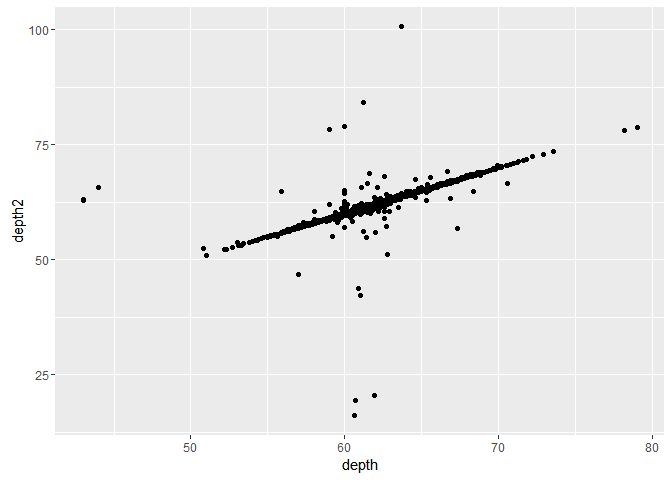
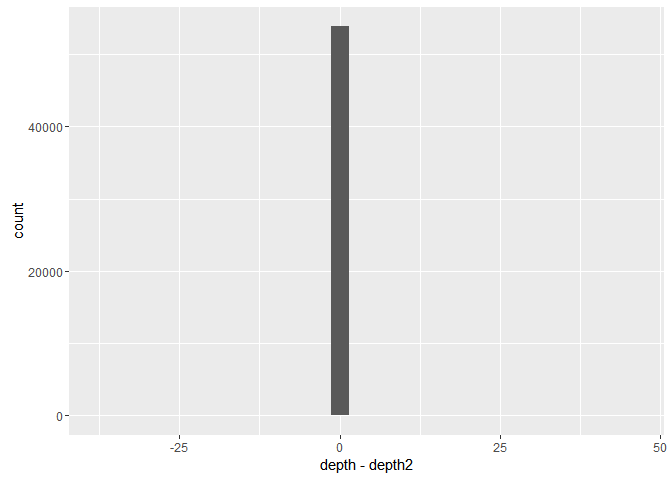
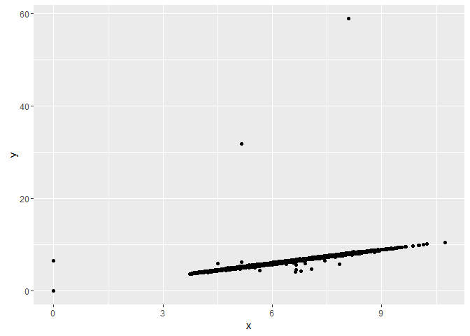
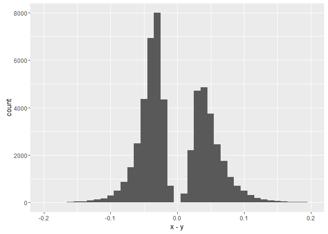
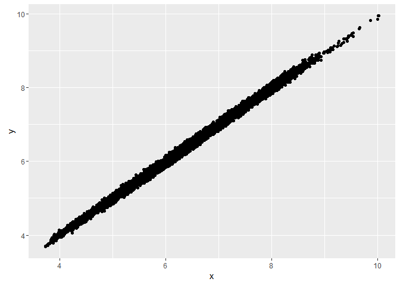
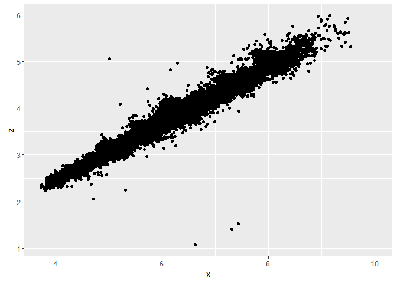
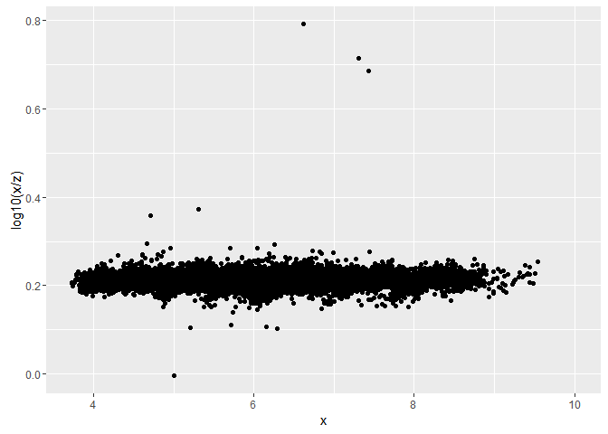
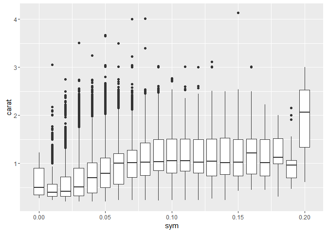
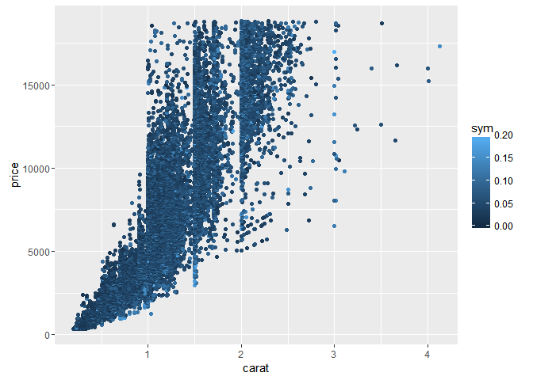
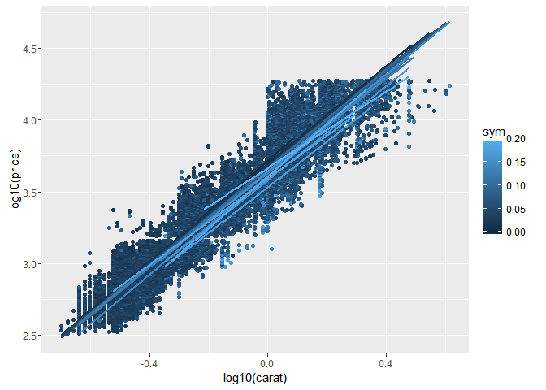

Lecture 5 for Hadley Wickham's STAT 405 at Rice U. Working directories, shortcuts and iteration
================
Mark Blackmore
2017-09-19

``` r
library(ggplot2)
library(plyr)

## Working Directories
### Never use setwd() in a scirpt
### Find out what directory you're in
getwd()
```

    ## [1] "C:/Users/Mark/Documents/R Projects Laptop/Experiments"

``` r
### List files in that directory
dir()
```

    ##  [1] "01_hadley_stat405_rice.html"     "01_hadley_stat405_rice.md"      
    ##  [3] "01_hadley_stat405_rice.R"        "01_hadley_stat405_rice_files"   
    ##  [5] "02_hadley_stat405_rice.html"     "02_hadley_stat405_rice.md"      
    ##  [7] "02_hadley_stat405_rice.R"        "02_hadley_stat405_rice_files"   
    ##  [9] "03_hadley_stat405_rice.html"     "03_hadley_stat405_rice.md"      
    ## [11] "03_hadley_stat405_rice.R"        "03_hadley_stat405_rice_files"   
    ## [13] "04_hadley_stat405_rice.html"     "04_hadley_stat405_rice.md"      
    ## [15] "04_hadley_stat405_rice.R"        "04_hadley_stat405_rice_files"   
    ## [17] "05_hadley_stat405_rice.html"     "05_hadley_stat405_rice.md"      
    ## [19] "05_hadley_stat405_rice.R"        "05_hadley_stat405_rice.spin.R"  
    ## [21] "05_hadley_stat405_rice.spin.Rmd" "05_hadley_stat405_rice_files"   
    ## [23] "06_hadley_stat405_rice.R"        "data"                           
    ## [25] "Experiments.Rproj"               "goodPractices.R"                
    ## [27] "my-plot.pdf"                     "my-plot.png"                    
    ## [29] "README.md"                       "renderMarkdown.html"            
    ## [31] "renderMarkdown.md"               "renderMarkdown.R"               
    ## [33] "renderMarkdown_files"

``` r
### Exercise
#### Check for data directory; Create one if not found
if (!file.exists("data")) {dir.create("data")}

#### Source URL
fileUrl <- "http://stat405.had.co.nz/project/mpg2.csv.bz2"
download.file(fileUrl, destfile = "./data/mpg2.csv.bz2")
list.files("./data")
```

    ## [1] "mpg2.csv.bz2"

``` r
#### Load file into workspace
mpg2 <- read.csv("./data/mpg2.csv.bz2", stringsAsFactors = FALSE)

### Exercise
#### Plot carat vs price
qplot(carat, price, data = diamonds)
```


``` r
#### Uses size on screen:
ggsave("my-plot.pdf")
```

    ## Saving 7 x 5 in image

``` r
ggsave("my-plot.png")
```

    ## Saving 7.94 x 4.49 in image


``` r
#### Specify size
ggsave("my-plot.pdf", width = 6, height = 6)
#### Plots are saved in the working directory
getwd()
```

    ## [1] "C:/Users/Mark/Documents/R Projects Laptop/Experiments"

``` r
list.files()
```

    ##  [1] "01_hadley_stat405_rice.html"     "01_hadley_stat405_rice.md"      
    ##  [3] "01_hadley_stat405_rice.R"        "01_hadley_stat405_rice_files"   
    ##  [5] "02_hadley_stat405_rice.html"     "02_hadley_stat405_rice.md"      
    ##  [7] "02_hadley_stat405_rice.R"        "02_hadley_stat405_rice_files"   
    ##  [9] "03_hadley_stat405_rice.html"     "03_hadley_stat405_rice.md"      
    ## [11] "03_hadley_stat405_rice.R"        "03_hadley_stat405_rice_files"   
    ## [13] "04_hadley_stat405_rice.html"     "04_hadley_stat405_rice.md"      
    ## [15] "04_hadley_stat405_rice.R"        "04_hadley_stat405_rice_files"   
    ## [17] "05_hadley_stat405_rice.html"     "05_hadley_stat405_rice.md"      
    ## [19] "05_hadley_stat405_rice.R"        "05_hadley_stat405_rice.spin.R"  
    ## [21] "05_hadley_stat405_rice.spin.Rmd" "05_hadley_stat405_rice_files"   
    ## [23] "06_hadley_stat405_rice.R"        "data"                           
    ## [25] "Experiments.Rproj"               "goodPractices.R"                
    ## [27] "my-plot.pdf"                     "my-plot.png"                    
    ## [29] "README.md"                       "renderMarkdown.html"            
    ## [31] "renderMarkdown.md"               "renderMarkdown.R"               
    ## [33] "renderMarkdown_files"

``` r
## Short Cuts
df <- data.frame(color = c("blue", "black", "blue", "blue", "black"),
                 value = c(1, 2, 3, 4, 5))
subset(df, color == "blue")
```

    ##   color value
    ## 1  blue     1
    ## 3  blue     3
    ## 4  blue     4

``` r
### subset: short cut for subsetting
zero_dim <- diamonds$x == 0 | diamonds$y == 0 | diamonds$z == 0
diamonds[zero_dim, ]
```

    ##       carat  cut color clarity depth table price  x  y  z
    ## NA       NA <NA>  <NA>    <NA>    NA    NA    NA NA NA NA
    ## NA.1     NA <NA>  <NA>    <NA>    NA    NA    NA NA NA NA
    ## NA.2     NA <NA>  <NA>    <NA>    NA    NA    NA NA NA NA
    ## NA.3     NA <NA>  <NA>    <NA>    NA    NA    NA NA NA NA
    ## NA.4     NA <NA>  <NA>    <NA>    NA    NA    NA NA NA NA
    ## NA.5     NA <NA>  <NA>    <NA>    NA    NA    NA NA NA NA
    ## NA.6     NA <NA>  <NA>    <NA>    NA    NA    NA NA NA NA
    ## NA.7     NA <NA>  <NA>    <NA>    NA    NA    NA NA NA NA
    ## NA.8     NA <NA>  <NA>    <NA>    NA    NA    NA NA NA NA
    ## NA.9     NA <NA>  <NA>    <NA>    NA    NA    NA NA NA NA
    ## NA.10    NA <NA>  <NA>    <NA>    NA    NA    NA NA NA NA
    ## NA.11    NA <NA>  <NA>    <NA>    NA    NA    NA NA NA NA
    ## NA.12    NA <NA>  <NA>    <NA>    NA    NA    NA NA NA NA
    ## NA.13    NA <NA>  <NA>    <NA>    NA    NA    NA NA NA NA
    ## NA.14    NA <NA>  <NA>    <NA>    NA    NA    NA NA NA NA
    ## NA.15    NA <NA>  <NA>    <NA>    NA    NA    NA NA NA NA
    ## NA.16    NA <NA>  <NA>    <NA>    NA    NA    NA NA NA NA
    ## NA.17    NA <NA>  <NA>    <NA>    NA    NA    NA NA NA NA
    ## NA.18    NA <NA>  <NA>    <NA>    NA    NA    NA NA NA NA
    ## NA.19    NA <NA>  <NA>    <NA>    NA    NA    NA NA NA NA
    ## NA.20    NA <NA>  <NA>    <NA>    NA    NA    NA NA NA NA
    ## NA.21    NA <NA>  <NA>    <NA>    NA    NA    NA NA NA NA
    ## NA.22    NA <NA>  <NA>    <NA>    NA    NA    NA NA NA NA
    ## NA.23    NA <NA>  <NA>    <NA>    NA    NA    NA NA NA NA
    ## NA.24    NA <NA>  <NA>    <NA>    NA    NA    NA NA NA NA
    ## NA.25    NA <NA>  <NA>    <NA>    NA    NA    NA NA NA NA
    ## NA.26    NA <NA>  <NA>    <NA>    NA    NA    NA NA NA NA
    ## NA.27    NA <NA>  <NA>    <NA>    NA    NA    NA NA NA NA
    ## NA.28    NA <NA>  <NA>    <NA>    NA    NA    NA NA NA NA
    ## NA.29    NA <NA>  <NA>    <NA>    NA    NA    NA NA NA NA
    ## NA.30    NA <NA>  <NA>    <NA>    NA    NA    NA NA NA NA
    ## NA.31    NA <NA>  <NA>    <NA>    NA    NA    NA NA NA NA
    ## NA.32    NA <NA>  <NA>    <NA>    NA    NA    NA NA NA NA
    ## NA.33    NA <NA>  <NA>    <NA>    NA    NA    NA NA NA NA
    ## NA.34    NA <NA>  <NA>    <NA>    NA    NA    NA NA NA NA

``` r
subset(diamonds, x == 0 | y == 0 | z == 0)
```

    ##  [1] carat   cut     color   clarity depth   table   price   x      
    ##  [9] y       z      
    ## <0 rows> (or 0-length row.names)

``` r
summarise(df, double = 2 * value)
```

    ##   double
    ## 1      2
    ## 2      4
    ## 3      6
    ## 4      8
    ## 5     10

``` r
summarise(df, total = sum(value))
```

    ##   total
    ## 1    15

``` r
### summarise/summarize: short cut for creating a summary
biggest <- data.frame(
  price.max = max(diamonds$price),
  carat.max = max(diamonds$carat))
biggest <- summarise(diamonds,
                     price.max = max(price),
                     carat.max = max(carat))

mutate(df, double = 2 * value)
```

    ##   color value double
    ## 1  blue     1      2
    ## 2 black     2      4
    ## 3  blue     3      6
    ## 4  blue     4      8
    ## 5 black     5     10

``` r
mutate(df, double = 2 * value, 
       quad = 2 * double)
```

    ##   color value double quad
    ## 1  blue     1      2    4
    ## 2 black     2      4    8
    ## 3  blue     3      6   12
    ## 4  blue     4      8   16
    ## 5 black     5     10   20

``` r
### mutate: short cut for adding new variables
diamonds$volume <- diamonds$x * diamonds$y * diamonds$z
diamonds$density <- diamonds$volume / diamonds$carat
diamonds <- mutate(diamonds,
                   volume = x * y * z,
                   density = volume / carat)
head(diamonds)
```

    ##   carat       cut color clarity depth table price    x    y    z   volume
    ## 1  0.23     Ideal     E     SI2  61.5    55   326 3.95 3.98 2.43 38.20203
    ## 2  0.21   Premium     E     SI1  59.8    61   326 3.89 3.84 2.31 34.50586
    ## 3  0.23      Good     E     VS1  56.9    65   327 4.05 4.07 2.31 38.07688
    ## 4  0.29   Premium     I     VS2  62.4    58   334 4.20 4.23 2.63 46.72458
    ## 5  0.31      Good     J     SI2  63.3    58   335 4.34 4.35 2.75 51.91725
    ## 6  0.24 Very Good     J    VVS2  62.8    57   336 3.94 3.96 2.48 38.69395
    ##    density
    ## 1 166.0958
    ## 2 164.3136
    ## 3 165.5517
    ## 4 161.1192
    ## 5 167.4750
    ## 6 161.2248

``` r
df <- data.frame(color = c(4, 1, 5, 3, 2),
                 value = c(1, 2, 3, 4, 5))
arrange(df, color)
```

    ##   color value
    ## 1     1     2
    ## 2     2     5
    ## 3     3     4
    ## 4     4     1
    ## 5     5     3

``` r
arrange(df, desc(color))
```

    ##   color value
    ## 1     5     3
    ## 2     4     1
    ## 3     3     4
    ## 4     2     5
    ## 5     1     2

``` r
### arrange: short cut for reordering
diamonds <- diamonds[order(diamonds$price,
                           desc(diamonds$carat)), ]
diamonds <- arrange(diamonds, price, desc(carat))
head(diamonds)
```

    ##   carat       cut color clarity depth table price    x    y    z   volume
    ## 1  0.23     Ideal     E     SI2  61.5    55   326 3.95 3.98 2.43 38.20203
    ## 2  0.21   Premium     E     SI1  59.8    61   326 3.89 3.84 2.31 34.50586
    ## 3  0.23      Good     E     VS1  56.9    65   327 4.05 4.07 2.31 38.07688
    ## 4  0.29   Premium     I     VS2  62.4    58   334 4.20 4.23 2.63 46.72458
    ## 5  0.31      Good     J     SI2  63.3    58   335 4.34 4.35 2.75 51.91725
    ## 6  0.24 Very Good     J    VVS2  62.8    57   336 3.94 3.96 2.48 38.69395
    ##    density
    ## 1 166.0958
    ## 2 164.3136
    ## 3 165.5517
    ## 4 161.1192
    ## 5 167.4750
    ## 6 161.2248

``` r
### Exercise
large_stones <- subset(diamonds, carat > 3)
arrange(large_stones, desc(price))
```

    ##    carat       cut color clarity depth table price     x    y    z
    ## 1   3.01   Premium     J     SI2  60.7    59 18710  9.35 9.22 5.64
    ## 2   3.01   Premium     J     SI2  59.7    58 18710  9.41 9.32 5.59
    ## 3   3.51   Premium     J     VS2  62.5    59 18701  9.66 9.63   NA
    ## 4   3.01      Good     H     SI2  57.6    64 18593  9.44 9.38 5.42
    ## 5   3.04   Premium     I     SI2  59.3    60 18559  9.51 9.46 5.62
    ## 6   4.50      Fair     J      I1  65.8    58 18531 10.23   NA   NA
    ## 7   3.01   Premium     I     SI2  60.2    59 18242  9.36 9.31 5.62
    ## 8   3.01      Fair     I     SI2  65.8    56 18242  8.99 8.94 5.90
    ## 9   3.01      Fair     I     SI2  65.8    56 18242  8.99 8.94 5.90
    ## 10  3.01      Good     I     SI2  63.9    60 18242  9.06 9.01 5.77
    ## 11  3.01      Good     I     SI2  63.9    60 18242  9.06 9.01 5.77
    ## 12  5.01      Fair     J      I1  65.5    59 18018 10.74   NA   NA
    ## 13  4.13      Fair     H      I1  64.8    61 17329 10.00 9.85   NA
    ## 14  3.01     Ideal     J      I1  65.4    60 16538  8.99 8.93 5.86
    ## 15  3.67   Premium     I      I1  62.4    56 16193  9.86 9.81   NA
    ## 16  3.01     Ideal     J     SI2  61.7    58 16037  9.25 9.20 5.69
    ## 17  4.00 Very Good     I      I1  63.3    58 15984 10.01 9.94   NA
    ## 18  3.40      Fair     D      I1  66.8    52 15964  9.42 9.34   NA
    ## 19  3.04 Very Good     I     SI2  63.2    59 15354  9.14 9.07 5.75
    ## 20  4.01   Premium     I      I1  61.0    61 15223 10.14   NA   NA
    ## 21  4.01   Premium     J      I1  62.5    62 15223 10.02 9.94   NA
    ## 22  3.01   Premium     G     SI2  59.8    58 14220  9.44 9.37 5.62
    ## 23  3.50     Ideal     H      I1  62.8    57 12587  9.65 9.59   NA
    ## 24  3.22     Ideal     I      I1  62.6    55 12545  9.49 9.42 5.92
    ## 25  3.24   Premium     H      I1  62.1    58 12300  9.44 9.40 5.85
    ## 26  3.65      Fair     H      I1  67.1    53 11668  9.53 9.48   NA
    ## 27  3.01      Fair     H      I1  56.1    62 10761  9.54 9.38 5.31
    ## 28  3.02      Fair     I      I1  65.2    56 10577  9.11 9.02 5.91
    ## 29  3.05   Premium     E      I1  60.9    58 10453  9.26 9.25 5.66
    ## 30  3.01   Premium     F      I1  62.2    56  9925  9.24 9.13 5.73
    ## 31  3.11      Fair     J      I1  65.9    57  9823  9.15 9.02 5.98
    ## 32  3.01   Premium     I      I1  62.7    58  8040  9.10 8.97 5.67
    ##      volume  density
    ## 1  486.2075 161.5307
    ## 2  490.2497 162.8737
    ## 3        NA       NA
    ## 4  479.9258 159.4438
    ## 5  505.6011 166.3161
    ## 6        NA       NA
    ## 7  489.7358 162.7029
    ## 8  474.1865 157.5371
    ## 9  474.1865 157.5371
    ## 10 471.0086 156.4812
    ## 11 471.0086 156.4812
    ## 12       NA       NA
    ## 13       NA       NA
    ## 14 470.4449 156.2940
    ## 15       NA       NA
    ## 16 484.2190 160.8701
    ## 17       NA       NA
    ## 18       NA       NA
    ## 19 476.6739 156.8006
    ## 20       NA       NA
    ## 21       NA       NA
    ## 22 497.1047 165.1511
    ## 23       NA       NA
    ## 24 529.2231 164.3550
    ## 25 519.1056 160.2178
    ## 26       NA       NA
    ## 27 475.1664 157.8626
    ## 28 485.6377 160.8072
    ## 29 484.8073 158.9532
    ## 30 483.3897 160.5946
    ## 31 493.5473 158.6969
    ## 32 462.8251 153.7625

``` r
diamonds <- mutate(diamonds,
                   diameter = (x + y) / 2,
                   depth2 = z / diameter * 100)
qplot(depth, depth2, data = diamonds)
```

    ## Warning: Removed 35 rows containing missing values (geom_point).



``` r
qplot(depth - depth2, data = diamonds)
```

    ## `stat_bin()` using `bins = 30`. Pick better value with `binwidth`.

    ## Warning: Removed 35 rows containing non-finite values (stat_bin).



``` r
### Use with()
with(diamonds, table(color, clarity))
```

    ##      clarity
    ## color   I1  SI2  SI1  VS2  VS1 VVS2 VVS1   IF
    ##     D   42 1370 2083 1697  705  553  252   73
    ##     E  102 1713 2426 2470 1281  991  656  158
    ##     F  143 1609 2131 2201 1364  975  734  385
    ##     G  150 1548 1976 2347 2148 1443  999  681
    ##     H  162 1563 2275 1643 1169  608  585  299
    ##     I   92  912 1424 1169  962  365  355  143
    ##     J   50  479  750  731  542  131   74   51

``` r
#### with is more general. Use in concert with other functions, 
#### particularly those that don't have a data argument
diamonds$volume <- with(diamonds, x * y * z)
#### This won't work:
with(diamonds, volume <- x * y * z)
#### with only changes lookup, not assignment

## Clean up
rm(diamonds)

## Iteration
### Best data analyses tell a story, with a natural flow from beginning to end.

qplot(x, y, data = diamonds)
```



``` r
qplot(x, z, data = diamonds)
```


``` r
#### Start by fixing incorrect values
y_big <- diamonds$y > 10
z_big <- diamonds$z > 6
x_zero <- diamonds$x == 0
y_zero <- diamonds$y == 0
z_zero <- diamonds$z == 0
diamonds$x[x_zero] <- NA
diamonds$y[y_zero | y_big] <- NA
diamonds$z[z_zero | z_big] <- NA
qplot(x, y, data = diamonds)
```

    ## Warning: Removed 13 rows containing missing values (geom_point).


``` r
#### How can I get rid of those outliers?
qplot(x, x - y, data = diamonds)
```

    ## Warning: Removed 13 rows containing missing values (geom_point).


``` r
qplot(x - y, data = diamonds)
```

    ## `stat_bin()` using `bins = 30`. Pick better value with `binwidth`.

    ## Warning: Removed 13 rows containing non-finite values (stat_bin).


``` r
qplot(x - y, data = diamonds, binwidth = 0.01)
```

    ## Warning: Removed 13 rows containing non-finite values (stat_bin).


``` r
last_plot() + xlim(-0.5, 0.5)
```

    ## Warning: Removed 27 rows containing non-finite values (stat_bin).


``` r
last_plot() + xlim(-0.2, 0.2)
```

    ## Scale for 'x' is already present. Adding another scale for 'x', which
    ## will replace the existing scale.

    ## Warning: Removed 108 rows containing non-finite values (stat_bin).

    ## Warning: Removed 1 rows containing missing values (geom_bar).



``` r
asym <- abs(diamonds$x - diamonds$y) > 0.2
diamonds_sym <- diamonds[!asym, ]
#### Did it work?
qplot(x, y, data = diamonds_sym)
```

    ## Warning: Removed 13 rows containing missing values (geom_point).



``` r
qplot(x, x - y, data = diamonds_sym)
```

    ## Warning: Removed 13 rows containing missing values (geom_point).


``` r
#### Something interesting is going on there!
qplot(x, x - y, data = diamonds_sym,
      geom = "bin2d", binwidth = c(0.1, 0.01))
```

    ## Warning: Removed 13 rows containing non-finite values (stat_bin2d).


``` r
#### What about x and z?
qplot(x, z, data = diamonds_sym)
```

    ## Warning: Removed 35 rows containing missing values (geom_point).



``` r
qplot(x, x - z, data = diamonds_sym)
```

    ## Warning: Removed 35 rows containing missing values (geom_point).


``` r
#### Subtracting doesn't work - z smaller than x and y
qplot(x, x / z, data = diamonds_sym)
```

    ## Warning: Removed 35 rows containing missing values (geom_point).


``` r
#### But better to log transform to make symmetrical
qplot(x, log10(x / z), data = diamonds_sym)
```

    ## Warning: Removed 35 rows containing missing values (geom_point).



``` r
#### How does symmetry relate to price?
qplot(abs(x - y), price, data = diamonds_sym) +
  geom_smooth()
```

    ## Warning: Removed 13 rows containing non-finite values (stat_smooth).

    ## Warning: Removed 13 rows containing missing values (geom_point).


``` r
diamonds_sym <- mutate(diamonds_sym,
                       sym = zapsmall(abs(x - y)))
#### Are asymmetric diamonds worth more?
qplot(sym, price, data = diamonds_sym) + geom_smooth()
```

    ## Warning: Removed 13 rows containing non-finite values (stat_smooth).

    ## Warning: Removed 13 rows containing missing values (geom_point).


``` r
qplot(sym, price, data = diamonds_sym, geom = "boxplot",
      group = sym)
```

    ## Warning: Removed 13 rows containing non-finite values (stat_boxplot).


``` r
qplot(sym, carat, data = diamonds_sym, geom = "boxplot",
      group = sym)
```

    ## Warning: Removed 13 rows containing non-finite values (stat_boxplot).



``` r
qplot(carat, price, data = diamonds_sym, colour = sym)
```

    ## Warning: Removed 13 rows containing missing values (geom_point).



``` r
qplot(log10(carat), log10(price), data = diamonds_sym,
      colour = sym, group = sym) + geom_smooth(method = lm, se = F)
```

    ## Warning: Removed 13 rows containing non-finite values (stat_smooth).

    ## Warning: Removed 13 rows containing missing values (geom_point).



``` r
## Modelling
summary(lm(log10(price) ~ log10(carat) + sym,
           data = diamonds_sym))
```

    ## 
    ## Call:
    ## lm(formula = log10(price) ~ log10(carat) + sym, data = diamonds_sym)
    ## 
    ## Residuals:
    ##      Min       1Q   Median       3Q      Max 
    ## -0.62869 -0.07380 -0.00264  0.07213  0.57978 
    ## 
    ## Coefficients:
    ##               Estimate Std. Error t value Pr(>|t|)    
    ## (Intercept)   3.692597   0.001294 2852.89   <2e-16 ***
    ## log10(carat)  1.692487   0.002079  814.04   <2e-16 ***
    ## sym          -0.443935   0.022282  -19.92   <2e-16 ***
    ## ---
    ## Signif. codes:  0 '***' 0.001 '**' 0.01 '*' 0.05 '.' 0.1 ' ' 1
    ## 
    ## Residual standard error: 0.1134 on 53829 degrees of freedom
    ##   (13 observations deleted due to missingness)
    ## Multiple R-squared:  0.9338, Adjusted R-squared:  0.9338 
    ## F-statistic: 3.797e+05 on 2 and 53829 DF,  p-value: < 2.2e-16

``` r
### But statistical significance != practical significance
sd(diamonds_sym$sym, na.rm = T)
```

    ## [1] 0.02368828

``` r
# [1] 0.02368828
# So 1 sd increase in sym, decreases log10(price)
# by -0.01 (= 0.023 * -0.44)
# 10 ^ -0.01 = 0.976; 0.976 - 1 = -0.024
# So 1 sd increase in sym decreases price by ~2%
```
