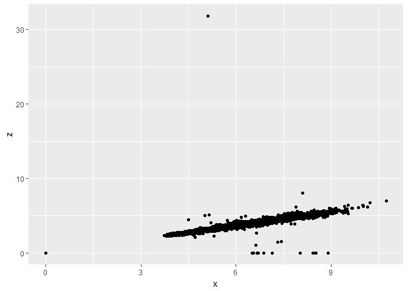
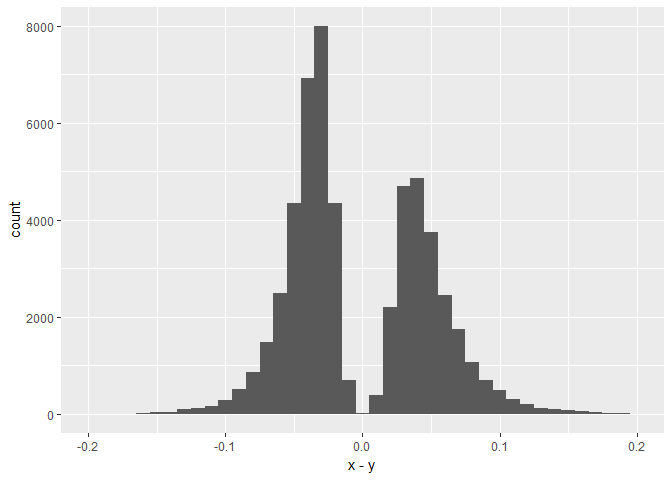
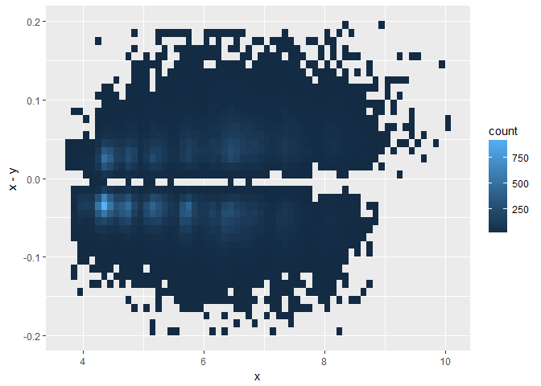
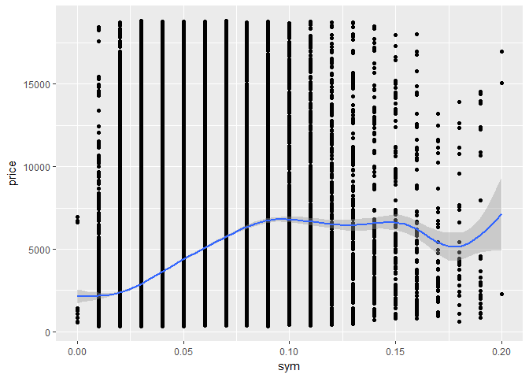
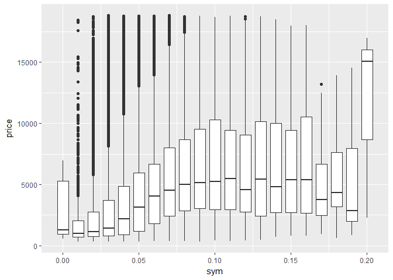

Lecture 5: Working directories, shortcuts and iteration
================
Mark Blackmore
2017-11-20

``` r
library(ggplot2)
library(plyr)
library(knitr)
```

Working Directories
-------------------

Never use setwd() in a scirpt
Find out what directory you're in with getwd()
List files in that directory with dir()

### Exercise

Check for data directory; Create one if not found

``` r
if (!file.exists("data")) {
  dir.create("data")
  }
```

Source URL

``` r
# fileUrl <- "http://stat405.had.co.nz/project/mpg2.csv.bz2"
# download.file(fileUrl, destfile = "./data/mpg2.csv.bz2")
# list.files("./data")
```

Load file into workspace

``` r
mpg2 <- read.csv("./data/mpg2.csv.bz2", stringsAsFactors = FALSE)
```

### Exercise

Plot carat vs price

``` r
qplot(carat, price, data = diamonds)
```


Uses size on screen:

``` r
ggsave("my-plot.pdf")
```

    ## Saving 7 x 5 in image

``` r
ggsave("my-plot.png")
```

    ## Saving 7 x 5 in image

Specify size

``` r
ggsave("my-plot.pdf", width = 6, height = 6)
```

Plots are saved in the working directory

``` r
list.files(pattern = "^['my']")
```

    ## [1] "my-plot.pdf" "my-plot.png"

Short Cuts
----------

``` r
df <- data.frame(color = c("blue", "black", "blue", "blue", "black"),
                 value = c(1, 2, 3, 4, 5))
subset(df, color == "blue")
```

    ##   color value
    ## 1  blue     1
    ## 3  blue     3
    ## 4  blue     4

### subset: short cut for subsetting

``` r
zero_dim <- diamonds$x == 0 | diamonds$y == 0 | diamonds$z == 0
diamonds[zero_dim, ]
```

    ## # A tibble: 20 x 10
    ##    carat       cut color clarity depth table price     x     y     z
    ##    <dbl>     <ord> <ord>   <ord> <dbl> <dbl> <int> <dbl> <dbl> <dbl>
    ##  1  1.00   Premium     G     SI2  59.1    59  3142  6.55  6.48     0
    ##  2  1.01   Premium     H      I1  58.1    59  3167  6.66  6.60     0
    ##  3  1.10   Premium     G     SI2  63.0    59  3696  6.50  6.47     0
    ##  4  1.01   Premium     F     SI2  59.2    58  3837  6.50  6.47     0
    ##  5  1.50      Good     G      I1  64.0    61  4731  7.15  7.04     0
    ##  6  1.07     Ideal     F     SI2  61.6    56  4954  0.00  6.62     0
    ##  7  1.00 Very Good     H     VS2  63.3    53  5139  0.00  0.00     0
    ##  8  1.15     Ideal     G     VS2  59.2    56  5564  6.88  6.83     0
    ##  9  1.14      Fair     G     VS1  57.5    67  6381  0.00  0.00     0
    ## 10  2.18   Premium     H     SI2  59.4    61 12631  8.49  8.45     0
    ## 11  1.56     Ideal     G     VS2  62.2    54 12800  0.00  0.00     0
    ## 12  2.25   Premium     I     SI1  61.3    58 15397  8.52  8.42     0
    ## 13  1.20   Premium     D    VVS1  62.1    59 15686  0.00  0.00     0
    ## 14  2.20   Premium     H     SI1  61.2    59 17265  8.42  8.37     0
    ## 15  2.25   Premium     H     SI2  62.8    59 18034  0.00  0.00     0
    ## 16  2.02   Premium     H     VS2  62.7    53 18207  8.02  7.95     0
    ## 17  2.80      Good     G     SI2  63.8    58 18788  8.90  8.85     0
    ## 18  0.71      Good     F     SI2  64.1    60  2130  0.00  0.00     0
    ## 19  0.71      Good     F     SI2  64.1    60  2130  0.00  0.00     0
    ## 20  1.12   Premium     G      I1  60.4    59  2383  6.71  6.67     0

``` r
subset(diamonds, x == 0 | y == 0 | z == 0)
```

    ## # A tibble: 20 x 10
    ##    carat       cut color clarity depth table price     x     y     z
    ##    <dbl>     <ord> <ord>   <ord> <dbl> <dbl> <int> <dbl> <dbl> <dbl>
    ##  1  1.00   Premium     G     SI2  59.1    59  3142  6.55  6.48     0
    ##  2  1.01   Premium     H      I1  58.1    59  3167  6.66  6.60     0
    ##  3  1.10   Premium     G     SI2  63.0    59  3696  6.50  6.47     0
    ##  4  1.01   Premium     F     SI2  59.2    58  3837  6.50  6.47     0
    ##  5  1.50      Good     G      I1  64.0    61  4731  7.15  7.04     0
    ##  6  1.07     Ideal     F     SI2  61.6    56  4954  0.00  6.62     0
    ##  7  1.00 Very Good     H     VS2  63.3    53  5139  0.00  0.00     0
    ##  8  1.15     Ideal     G     VS2  59.2    56  5564  6.88  6.83     0
    ##  9  1.14      Fair     G     VS1  57.5    67  6381  0.00  0.00     0
    ## 10  2.18   Premium     H     SI2  59.4    61 12631  8.49  8.45     0
    ## 11  1.56     Ideal     G     VS2  62.2    54 12800  0.00  0.00     0
    ## 12  2.25   Premium     I     SI1  61.3    58 15397  8.52  8.42     0
    ## 13  1.20   Premium     D    VVS1  62.1    59 15686  0.00  0.00     0
    ## 14  2.20   Premium     H     SI1  61.2    59 17265  8.42  8.37     0
    ## 15  2.25   Premium     H     SI2  62.8    59 18034  0.00  0.00     0
    ## 16  2.02   Premium     H     VS2  62.7    53 18207  8.02  7.95     0
    ## 17  2.80      Good     G     SI2  63.8    58 18788  8.90  8.85     0
    ## 18  0.71      Good     F     SI2  64.1    60  2130  0.00  0.00     0
    ## 19  0.71      Good     F     SI2  64.1    60  2130  0.00  0.00     0
    ## 20  1.12   Premium     G      I1  60.4    59  2383  6.71  6.67     0

``` r
plyr::summarise(df, double = 2 * value)
```

    ##   double
    ## 1      2
    ## 2      4
    ## 3      6
    ## 4      8
    ## 5     10

``` r
summarise(df, total = sum(value))
```

    ##   total
    ## 1    15

### summarise/summarize: short cut for creating a summary

``` r
biggest <- data.frame(
  price.max = max(diamonds$price),
  carat.max = max(diamonds$carat))
biggest <- summarise(diamonds,
                     price.max = max(price),
                     carat.max = max(carat))
```

### mutate: short cut for adding new variables

``` r
mutate(df, double = 2 * value)
```

    ##   color value double
    ## 1  blue     1      2
    ## 2 black     2      4
    ## 3  blue     3      6
    ## 4  blue     4      8
    ## 5 black     5     10

``` r
mutate(df, double = 2 * value, 
       quad = 2 * double)
```

    ##   color value double quad
    ## 1  blue     1      2    4
    ## 2 black     2      4    8
    ## 3  blue     3      6   12
    ## 4  blue     4      8   16
    ## 5 black     5     10   20

``` r
diamonds$volume <- diamonds$x * diamonds$y * diamonds$z
diamonds$density <- diamonds$volume / diamonds$carat
diamonds <- mutate(diamonds,
                   volume = x * y * z,
                   density = volume / carat)
kable(head(diamonds))
```

|  carat| cut       | color | clarity |  depth|  table|  price|     x|     y|     z|    volume|   density|
|------:|:----------|:------|:--------|------:|------:|------:|-----:|-----:|-----:|---------:|---------:|
|   0.23| Ideal     | E     | SI2     |   61.5|     55|    326|  3.95|  3.98|  2.43|  38.20203|  166.0958|
|   0.21| Premium   | E     | SI1     |   59.8|     61|    326|  3.89|  3.84|  2.31|  34.50586|  164.3136|
|   0.23| Good      | E     | VS1     |   56.9|     65|    327|  4.05|  4.07|  2.31|  38.07688|  165.5517|
|   0.29| Premium   | I     | VS2     |   62.4|     58|    334|  4.20|  4.23|  2.63|  46.72458|  161.1192|
|   0.31| Good      | J     | SI2     |   63.3|     58|    335|  4.34|  4.35|  2.75|  51.91725|  167.4750|
|   0.24| Very Good | J     | VVS2    |   62.8|     57|    336|  3.94|  3.96|  2.48|  38.69395|  161.2248|

``` r
df <- data.frame(color = c(4, 1, 5, 3, 2),
                 value = c(1, 2, 3, 4, 5))
arrange(df, color)
```

    ##   color value
    ## 1     1     2
    ## 2     2     5
    ## 3     3     4
    ## 4     4     1
    ## 5     5     3

``` r
arrange(df, desc(color))
```

    ##   color value
    ## 1     5     3
    ## 2     4     1
    ## 3     3     4
    ## 4     2     5
    ## 5     1     2

### arrange: short cut for reordering

``` r
diamonds <- diamonds[order(diamonds$price,
                           desc(diamonds$carat)), ]
diamonds <- arrange(diamonds, price, desc(carat))
kable(head(diamonds))
```

|  carat| cut       | color | clarity |  depth|  table|  price|     x|     y|     z|    volume|   density|
|------:|:----------|:------|:--------|------:|------:|------:|-----:|-----:|-----:|---------:|---------:|
|   0.23| Ideal     | E     | SI2     |   61.5|     55|    326|  3.95|  3.98|  2.43|  38.20203|  166.0958|
|   0.21| Premium   | E     | SI1     |   59.8|     61|    326|  3.89|  3.84|  2.31|  34.50586|  164.3136|
|   0.23| Good      | E     | VS1     |   56.9|     65|    327|  4.05|  4.07|  2.31|  38.07688|  165.5517|
|   0.29| Premium   | I     | VS2     |   62.4|     58|    334|  4.20|  4.23|  2.63|  46.72458|  161.1192|
|   0.31| Good      | J     | SI2     |   63.3|     58|    335|  4.34|  4.35|  2.75|  51.91725|  167.4750|
|   0.24| Very Good | J     | VVS2    |   62.8|     57|    336|  3.94|  3.96|  2.48|  38.69395|  161.2248|

### Exercise

``` r
large_stones <- subset(diamonds, carat > 3)
arrange(large_stones, desc(price))
```

    ## # A tibble: 32 x 12
    ##    carat     cut color clarity depth table price     x     y     z
    ##    <dbl>   <ord> <ord>   <ord> <dbl> <dbl> <int> <dbl> <dbl> <dbl>
    ##  1  3.01 Premium     J     SI2  60.7    59 18710  9.35  9.22  5.64
    ##  2  3.01 Premium     J     SI2  59.7    58 18710  9.41  9.32  5.59
    ##  3  3.51 Premium     J     VS2  62.5    59 18701  9.66  9.63  6.03
    ##  4  3.01    Good     H     SI2  57.6    64 18593  9.44  9.38  5.42
    ##  5  3.04 Premium     I     SI2  59.3    60 18559  9.51  9.46  5.62
    ##  6  4.50    Fair     J      I1  65.8    58 18531 10.23 10.16  6.72
    ##  7  3.01 Premium     I     SI2  60.2    59 18242  9.36  9.31  5.62
    ##  8  3.01    Fair     I     SI2  65.8    56 18242  8.99  8.94  5.90
    ##  9  3.01    Fair     I     SI2  65.8    56 18242  8.99  8.94  5.90
    ## 10  3.01    Good     I     SI2  63.9    60 18242  9.06  9.01  5.77
    ## # ... with 22 more rows, and 2 more variables: volume <dbl>, density <dbl>

``` r
diamonds <- mutate(diamonds,
                   diameter = (x + y) / 2,
                   depth2 = z / diameter * 100)
qplot(depth, depth2, data = diamonds)
```

    ## Warning: Removed 7 rows containing missing values (geom_point).


``` r
qplot(depth - depth2, data = diamonds)
```

    ## `stat_bin()` using `bins = 30`. Pick better value with `binwidth`.

    ## Warning: Removed 7 rows containing non-finite values (stat_bin).


### Use with()

``` r
with(diamonds, table(color, clarity))
```

    ##      clarity
    ## color   I1  SI2  SI1  VS2  VS1 VVS2 VVS1   IF
    ##     D   42 1370 2083 1697  705  553  252   73
    ##     E  102 1713 2426 2470 1281  991  656  158
    ##     F  143 1609 2131 2201 1364  975  734  385
    ##     G  150 1548 1976 2347 2148 1443  999  681
    ##     H  162 1563 2275 1643 1169  608  585  299
    ##     I   92  912 1424 1169  962  365  355  143
    ##     J   50  479  750  731  542  131   74   51

with is more general. Use in concert with other functions, particularly those that don't have a data argument

``` r
diamonds$volume <- with(diamonds, x * y * z)
```

This won't work:

``` r
with(diamonds, volume <- x * y * z)
```

with only changes lookup, not assignment

``` r
# Clean up
rm(diamonds)
```

Iteration
---------

Best data analyses tell a story, with a natural flow from beginning to end.

``` r
qplot(x, y, data = diamonds)
```


``` r
qplot(x, z, data = diamonds)
```



### Start by fixing incorrect values

``` r
y_big <- diamonds$y > 10
z_big <- diamonds$z > 6
x_zero <- diamonds$x == 0
y_zero <- diamonds$y == 0
z_zero <- diamonds$z == 0
diamonds$x[x_zero] <- NA
diamonds$y[y_zero | y_big] <- NA
diamonds$z[z_zero | z_big] <- NA
qplot(x, y, data = diamonds)
```

    ## Warning: Removed 13 rows containing missing values (geom_point).


### How can I get rid of those outliers?

``` r
qplot(x, x - y, data = diamonds)
```

    ## Warning: Removed 13 rows containing missing values (geom_point).


``` r
qplot(x - y, data = diamonds)
```

    ## `stat_bin()` using `bins = 30`. Pick better value with `binwidth`.

    ## Warning: Removed 13 rows containing non-finite values (stat_bin).


``` r
qplot(x - y, data = diamonds, binwidth = 0.01)
```

    ## Warning: Removed 13 rows containing non-finite values (stat_bin).


``` r
last_plot() + xlim(-0.5, 0.5)
```

    ## Warning: Removed 27 rows containing non-finite values (stat_bin).


``` r
last_plot() + xlim(-0.2, 0.2)
```

    ## Scale for 'x' is already present. Adding another scale for 'x', which
    ## will replace the existing scale.

    ## Warning: Removed 108 rows containing non-finite values (stat_bin).

    ## Warning: Removed 1 rows containing missing values (geom_bar).



``` r
asym <- abs(diamonds$x - diamonds$y) > 0.2
diamonds_sym <- diamonds[!asym, ]
```

### Did it work?

``` r
qplot(x, y, data = diamonds_sym)
```

    ## Warning: Removed 13 rows containing missing values (geom_point).


``` r
qplot(x, x - y, data = diamonds_sym)
```

    ## Warning: Removed 13 rows containing missing values (geom_point).


### Something interesting is going on there!

``` r
qplot(x, x - y, data = diamonds_sym,
      geom = "bin2d", binwidth = c(0.1, 0.01))
```

    ## Warning: Removed 13 rows containing non-finite values (stat_bin2d).



### What about x and z?

``` r
qplot(x, z, data = diamonds_sym)
```

    ## Warning: Removed 35 rows containing missing values (geom_point).


``` r
qplot(x, x - z, data = diamonds_sym)
```

    ## Warning: Removed 35 rows containing missing values (geom_point).


### Subtracting doesn't work - z smaller than x and y

``` r
qplot(x, x / z, data = diamonds_sym)
```

    ## Warning: Removed 35 rows containing missing values (geom_point).


### But better to log transform to make symmetrical

``` r
qplot(x, log10(x / z), data = diamonds_sym)
```

    ## Warning: Removed 35 rows containing missing values (geom_point).


### How does symmetry relate to price?

``` r
qplot(abs(x - y), price, data = diamonds_sym) +
  geom_smooth()
```

    ## `geom_smooth()` using method = 'gam'

    ## Warning: Removed 13 rows containing non-finite values (stat_smooth).

    ## Warning: Removed 13 rows containing missing values (geom_point).


``` r
diamonds_sym <- mutate(diamonds_sym,
                       sym = zapsmall(abs(x - y)))
```

### Are asymmetric diamonds worth more?

``` r
qplot(sym, price, data = diamonds_sym) + 
  geom_smooth()
```

    ## `geom_smooth()` using method = 'gam'

    ## Warning: Removed 13 rows containing non-finite values (stat_smooth).

    ## Warning: Removed 13 rows containing missing values (geom_point).



``` r
qplot(sym, price, data = diamonds_sym, geom = "boxplot",
      group = sym)
```

    ## Warning: Removed 13 rows containing non-finite values (stat_boxplot).



``` r
qplot(sym, carat, data = diamonds_sym, geom = "boxplot",
      group = sym)
```

    ## Warning: Removed 13 rows containing non-finite values (stat_boxplot).


``` r
qplot(carat, price, data = diamonds_sym, colour = sym)
```

    ## Warning: Removed 13 rows containing missing values (geom_point).


``` r
qplot(log10(carat), log10(price), data = diamonds_sym,
      colour = sym, group = sym) + geom_smooth(method = lm, se = F)
```

    ## Warning: Removed 13 rows containing non-finite values (stat_smooth).

    ## Warning: Removed 13 rows containing missing values (geom_point).


Modelling
---------

``` r
summary(lm(log10(price) ~ log10(carat) + sym,
           data = diamonds_sym))
```

    ## 
    ## Call:
    ## lm(formula = log10(price) ~ log10(carat) + sym, data = diamonds_sym)
    ## 
    ## Residuals:
    ##      Min       1Q   Median       3Q      Max 
    ## -0.62869 -0.07380 -0.00264  0.07213  0.57978 
    ## 
    ## Coefficients:
    ##               Estimate Std. Error t value Pr(>|t|)    
    ## (Intercept)   3.692597   0.001294 2852.89   <2e-16 ***
    ## log10(carat)  1.692487   0.002079  814.04   <2e-16 ***
    ## sym          -0.443935   0.022282  -19.92   <2e-16 ***
    ## ---
    ## Signif. codes:  0 '***' 0.001 '**' 0.01 '*' 0.05 '.' 0.1 ' ' 1
    ## 
    ## Residual standard error: 0.1134 on 53829 degrees of freedom
    ##   (13 observations deleted due to missingness)
    ## Multiple R-squared:  0.9338, Adjusted R-squared:  0.9338 
    ## F-statistic: 3.797e+05 on 2 and 53829 DF,  p-value: < 2.2e-16

### But statistical significance != practical significance

``` r
sd(diamonds_sym$sym, na.rm = T)
```

    ## [1] 0.02368828

\[1\] 0.02368828 So 1 sd increase in sym, decreases log10(price) by -0.01 (= 0.023 \* -0.44) 10 ^ -0.01 = 0.976; 0.976 - 1 = -0.024 So 1 sd increase in sym decreases price by ~2%
