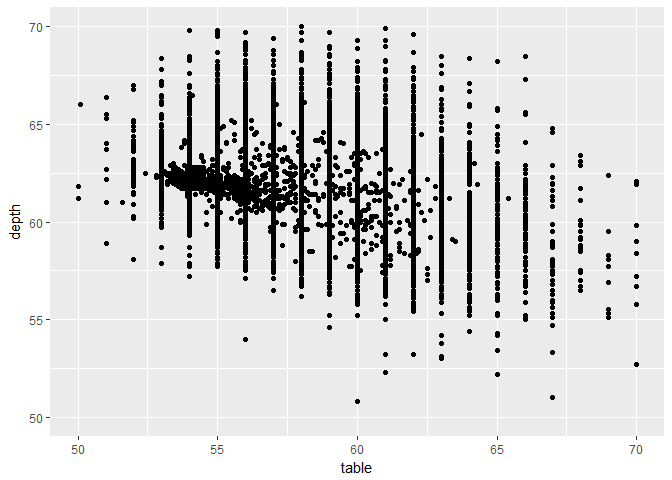

Lecture 6 for Hadley Wickham's STAT 405 at Rice U. Statistical Reports
================
Mark Blackmore
2017-09-20

``` r
library(ggplot2)
library(plyr)
```

Example: Good code presentation
-------------------------------

``` r
# Table and depth -------------------------
qplot(table, depth, data = diamonds)
```


``` r
qplot(table, depth, data = diamonds) +
  xlim(50, 70) + ylim(50, 70)
```

    ## Warning: Removed 36 rows containing missing values (geom_point).



``` r
# Is there a linear relationship?
qplot(table - depth, data = diamonds,
      geom = "histogram")
```

    ## `stat_bin()` using `bins = 30`. Pick better value with `binwidth`.


``` r
# This bin width seems the most revealing
qplot(table / depth, data = diamonds,
      geom = "histogram", binwidth = 0.01) +
  xlim(0.8, 1.2)
```

    ## Warning: Removed 67 rows containing non-finite values (stat_bin).

    ## Warning: Removed 1 rows containing missing values (geom_bar).


``` r
# Also tried: 0.05, 0.005, 0.002
```

Exercise: rewrite the following with proper style
-------------------------------------------------

``` r
x <- c( 1,-2,3,-4,5,NA )
y <- x * - 1
y[ y>0 ]
```

    ## [1]  2  4 NA

### Answer

``` r
x <- c(1, -2, 3, -4, 5, NA)
y <- x * -1
y[y > 0]
```

    ## [1]  2  4 NA
