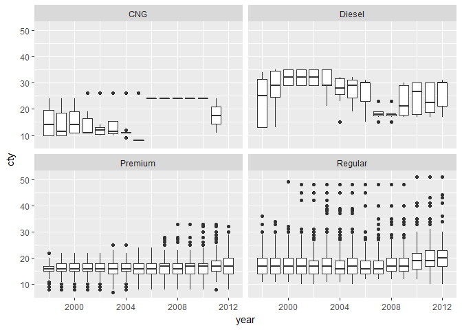

Lecture 8 for Hadley Wickham's STAT 405 at Rice U. Problem Solving
================
Mark Blackmore
2017-09-23

Problem Solving
---------------

``` r
library(ggplot2)
mpg2 <- read.csv("./data/mpg2.csv.bz2", stringsAsFactors = FALSE)
```

### Be sceptical

``` r
recent <- subset(mpg2, year >= 1998 &
                   fueltype %in% c("CNG", "Diesel", "Regular", "Premium"))
qplot(year, cty, data = recent, colour = fueltype,
      geom = "smooth")
```


``` r
qplot(year, cty, data = recent, colour = fueltype,
      geom = "jitter")
```


### Be curious

``` r
qplot(year, cty, data = recent, geom = "boxplot", group = year) +
  facet_wrap(~ fueltype) +
  geom_smooth(colour = "red")
```



Saving Data
-----------

### Make sure your working directory is set correctly!

``` r
slots <- read.delim("./data/slots.txt", sep = " ", header = F,
                    stringsAsFactors = F)
names(slots) <- c("w1", "w2", "w3", "prize", "night")
levels <- c(0, 1, 2, 3, 5, 6, 7)
labels <- c("0", "B", "BB", "BBB", "DD", "C", "7")
slots$w1 <- factor(slots$w1, levels = levels, labels = labels)
slots$w2 <- factor(slots$w2, levels = levels, labels = labels)
slots$w3 <- factor(slots$w3, levels = levels, labels = labels)
```

### How to save work

``` r
write.csv(slots, "slots-2.csv")
slots2 <- read.csv("slots-2.csv")
head(slots)
```

    ##   w1 w2 w3 prize night
    ## 1 BB  0  0     0     1
    ## 2  0 DD  B     0     1
    ## 3  0  0  0     0     1
    ## 4 BB  0  0     0     1
    ## 5  0  0  0     0     1
    ## 6  0  0  B     0     1

``` r
head(slots2)
```

    ##   X w1 w2 w3 prize night
    ## 1 1 BB  0  0     0     1
    ## 2 2  0 DD  B     0     1
    ## 3 3  0  0  0     0     1
    ## 4 4 BB  0  0     0     1
    ## 5 5  0  0  0     0     1
    ## 6 6  0  0  B     0     1

``` r
str(slots)
```

    ## 'data.frame':    345 obs. of  5 variables:
    ##  $ w1   : Factor w/ 7 levels "0","B","BB","BBB",..: 3 1 1 3 1 1 2 1 2 1 ...
    ##  $ w2   : Factor w/ 7 levels "0","B","BB","BBB",..: 1 5 1 1 1 1 1 1 3 1 ...
    ##  $ w3   : Factor w/ 7 levels "0","B","BB","BBB",..: 1 2 1 1 1 2 2 1 2 2 ...
    ##  $ prize: int  0 0 0 0 0 0 0 0 5 0 ...
    ##  $ night: int  1 1 1 1 1 1 1 1 1 1 ...

``` r
str(slots2)
```

    ## 'data.frame':    345 obs. of  6 variables:
    ##  $ X    : int  1 2 3 4 5 6 7 8 9 10 ...
    ##  $ w1   : Factor w/ 7 levels "0","7","B","BB",..: 4 1 1 4 1 1 3 1 3 1 ...
    ##  $ w2   : Factor w/ 7 levels "0","7","B","BB",..: 1 7 1 1 1 1 1 1 4 1 ...
    ##  $ w3   : Factor w/ 7 levels "0","7","B","BB",..: 1 3 1 1 1 3 3 1 3 3 ...
    ##  $ prize: int  0 0 0 0 0 0 0 0 5 0 ...
    ##  $ night: int  1 1 1 1 1 1 1 1 1 1 ...

### Better, but still loses factor levels

``` r
write.csv(slots, file = "slots-3.csv", row.names = F)
slots3 <- read.csv("slots-3.csv")
head(slots)
```

    ##   w1 w2 w3 prize night
    ## 1 BB  0  0     0     1
    ## 2  0 DD  B     0     1
    ## 3  0  0  0     0     1
    ## 4 BB  0  0     0     1
    ## 5  0  0  0     0     1
    ## 6  0  0  B     0     1

``` r
head(slots3)
```

    ##   w1 w2 w3 prize night
    ## 1 BB  0  0     0     1
    ## 2  0 DD  B     0     1
    ## 3  0  0  0     0     1
    ## 4 BB  0  0     0     1
    ## 5  0  0  0     0     1
    ## 6  0  0  B     0     1

``` r
str(slots)
```

    ## 'data.frame':    345 obs. of  5 variables:
    ##  $ w1   : Factor w/ 7 levels "0","B","BB","BBB",..: 3 1 1 3 1 1 2 1 2 1 ...
    ##  $ w2   : Factor w/ 7 levels "0","B","BB","BBB",..: 1 5 1 1 1 1 1 1 3 1 ...
    ##  $ w3   : Factor w/ 7 levels "0","B","BB","BBB",..: 1 2 1 1 1 2 2 1 2 2 ...
    ##  $ prize: int  0 0 0 0 0 0 0 0 5 0 ...
    ##  $ night: int  1 1 1 1 1 1 1 1 1 1 ...

``` r
str(slots3)
```

    ## 'data.frame':    345 obs. of  5 variables:
    ##  $ w1   : Factor w/ 7 levels "0","7","B","BB",..: 4 1 1 4 1 1 3 1 3 1 ...
    ##  $ w2   : Factor w/ 7 levels "0","7","B","BB",..: 1 7 1 1 1 1 1 1 4 1 ...
    ##  $ w3   : Factor w/ 7 levels "0","7","B","BB",..: 1 3 1 1 1 3 3 1 3 3 ...
    ##  $ prize: int  0 0 0 0 0 0 0 0 5 0 ...
    ##  $ night: int  1 1 1 1 1 1 1 1 1 1 ...

### For long-term storage

``` r
write.csv(slots, file = "slots.csv",
          row.names = FALSE)
```

### For short-term caching

Preserves factors etc.

``` r
saveRDS(slots, "slots.rds")
slots2 <- readRDS("slots.rds")
head(slots2)
```

    ##   w1 w2 w3 prize night
    ## 1 BB  0  0     0     1
    ## 2  0 DD  B     0     1
    ## 3  0  0  0     0     1
    ## 4 BB  0  0     0     1
    ## 5  0  0  0     0     1
    ## 6  0  0  B     0     1

``` r
str(slots2)
```

    ## 'data.frame':    345 obs. of  5 variables:
    ##  $ w1   : Factor w/ 7 levels "0","B","BB","BBB",..: 3 1 1 3 1 1 2 1 2 1 ...
    ##  $ w2   : Factor w/ 7 levels "0","B","BB","BBB",..: 1 5 1 1 1 1 1 1 3 1 ...
    ##  $ w3   : Factor w/ 7 levels "0","B","BB","BBB",..: 1 2 1 1 1 2 2 1 2 2 ...
    ##  $ prize: int  0 0 0 0 0 0 0 0 5 0 ...
    ##  $ night: int  1 1 1 1 1 1 1 1 1 1 ...

Slot Machine Payoffs
--------------------

Casino claims that slot machines have prize payout of 92%. Is this claim true?

``` r
mean(slots$prize)
```

    ## [1] 0.6724638

``` r
t.test(slots$prize, mu = 0.92)
```

    ## 
    ##  One Sample t-test
    ## 
    ## data:  slots$prize
    ## t = -1.8026, df = 344, p-value = 0.07233
    ## alternative hypothesis: true mean is not equal to 0.92
    ## 95 percent confidence interval:
    ##  0.4023673 0.9425602
    ## sample estimates:
    ## mean of x 
    ## 0.6724638

``` r
qplot(prize, data = slots, binwidth = 1)
```


#### How can we do better?

### \# Challenge: given e.g.

``` r
windows <- c("7", "C", "C")
#" how can we calculate thepayoff in R?
```

### Using Conditionals to check all cases

``` r
x <- 5
if (x < 5) print("x < 5")
if (x == 5) print("x == 5")
```

    ## [1] "x == 5"

``` r
x <- 1:5
if (x < 3) print("What should happen here?")
```

    ## Warning in if (x < 3) print("What should happen here?"): the condition has
    ## length > 1 and only the first element will be used

    ## [1] "What should happen here?"

``` r
if (x[1] < x[2]) print("x1 < x2")
```

    ## [1] "x1 < x2"

``` r
if (x[1] < x[2] && x[2] < x[3]) print("Asc")
```

    ## [1] "Asc"

``` r
if (x[1] < x[2] || x[2] < x[3]) print("Asc")
```

    ## [1] "Asc"

``` r
if (windows[1] == "DD") {
  prize <- 800
} else if (windows[1] == "7") {
  prize <- 80
} else if (windows[1] == "BBB") { 
  print("end")
}
```

#### Or use subsetting

``` r
c("DD" = 800, "7" = 80, "BBB" = 40)
```

    ##  DD   7 BBB 
    ## 800  80  40

``` r
c("DD" = 800, "7" = 80, "BBB" = 40)["BBB"]
```

    ## BBB 
    ##  40

``` r
c("DD" = 800, "7" = 80, "BBB" = 40)["0"]
```

    ## <NA> 
    ##   NA

``` r
c("DD" = 800, "7" = 80, "BBB" = 40)[windows[1]]
```

    ##  7 
    ## 80

``` r
windows[1] %in% c("B", "BB", "BBB")
```

    ## [1] FALSE

``` r
windows %in% c("B", "BB", "BBB")
```

    ## [1] FALSE FALSE FALSE

``` r
allbars <- windows %in% c("B", "BB", "BBB")
allbars[1] & allbars[2] & allbars[3]
```

    ## [1] FALSE

``` r
all(allbars)
```

    ## [1] FALSE

### Exercise

Complete the previous code so that the correct value of prize is set if all the windows are the same, or they are all bars

``` r
payoffs <- c("DD" = 800, "7" = 80, "BBB" = 40,
             "BB" = 25, "B" = 10, "C" = 10, "0" = 0)
same <- length(unique(windows)) == 1
allbars <- all(windows %in% c("B", "BB", "BBB"))
if (same) {
  prize <- payoffs[windows[1]]
} else if (allbars) {
  prize <- 5
}
prize
```

    ## [1] 80

Need numbers of cherries, and numbers of diamonds (hint: use sum) Then need to look up values (like for the first case) and multiply together

``` r
cherries <- sum(windows == "C")
diamonds <- sum(windows == "DD")
c(0, 2, 5)[cherries + 1] *
  c(1, 2, 4)[diamonds + 1]
```

    ## [1] 5

``` r
payoffs <- c("DD" = 800, "7" = 80, "BBB" = 40,
             "BB" = 25, "B" = 10, "C" = 10, "0" = 0)
same <- length(unique(windows)) == 1
allbars <- all(windows %in% c("B", "BB", "BBB"))
if (same) {
  prize <- payoffs[windows[1]]
} else if (allbars) {
  prize <- 5
} else {
  cherries <- sum(windows == "C")
  diamonds <- sum(windows == "DD")
  prize <- c(0, 2, 5)[cherries + 1] *
    c(1, 2, 4)[diamonds + 1]
}
prize
```

    ## [1] 5
