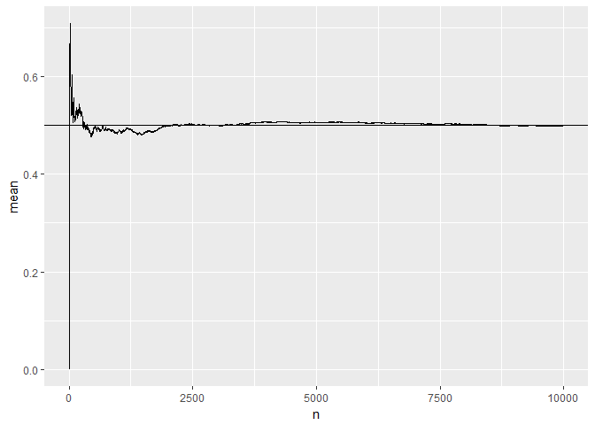
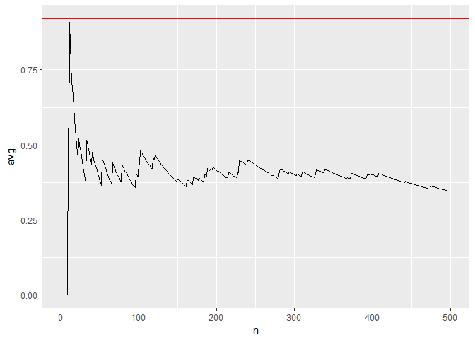
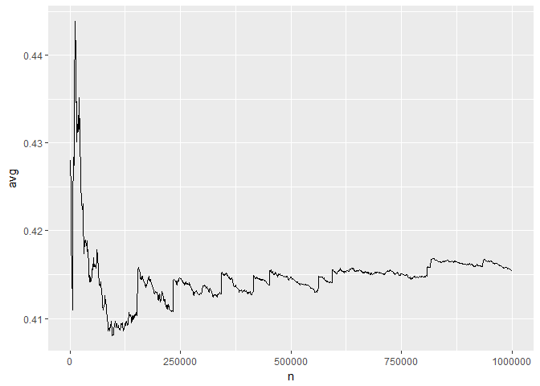
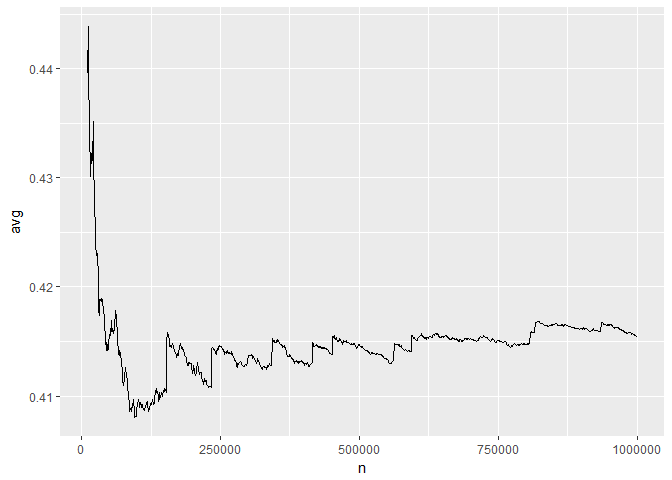
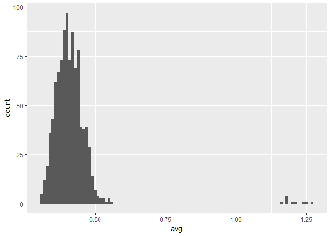

Lecture 10: Simulation
================
Mark Blackmore
2017-11-20

``` r
library(ggplot2)
library(plyr)
```

For Loops
---------

Common pattern: create object for output, then fill with results

``` r
library(ggplot2)
cuts <- levels(diamonds$cut)
means <- rep(NA, length(cuts))
for(i in seq_along(cuts)) {
  sub <- diamonds[diamonds$cut == cuts[i], ]
  means[i] <- mean(sub$price)
}
```

We will learn more sophisticated ways to do this later on, but this is the most explicit

``` r
1:5
```

    ## [1] 1 2 3 4 5

``` r
seq_len(5)
```

    ## [1] 1 2 3 4 5

``` r
1:10
```

    ##  [1]  1  2  3  4  5  6  7  8  9 10

``` r
seq_len(10)
```

    ##  [1]  1  2  3  4  5  6  7  8  9 10

``` r
1:0
```

    ## [1] 1 0

``` r
seq_len(0)
```

    ## integer(0)

``` r
seq_along(1:10)
```

    ##  [1]  1  2  3  4  5  6  7  8  9 10

``` r
1:10 * 2
```

    ##  [1]  2  4  6  8 10 12 14 16 18 20

``` r
seq_along(1:10 * 2)
```

    ##  [1]  1  2  3  4  5  6  7  8  9 10

### Exercise

For each diamond colour, calculate the median price and carat size

``` r
colours <- levels(diamonds$color)
n <- length(colours)
mprice <- rep(NA, n)
mcarat <- rep(NA, n)
for(i in seq_len(n)) {
  set <- diamonds[diamonds$color == colours[i], ]
  mprice[i] <- median(set$price)
  mcarat[i] <- median(set$carat)
}
results <- data.frame(colours, mprice, mcarat)
```

Back to slots...
----------------

For each row, calculate the prize and save it, then compare calculated prize to actual prize.

Question: given a row, how can we extract the slots in the right form for the function?

### Calculate\_prize function

``` r
calculate_prize <- function(windows) {
  prize <- NA 
  payoffs <- c("DD" = 800, "7" = 80, "BBB" = 40,
               "BB" = 25, "B" = 10, "C" = 10, "0" = 0)
  same <- length(unique(windows)) == 1
  allbars <- all(windows %in% c("B", "BB", "BBB"))
  if (same) {
    prize <- unname(payoffs[windows[1]]) 
  } else if (allbars) {
    prize <- 5
  } else {
    cherries <- sum(windows == "C")
    diamonds <- sum(windows == "DD")
    prize <- c(0, 2, 5)[cherries + 1] *
      c(1, 2, 4)[diamonds + 1]
  }
  prize
}
```

### Recall: Loss of factor levels

``` r
slots <- read.csv("./data/slots.csv")
str(slots)
```

    ## 'data.frame':    345 obs. of  5 variables:
    ##  $ w1   : Factor w/ 7 levels "0","7","B","BB",..: 4 1 1 4 1 1 3 1 3 1 ...
    ##  $ w2   : Factor w/ 7 levels "0","7","B","BB",..: 1 7 1 1 1 1 1 1 4 1 ...
    ##  $ w3   : Factor w/ 7 levels "0","7","B","BB",..: 1 3 1 1 1 3 3 1 3 3 ...
    ##  $ prize: int  0 0 0 0 0 0 0 0 5 0 ...
    ##  $ night: int  1 1 1 1 1 1 1 1 1 1 ...

``` r
i <- 334
slots[i, ]
```

    ##     w1 w2 w3 prize night
    ## 334  B BB  B     5     2

``` r
slots[i, 1:3]
```

    ##     w1 w2 w3
    ## 334  B BB  B

``` r
str(slots[i, 1:3])
```

    ## 'data.frame':    1 obs. of  3 variables:
    ##  $ w1: Factor w/ 7 levels "0","7","B","BB",..: 3
    ##  $ w2: Factor w/ 7 levels "0","7","B","BB",..: 4
    ##  $ w3: Factor w/ 7 levels "0","7","B","BB",..: 3

``` r
as.character(slots[i, 1:3])
```

    ## [1] "3" "4" "3"

``` r
c(as.character(slots[i, 1]), as.character(slots[i, 2]),
  as.character(slots[i, 3])) 
```

    ## [1] "B"  "BB" "B"

### Recall: soloution to this issue

``` r
slots <- read.csv("./data/slots.csv", stringsAsFactors = F)
str(slots[i, 1:3])
```

    ## 'data.frame':    1 obs. of  3 variables:
    ##  $ w1: chr "B"
    ##  $ w2: chr "BB"
    ##  $ w3: chr "B"

``` r
as.character(slots[i, 1:3])
```

    ## [1] "B"  "BB" "B"

``` r
calculate_prize(as.character(slots[i, 1:3]))  
```

    ## [1] 5

### Create space to put the results

``` r
slots$check <- NA
```

### For each row, calculate the prize

``` r
for(i in seq_len(nrow(slots))) {
  w <- as.character(slots[i, 1:3])
  slots$check[i] <- calculate_prize(w)
}
```

### Check with known answers

``` r
subset(slots, prize != check)
```

    ##     w1 w2 w3 prize night check
    ## 139  C  0 DD    10     2     4
    ## 168  B BB DD    10     2     0
    ## 191  B  B DD    20     2     0
    ## 247  B DD  B    20     2     0
    ## 294  B DD  B    20     2     0
    ## 312  B DD  B    20     2     0
    ## 345  C  0  0     0     2     2

Uh oh! Check doesn't match known answers!

Hypothesis Testing
------------------

Casino claims that slot machines have prize payout of 92%, but payoff for the 345 we observed is 67%. Is the casino lying? (House advantage of 8% vs. 33%) (Big caveat: today we're using a prize calculation function we know to be incorrect)

### Strategy 1

Play the slot machine an infinite number of times. If the average prize is not $0.92, reject the casino's claim. But...

Let's make a virtual coin flip 1 = heads, 0 = tails

``` r
coin <- c(0, 1)
```

We can flip the coin once

``` r
flips <- sample(coin, 1, replace = T)
mean(flips)
```

    ## [1] 1

We can flip the coin many times

``` r
flips <- sample(coin, 10, replace = T)
mean(flips)
```

    ## [1] 0.7

What happens to the proportion of heads as n increases?

``` r
flips <- sample(coin, 10000, replace = T)
n <- seq_along(flips)
mean <- cumsum(flips) / n
coin_toss <- data.frame(n, flips, mean)
qplot(n, mean, data = coin_toss, geom = "line") +
  geom_hline(yintercept = 0.5)
```



### Strategy 2

Play the slot machine a large number of times. If the average prize is "far" from $0.92, reject the casino's claim.

Simulation
----------

Simulate the first window

``` r
sample(slots$w1, 1)
```

    ## [1] "B"

Simulate the second window

``` r
sample(slots$w2, 1)
```

    ## [1] "B"

Simulate the third window

``` r
sample(slots$w3, 1)
```

    ## [1] "0"

What is the implicit assumption here? How could we test that assumption?

Single Play

``` r
play_once <- function() {
  w1 <- sample(slots$w1, 1)
  w2 <- sample(slots$w2, 1)
  w3 <- sample(slots$w3, 1)
calculate_prize(c(w1, w2, w3))
}
```

n plays

``` r
play_n <- function(n) {
  prizes <- rep(NA, n)
  for(i in seq_len(n)) {
    prizes[i] <- play_once()
  }
  prizes
}
```

Now we can see what happens to the mean prize as n increases

``` r
games <- data.frame(prizes = play_n(500))
games <- mutate(games,
                n = seq_along(prizes),
                avg = cumsum(prizes) / n)
qplot(n, avg, data = games, geom = "line") +
  geom_hline(yintercept = 0.92, color = "red")
```



### Questions

Is 500 pulls enough? What do other realisations look like? How can we do this more quickly? Current function is pretty slow

``` r
system.time(play_n(5000))
```

    ##    user  system elapsed 
    ##    0.32    0.00    0.31

I wrote a vectorised version - instead of using explicit for loops, use R functions that work with vectors. This is usually much much faster

``` r
file_source <- "http://stat405.had.co.nz/data/payoff-v.r"
download.file(file_source, destfile = "payoff-v.r")
file_slots <- "http://stat405.had.co.nz/data/slots.csv"
download.file(file_slots, destfile = "slots.csv")

source("payoff-v.r")
system.time(play_many(5000))
```

    ##    user  system elapsed 
    ##    0.05    0.00    0.05

### What happens if we play more games?

``` r
games <- data.frame(prizes = play_many(10^6))
games <- mutate(games,
                n = seq_along(prizes),
                avg = cumsum(prizes) / n)
every1000 <- subset(games, n %% 1000 == 0)
qplot(n, avg, data = every1000, geom = "line")
```



``` r
qplot(n, avg, data = subset(every1000, n > 10000),
      geom = "line")
```



Still seems to be quite a lot of variation even after 1,000,000 pulls

%% remainder
%/% integer division

``` r
seq_len(100) %% 5
```

    ##   [1] 1 2 3 4 0 1 2 3 4 0 1 2 3 4 0 1 2 3 4 0 1 2 3 4 0 1 2 3 4 0 1 2 3 4 0
    ##  [36] 1 2 3 4 0 1 2 3 4 0 1 2 3 4 0 1 2 3 4 0 1 2 3 4 0 1 2 3 4 0 1 2 3 4 0
    ##  [71] 1 2 3 4 0 1 2 3 4 0 1 2 3 4 0 1 2 3 4 0 1 2 3 4 0 1 2 3 4 0

``` r
seq_len(100) %/% 5
```

    ##   [1]  0  0  0  0  1  1  1  1  1  2  2  2  2  2  3  3  3  3  3  4  4  4  4
    ##  [24]  4  5  5  5  5  5  6  6  6  6  6  7  7  7  7  7  8  8  8  8  8  9  9
    ##  [47]  9  9  9 10 10 10 10 10 11 11 11 11 11 12 12 12 12 12 13 13 13 13 13
    ##  [70] 14 14 14 14 14 15 15 15 15 15 16 16 16 16 16 17 17 17 17 17 18 18 18
    ##  [93] 18 18 19 19 19 19 19 20

``` r
seq_len(100) %% 10
```

    ##   [1] 1 2 3 4 5 6 7 8 9 0 1 2 3 4 5 6 7 8 9 0 1 2 3 4 5 6 7 8 9 0 1 2 3 4 5
    ##  [36] 6 7 8 9 0 1 2 3 4 5 6 7 8 9 0 1 2 3 4 5 6 7 8 9 0 1 2 3 4 5 6 7 8 9 0
    ##  [71] 1 2 3 4 5 6 7 8 9 0 1 2 3 4 5 6 7 8 9 0 1 2 3 4 5 6 7 8 9 0

``` r
seq_len(100) %/% 10
```

    ##   [1]  0  0  0  0  0  0  0  0  0  1  1  1  1  1  1  1  1  1  1  2  2  2  2
    ##  [24]  2  2  2  2  2  2  3  3  3  3  3  3  3  3  3  3  4  4  4  4  4  4  4
    ##  [47]  4  4  4  5  5  5  5  5  5  5  5  5  5  6  6  6  6  6  6  6  6  6  6
    ##  [70]  7  7  7  7  7  7  7  7  7  7  8  8  8  8  8  8  8  8  8  8  9  9  9
    ##  [93]  9  9  9  9  9  9  9 10

``` r
seq_len(100) %% 11
```

    ##   [1]  1  2  3  4  5  6  7  8  9 10  0  1  2  3  4  5  6  7  8  9 10  0  1
    ##  [24]  2  3  4  5  6  7  8  9 10  0  1  2  3  4  5  6  7  8  9 10  0  1  2
    ##  [47]  3  4  5  6  7  8  9 10  0  1  2  3  4  5  6  7  8  9 10  0  1  2  3
    ##  [70]  4  5  6  7  8  9 10  0  1  2  3  4  5  6  7  8  9 10  0  1  2  3  4
    ##  [93]  5  6  7  8  9 10  0  1

``` r
seq_len(100) %/% 11 
```

    ##   [1] 0 0 0 0 0 0 0 0 0 0 1 1 1 1 1 1 1 1 1 1 1 2 2 2 2 2 2 2 2 2 2 2 3 3 3
    ##  [36] 3 3 3 3 3 3 3 3 4 4 4 4 4 4 4 4 4 4 4 5 5 5 5 5 5 5 5 5 5 5 6 6 6 6 6
    ##  [71] 6 6 6 6 6 6 7 7 7 7 7 7 7 7 7 7 7 8 8 8 8 8 8 8 8 8 8 8 9 9

How can we characterise the amount of variation? We could do multiple runs and look at the distribution at multiple points Turn our million pulls into 1,000 sessions of 1,000 pulls

``` r
many <- mutate(games,
               group = (n - 1) %/% 1000 + 1,
               group_n = (n - 1) %% 1000 + 1)
```

How do we calculate the average? Just looking at the cumulative sum will no longer work

New function: ave ave takes the first argument, divides it into pieces according to the second argument, applies FUN to each piece, and joins them back together

``` r
many$avg <- ave(many$prize, many$group,
                FUN = cumsum) / many$group_n
every10 <- subset(many, group_n %% 10 == 0)
qplot(group_n, avg, data = every10, geom = "line",
      group = group, alpha = I(1/5))
```


Could just look at the distribution at pull 1000

``` r
final <- subset(many, group_n == 1000)
qplot(avg, data = final, binwidth = 0.01)
```



What do you think the average payoff is?
