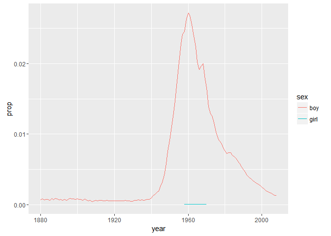
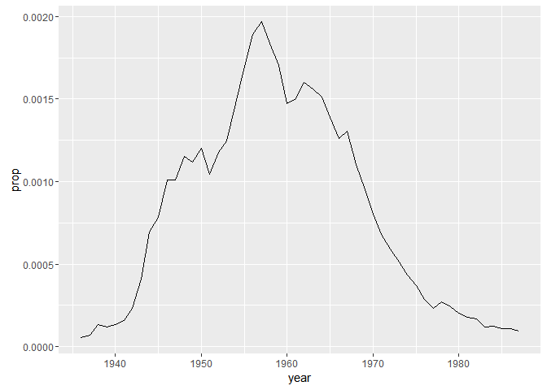
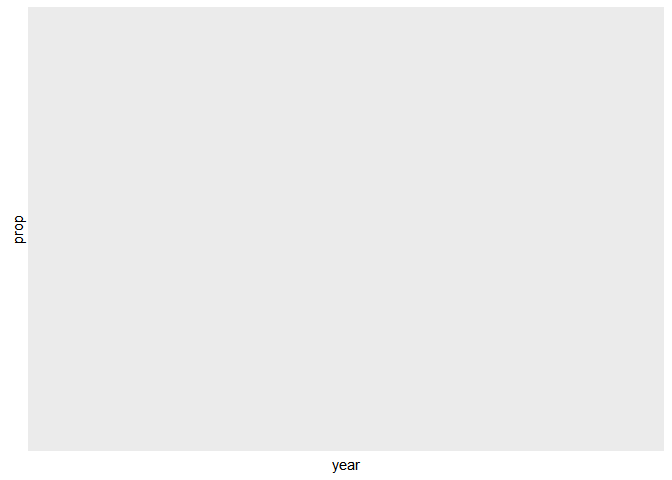
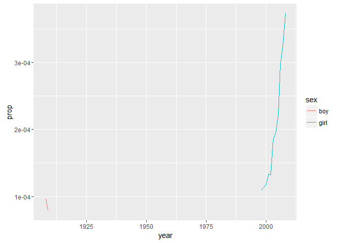

Lecture 11 for Hadley Wickham's STAT 405 Advanced Data Manipulation
================
Mark Blackmore
2017-09-26

Baby names data
---------------

Top 1000 male and female baby names in the US, from 1880 to 2008. 258,000 records (1000 \* 2 \* 129) But only five variables: year, name, soundex, sex and prop.

``` r
file_bnames <- "http://stat405.had.co.nz/data/bnames2.csv.bz2"
file_births <- "http://stat405.had.co.nz/data/births.csv" 

library(plyr)
library(ggplot2)
options(stringsAsFactors = FALSE)
download.file(file_bnames, destfile = "./data/bnames2.csv.bz2")
download.file(file_births, destfile = "./data/births.csv")
bnames <- read.csv("./data/bnames2.csv.bz2")
births <- read.csv("./data/births.csv")

head(bnames, 20)
```

    ##    year    name     prop sex soundex
    ## 1  1880    John 0.081541 boy    J500
    ## 2  1880 William 0.080511 boy    W450
    ## 3  1880   James 0.050057 boy    J520
    ## 4  1880 Charles 0.045167 boy    C642
    ## 5  1880  George 0.043292 boy    G620
    ## 6  1880   Frank 0.027380 boy    F652
    ## 7  1880  Joseph 0.022229 boy    J210
    ## 8  1880  Thomas 0.021401 boy    T520
    ## 9  1880   Henry 0.020641 boy    H560
    ## 10 1880  Robert 0.020404 boy    R163
    ## 11 1880  Edward 0.019965 boy    E363
    ## 12 1880   Harry 0.018175 boy    H600
    ## 13 1880  Walter 0.014822 boy    W436
    ## 14 1880  Arthur 0.013504 boy    A636
    ## 15 1880    Fred 0.013251 boy    F630
    ## 16 1880  Albert 0.012609 boy    A416
    ## 17 1880  Samuel 0.008648 boy    S540
    ## 18 1880   David 0.007339 boy    D130
    ## 19 1880   Louis 0.006993 boy    L200
    ## 20 1880     Joe 0.006174 boy    J000

``` r
tail(bnames, 20)
```

    ##        year     name     prop  sex soundex
    ## 257981 2008     Miya 0.000130 girl    M000
    ## 257982 2008     Rory 0.000130 girl    R600
    ## 257983 2008  Desirae 0.000130 girl    D260
    ## 257984 2008   Kianna 0.000130 girl    K500
    ## 257985 2008   Laurel 0.000130 girl    L640
    ## 257986 2008   Neveah 0.000130 girl    N100
    ## 257987 2008   Amaris 0.000129 girl    A562
    ## 257988 2008 Hadassah 0.000129 girl    H320
    ## 257989 2008    Dania 0.000129 girl    D500
    ## 257990 2008   Hailie 0.000129 girl    H400
    ## 257991 2008   Jamiya 0.000129 girl    J500
    ## 257992 2008    Kathy 0.000129 girl    K300
    ## 257993 2008   Laylah 0.000129 girl    L400
    ## 257994 2008     Riya 0.000129 girl    R000
    ## 257995 2008     Diya 0.000128 girl    D000
    ## 257996 2008 Carleigh 0.000128 girl    C642
    ## 257997 2008    Iyana 0.000128 girl    I500
    ## 257998 2008   Kenley 0.000127 girl    K540
    ## 257999 2008   Sloane 0.000127 girl    S450
    ## 258000 2008  Elianna 0.000127 girl    E450

### Exercise:

Extract your name from the dataset. Plot the trend over time. What geom should you use? Do you need any extra aesthetics?

``` r
mark <- subset(bnames, name == "Mark")
qplot(year, prop, data = mark, color = sex, geom = "line")
```



``` r
sheryl <- subset(bnames, name == "Sheryl")
qplot(year, prop, data = sheryl, geom = "line")
```



``` r
garret <- subset(bnames, name == "Garret")
hadley <- subset(bnames, name == "Hadley")
qplot(year, prop, data = garret, geom = "line")
```



``` r
qplot(year, prop, data = hadley, color = sex,
      geom = "line")
```


