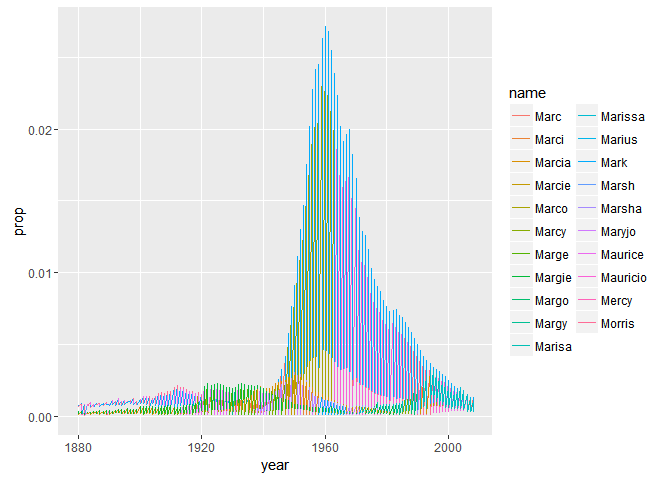
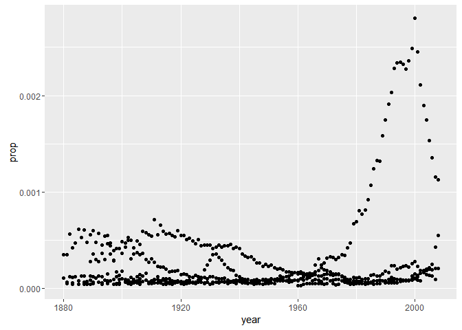
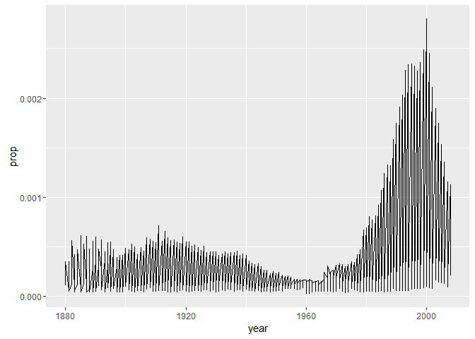
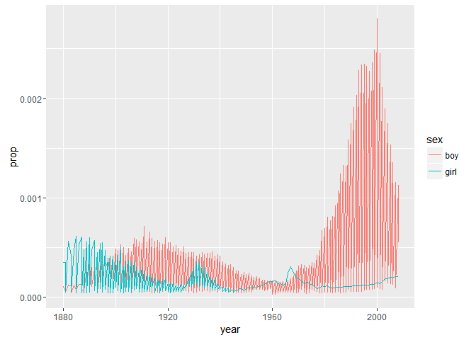
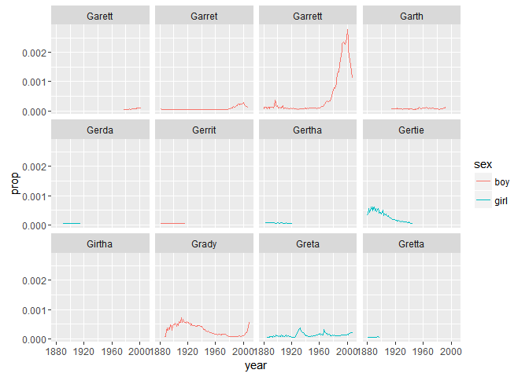
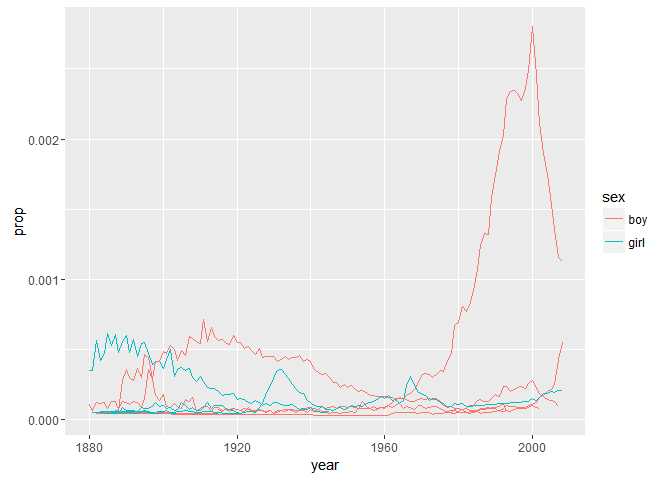
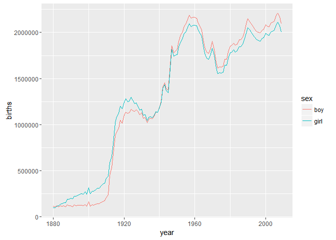

Lecture 11 for Hadley Wickham's STAT 405 Advanced Data Manipulation
================
Mark Blackmore
2017-09-27

Baby names data
---------------

Top 1000 male and female baby names in the US, from 1880 to 2008.
258,000 records (1000 \* 2 \* 129) But only five variables: year, name, soundex, sex and prop.

``` r
file_bnames <- "http://stat405.had.co.nz/data/bnames2.csv.bz2"
file_births <- "http://stat405.had.co.nz/data/births.csv" 

library(plyr)
library(ggplot2)
options(stringsAsFactors = FALSE)
download.file(file_bnames, destfile = "./data/bnames2.csv.bz2")
download.file(file_births, destfile = "./data/births.csv")
bnames <- read.csv("./data/bnames2.csv.bz2")
births <- read.csv("./data/births.csv")

head(bnames, 20)
```

    ##    year    name     prop sex soundex
    ## 1  1880    John 0.081541 boy    J500
    ## 2  1880 William 0.080511 boy    W450
    ## 3  1880   James 0.050057 boy    J520
    ## 4  1880 Charles 0.045167 boy    C642
    ## 5  1880  George 0.043292 boy    G620
    ## 6  1880   Frank 0.027380 boy    F652
    ## 7  1880  Joseph 0.022229 boy    J210
    ## 8  1880  Thomas 0.021401 boy    T520
    ## 9  1880   Henry 0.020641 boy    H560
    ## 10 1880  Robert 0.020404 boy    R163
    ## 11 1880  Edward 0.019965 boy    E363
    ## 12 1880   Harry 0.018175 boy    H600
    ## 13 1880  Walter 0.014822 boy    W436
    ## 14 1880  Arthur 0.013504 boy    A636
    ## 15 1880    Fred 0.013251 boy    F630
    ## 16 1880  Albert 0.012609 boy    A416
    ## 17 1880  Samuel 0.008648 boy    S540
    ## 18 1880   David 0.007339 boy    D130
    ## 19 1880   Louis 0.006993 boy    L200
    ## 20 1880     Joe 0.006174 boy    J000

``` r
tail(bnames, 20)
```

    ##        year     name     prop  sex soundex
    ## 257981 2008     Miya 0.000130 girl    M000
    ## 257982 2008     Rory 0.000130 girl    R600
    ## 257983 2008  Desirae 0.000130 girl    D260
    ## 257984 2008   Kianna 0.000130 girl    K500
    ## 257985 2008   Laurel 0.000130 girl    L640
    ## 257986 2008   Neveah 0.000130 girl    N100
    ## 257987 2008   Amaris 0.000129 girl    A562
    ## 257988 2008 Hadassah 0.000129 girl    H320
    ## 257989 2008    Dania 0.000129 girl    D500
    ## 257990 2008   Hailie 0.000129 girl    H400
    ## 257991 2008   Jamiya 0.000129 girl    J500
    ## 257992 2008    Kathy 0.000129 girl    K300
    ## 257993 2008   Laylah 0.000129 girl    L400
    ## 257994 2008     Riya 0.000129 girl    R000
    ## 257995 2008     Diya 0.000128 girl    D000
    ## 257996 2008 Carleigh 0.000128 girl    C642
    ## 257997 2008    Iyana 0.000128 girl    I500
    ## 257998 2008   Kenley 0.000127 girl    K540
    ## 257999 2008   Sloane 0.000127 girl    S450
    ## 258000 2008  Elianna 0.000127 girl    E450

### Exercise:

Extract your name from the dataset. Plot the trend over time. What geom should you use? Do you need any extra aesthetics?

``` r
mark <- subset(bnames, name == "Mark")
qplot(year, prop, data = mark, color = sex, geom = "line")
```


``` r
sheryl <- subset(bnames, name == "Sheryl")
qplot(year, prop, data = sheryl, geom = "line")
```


``` r
garrett <- subset(bnames, name == "garrett")
hadley <- subset(bnames, name == "Hadley")
qplot(year, prop, data = garrett, geom = "line")
```


``` r
qplot(year, prop, data = hadley, color = sex,
      geom = "line")
```


### Exercise:

Use the soundex variable to extract all names that sound like yours. Plot the trend over time.

``` r
mark_soundex <- subset(bnames, soundex == "M620")
qplot(year, prop, data = mark_soundex, color = name, group = sex, geom = "line")
```



``` r
glike <- subset(bnames, soundex == "G630")
qplot(year, prop, data = glike)
```



``` r
qplot(year, prop, data = glike, geom = "line")
```



``` r
qplot(year, prop, data = glike, geom = "line",
      colour = sex)
```



``` r
qplot(year, prop, data = glike, geom = "line",
      colour = sex) + facet_wrap(~ name)
```

    ## geom_path: Each group consists of only one observation. Do you need to
    ## adjust the group aesthetic?



``` r
qplot(year, prop, data = glike, geom = "line",
      colour = sex, group = interaction(sex, name))
```



### Exercise

In which year was your name most popular? Least popular? Reorder the data frame containing your name from highest to lowest popularity. Add a new column that gives the number of babies per thousand with your name.

``` r
head(arrange(mark, desc(prop)),1)
```

    ##   year name     prop sex soundex
    ## 1 1960 Mark 0.027121 boy    M620

``` r
head(arrange(mark, prop),1)     
```

    ##   year name    prop  sex soundex
    ## 1 1958 Mark 5.5e-05 girl    M620

``` r
head(mutate(mark, per1000 = prop*1000))
```

    ##      year name     prop sex soundex per1000
    ## 160  1880 Mark 0.000726 boy    M620   0.726
    ## 1129 1881 Mark 0.000868 boy    M620   0.868
    ## 2155 1882 Mark 0.000737 boy    M620   0.737
    ## 3142 1883 Mark 0.000809 boy    M620   0.809
    ## 4144 1884 Mark 0.000782 boy    M620   0.782
    ## 5178 1885 Mark 0.000638 boy    M620   0.638

``` r
summarise(garrett,
          least = year[prop == min(prop)],
          most = year[prop == max(prop)])
```

    ## Warning in min(prop): no non-missing arguments to min; returning Inf

    ## Warning in max(prop): no non-missing arguments to max; returning -Inf

    ## [1] least most 
    ## <0 rows> (or 0-length row.names)

``` r
# OR
summarise(garrett,
          least = year[which.min(prop)],
          most = year[which.max(prop)])
```

    ## [1] least most 
    ## <0 rows> (or 0-length row.names)

``` r
head(arrange(garrett, desc(prop)))
```

    ## [1] year    name    prop    sex     soundex
    ## <0 rows> (or 0-length row.names)

``` r
head(mutate(garrett, per1000 = round(1000 * prop)))
```

    ## [1] year    name    prop    sex     soundex per1000
    ## <0 rows> (or 0-length row.names)

Merging Data
------------

``` r
library(knitr)
what_played<- data.frame(name = c("John", "Paul",
  "George", "Ringo", "Stuart", "Pete"), instrument =
  c("guitar", "bass", "guitar", "drums", "bass", "drums"))

members <- data.frame(name = c("John", "Paul",
  "George", "Ringo", "Brian"), band = c("TRUE",
  "TRUE", "TRUE", "TRUE", "FALSE")) 

kable(join(what_played, members, type = "left"))
```

    ## Joining by: name

| name   | instrument | band |
|:-------|:-----------|:-----|
| John   | guitar     | TRUE |
| Paul   | bass       | TRUE |
| George | guitar     | TRUE |
| Ringo  | drums      | TRUE |
| Stuart | bass       | NA   |
| Pete   | drums      | NA   |

``` r
kable(join(what_played, members, type = "right"))
```

    ## Joining by: name

| name   | instrument | band  |
|:-------|:-----------|:------|
| John   | guitar     | TRUE  |
| Paul   | bass       | TRUE  |
| George | guitar     | TRUE  |
| Ringo  | drums      | TRUE  |
| Brian  | NA         | FALSE |

``` r
kable(join(what_played, members, type = "inner"))
```

    ## Joining by: name

| name   | instrument | band |
|:-------|:-----------|:-----|
| John   | guitar     | TRUE |
| Paul   | bass       | TRUE |
| George | guitar     | TRUE |
| Ringo  | drums      | TRUE |

``` r
kable(join(what_played, members, type = "full"))
```

    ## Joining by: name

| name   | instrument | band  |
|:-------|:-----------|:------|
| John   | guitar     | TRUE  |
| Paul   | bass       | TRUE  |
| George | guitar     | TRUE  |
| Ringo  | drums      | TRUE  |
| Stuart | bass       | NA    |
| Pete   | drums      | NA    |
| Brian  | NA         | FALSE |

### Exercise

Convert from proportions to absolute numbers by combining bnames with births, and then performing the appropriate calculation.

``` r
head(bnames)
```

    ##   year    name     prop sex soundex
    ## 1 1880    John 0.081541 boy    J500
    ## 2 1880 William 0.080511 boy    W450
    ## 3 1880   James 0.050057 boy    J520
    ## 4 1880 Charles 0.045167 boy    C642
    ## 5 1880  George 0.043292 boy    G620
    ## 6 1880   Frank 0.027380 boy    F652

``` r
head(births)
```

    ##   year sex births
    ## 1 1880 boy 118405
    ## 2 1881 boy 108290
    ## 3 1882 boy 122034
    ## 4 1883 boy 112487
    ## 5 1884 boy 122745
    ## 6 1885 boy 115948

``` r
bnames2 <- join(bnames, births,
                by = c("year", "sex"))
tail(bnames2)
```

    ##        year     name     prop  sex soundex  births
    ## 257995 2008     Diya 0.000128 girl    D000 2072756
    ## 257996 2008 Carleigh 0.000128 girl    C642 2072756
    ## 257997 2008    Iyana 0.000128 girl    I500 2072756
    ## 257998 2008   Kenley 0.000127 girl    K540 2072756
    ## 257999 2008   Sloane 0.000127 girl    S450 2072756
    ## 258000 2008  Elianna 0.000127 girl    E450 2072756

``` r
bnames2 <- mutate(bnames2, n = prop * births)
tail(bnames2)
```

    ##        year     name     prop  sex soundex  births        n
    ## 257995 2008     Diya 0.000128 girl    D000 2072756 265.3128
    ## 257996 2008 Carleigh 0.000128 girl    C642 2072756 265.3128
    ## 257997 2008    Iyana 0.000128 girl    I500 2072756 265.3128
    ## 257998 2008   Kenley 0.000127 girl    K540 2072756 263.2400
    ## 257999 2008   Sloane 0.000127 girl    S450 2072756 263.2400
    ## 258000 2008  Elianna 0.000127 girl    E450 2072756 263.2400

``` r
bnames2 <- mutate(bnames2, n = round(prop * births))
tail(bnames2)
```

    ##        year     name     prop  sex soundex  births   n
    ## 257995 2008     Diya 0.000128 girl    D000 2072756 265
    ## 257996 2008 Carleigh 0.000128 girl    C642 2072756 265
    ## 257997 2008    Iyana 0.000128 girl    I500 2072756 265
    ## 257998 2008   Kenley 0.000127 girl    K540 2072756 263
    ## 257999 2008   Sloane 0.000127 girl    S450 2072756 263
    ## 258000 2008  Elianna 0.000127 girl    E450 2072756 263

``` r
head(arrange(bnames2, desc(n)))
```

    ##   year    name     prop  sex soundex  births     n
    ## 1 1947   Linda 0.054829 girl    L530 1817550 99654
    ## 2 1948   Linda 0.055203 girl    L530 1741506 96136
    ## 3 1947   James 0.050987  boy    J520 1855892 94626
    ## 4 1957 Michael 0.042392  boy    M240 2186874 92706
    ## 5 1947  Robert 0.049360  boy    R163 1855892 91607
    ## 6 1949   Linda 0.051835 girl    L530 1754263 90932

``` r
library(dplyr)
```

    ## 
    ## Attaching package: 'dplyr'

    ## The following objects are masked from 'package:plyr':
    ## 
    ##     arrange, count, desc, failwith, id, mutate, rename, summarise,
    ##     summarize

    ## The following objects are masked from 'package:stats':
    ## 
    ##     filter, lag

    ## The following objects are masked from 'package:base':
    ## 
    ##     intersect, setdiff, setequal, union

``` r
bnames2 %>% filter(name == "Mark") %>% arrange(desc(n)) %>% head()
```

    ##   year name     prop sex soundex  births     n
    ## 1 1960 Mark 0.027121 boy    M620 2165791 58738
    ## 2 1961 Mark 0.026795 boy    M620 2154552 57731
    ## 3 1959 Mark 0.026277 boy    M620 2165866 56912
    ## 4 1962 Mark 0.025460 boy    M620 2101707 53509
    ## 5 1957 Mark 0.024137 boy    M620 2186874 52785
    ## 6 1958 Mark 0.024467 boy    M620 2152102 52655

Births database does not contain all births!

``` r
qplot(year, births, data = births, geom = "line",
      color = sex)
```



### Add to Beatles data. How could we combine what\_player & members now?

``` r
members$instrument <- c("vocals", "vocals", "backup",
                        "backup", "manager")

kable(what_played)
```

| name   | instrument |
|:-------|:-----------|
| John   | guitar     |
| Paul   | bass       |
| George | guitar     |
| Ringo  | drums      |
| Stuart | bass       |
| Pete   | drums      |

``` r
kable(members)
```

| name   | band  | instrument |
|:-------|:------|:-----------|
| John   | TRUE  | vocals     |
| Paul   | TRUE  | vocals     |
| George | TRUE  | backup     |
| Ringo  | TRUE  | backup     |
| Brian  | FALSE | manager    |

``` r
kable(join(what_played, members, type = "full"))
```

    ## Joining by: name, instrument

| name   | instrument | band  |
|:-------|:-----------|:------|
| John   | guitar     | NA    |
| Paul   | bass       | NA    |
| George | guitar     | NA    |
| Ringo  | drums      | NA    |
| Stuart | bass       | NA    |
| Pete   | drums      | NA    |
| John   | vocals     | TRUE  |
| Paul   | vocals     | TRUE  |
| George | backup     | TRUE  |
| Ringo  | backup     | TRUE  |
| Brian  | manager    | FALSE |

``` r
# :(

kable(join(what_played, members, by = "name", type = "full"))
```

| name   | instrument | band  |
|:-------|:-----------|:------|
| John   | guitar     | TRUE  |
| Paul   | bass       | TRUE  |
| George | guitar     | TRUE  |
| Ringo  | drums      | TRUE  |
| Stuart | bass       | NA    |
| Pete   | drums      | NA    |
| Brian  | manager    | FALSE |

``` r
# :(

names(members)[3] <- "instrument2"
kable(members)
```

| name   | band  | instrument2 |
|:-------|:------|:------------|
| John   | TRUE  | vocals      |
| Paul   | TRUE  | vocals      |
| George | TRUE  | backup      |
| Ringo  | TRUE  | backup      |
| Brian  | FALSE | manager     |

``` r
kable(join(what_played, members, type = "full"))
```

    ## Joining by: name

| name   | instrument | band  | instrument2 |
|:-------|:-----------|:------|:------------|
| John   | guitar     | TRUE  | vocals      |
| Paul   | bass       | TRUE  | vocals      |
| George | guitar     | TRUE  | backup      |
| Ringo  | drums      | TRUE  | backup      |
| Stuart | bass       | NA    | NA          |
| Pete   | drums      | NA    | NA          |
| Brian  | NA         | FALSE | manager     |

Groupwise Operations
--------------------

How do we compute the number of people with each name over all years ? It's pretty easy if you have a single name. (e.g. how many people with your name were born over the entire 128 years)

``` r
garrett <- subset(bnames2, name == "garrett")
sum(garrett$n)
```

    ## [1] 0

``` r
# Or
summarise(garrett, n = sum(n))
```

    ##   n
    ## 1 0

But how could we do this for every name?
