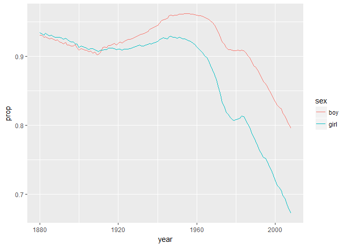
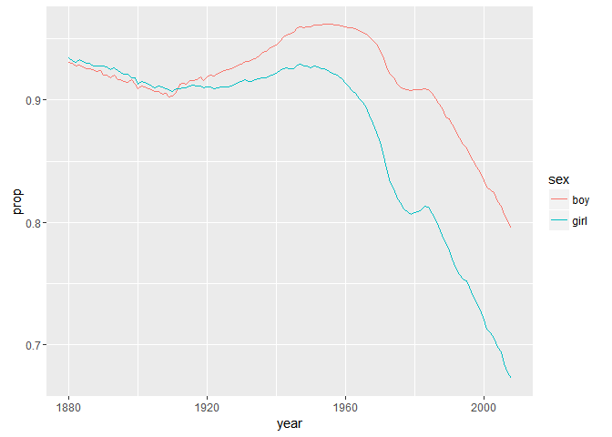
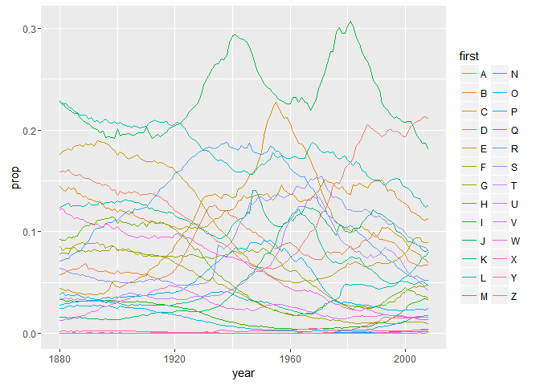
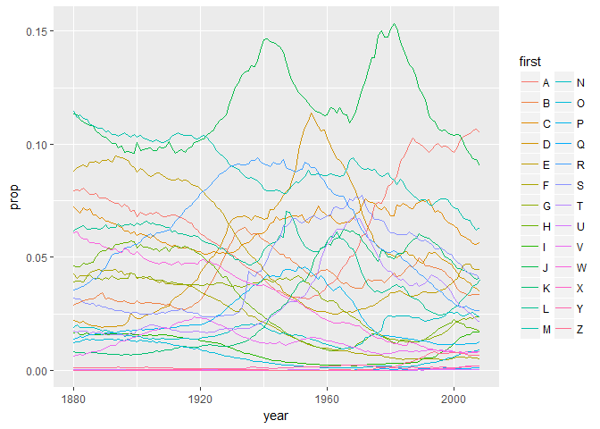

Lecture 12 for Hadley Wickham's STAT 405 at Rice Groupwise Operation
================
Mark Blackmore
2017-09-29

Getting started
---------------

``` r
library(ggplot2)
library(plyr)
library(stringr)
library(dplyr)
library(knitr)

options(stringsAsFactors = FALSE)
bnames <- read.csv("./data/bnames2.csv.bz2")
births <- read.csv("http://stat405.had.co.nz/data/births.csv")
kable(head(bnames))
```

|  year| name    |      prop| sex | soundex |
|-----:|:--------|---------:|:----|:--------|
|  1880| John    |  0.081541| boy | J500    |
|  1880| William |  0.080511| boy | W450    |
|  1880| James   |  0.050057| boy | J520    |
|  1880| Charles |  0.045167| boy | C642    |
|  1880| George  |  0.043292| boy | G620    |
|  1880| Frank   |  0.027380| boy | F652    |

``` r
kable(head(births))
```

|  year| sex |  births|
|-----:|:----|-------:|
|  1880| boy |  118405|
|  1881| boy |  108290|
|  1882| boy |  122034|
|  1883| boy |  112487|
|  1884| boy |  122745|
|  1885| boy |  115948|

### Join files

``` r
bnames2 <- join(bnames, births, type = "left")
```

    ## Joining by: year, sex

``` r
kable(head(bnames2))
```

|  year| name    |      prop| sex | soundex |  births|
|-----:|:--------|---------:|:----|:--------|-------:|
|  1880| John    |  0.081541| boy | J500    |  118405|
|  1880| William |  0.080511| boy | W450    |  118405|
|  1880| James   |  0.050057| boy | J520    |  118405|
|  1880| Charles |  0.045167| boy | C642    |  118405|
|  1880| George  |  0.043292| boy | G620    |  118405|
|  1880| Frank   |  0.027380| boy | F652    |  118405|

### Add `n` for counts, `first` for first letter of name, and `last` for last letter

``` r
bnames2 <- mutate(bnames2,
                  n = round(prop * births),
                  first = str_sub(name, 1, 1),
                  last = str_sub(name, -1, -1))
kable(head(bnames2))
```

|  year| name    |      prop| sex | soundex |  births|     n| first | last |
|-----:|:--------|---------:|:----|:--------|-------:|-----:|:------|:-----|
|  1880| John    |  0.081541| boy | J500    |  118405|  9655| J     | n    |
|  1880| William |  0.080511| boy | W450    |  118405|  9533| W     | m    |
|  1880| James   |  0.050057| boy | J520    |  118405|  5927| J     | s    |
|  1880| Charles |  0.045167| boy | C642    |  118405|  5348| C     | s    |
|  1880| George  |  0.043292| boy | G620    |  118405|  5126| G     | e    |
|  1880| Frank   |  0.027380| boy | F652    |  118405|  3242| F     | k    |

### Question

How do we compute the number of people with each name over all years ? It's pretty easy if you have a single name. (e.g. how many people with your name were born over the entire 128 years)

#### Using `dplyr`

``` r
sum_by_name <- bnames2 %>% group_by(name, sex) %>% summarise(count = sum(n))
kable(head(sum_by_name))
```

| name    | sex  |   count|
|:--------|:-----|-------:|
| Aaden   | boy  |     959|
| Aaliyah | girl |   39665|
| Aarav   | boy  |     219|
| Aaron   | boy  |  508094|
| Aaron   | girl |    1370|
| Ab      | boy  |      25|

#### Hadley's Solution

Split

``` r
pieces <- split(bnames2, list(bnames$name))
```

Apply

``` r
results <- vector("list", length(pieces))
for(i in seq_along(pieces)) {
  piece <- pieces[[i]]
  results[[i]] <- summarise(piece,
                            name = name[1], n = sum(n))
}
```

Combine

``` r
result <- do.call("rbind", results)
kable(head(result))
```

| name    |       n|
|:--------|-------:|
| Aaden   |     959|
| Aaliyah |   39665|
| Aarav   |     219|
| Aaron   |  509464|
| Ab      |      25|
| Abagail |    2682|

Or equivalently

``` r
counts <- ddply(bnames2, "name", summarise,
                n = sum(n))
kable(head(counts))
```

| name    |       n|
|:--------|-------:|
| Aaden   |     959|
| Aaliyah |   39665|
| Aarav   |     219|
| Aaron   |  509464|
| Ab      |      25|
| Abagail |    2682|

### Exercise

Repeat the same operation, but use soundex instead of name. What is the most common sound? What name does it correspond to?

#### Solution using `dplyr`

``` r
sound_by_name <- bnames2 %>% group_by(soundex) %>% summarise(count = sum(n)) %>%
  arrange(desc(count))
kable(head(sound_by_name))
```

| soundex |    count|
|:--------|--------:|
| J500    |  9991737|
| M240    |  5823791|
| M600    |  5553703|
| J520    |  5524958|
| R163    |  5047182|
| W450    |  4116109|

``` r
kable(head(subset(bnames, soundex == "J500"), 10))
```

|     |  year| name    |      prop| sex | soundex |
|-----|-----:|:--------|---------:|:----|:--------|
| 1   |  1880| John    |  0.081541| boy | J500    |
| 49  |  1880| Jim     |  0.002914| boy | J500    |
| 272 |  1880| Juan    |  0.000329| boy | J500    |
| 353 |  1880| Jimmie  |  0.000203| boy | J500    |
| 354 |  1880| Johnnie |  0.000203| boy | J500    |
| 387 |  1880| Johnny  |  0.000169| boy | J500    |
| 414 |  1880| Johnie  |  0.000152| boy | J500    |
| 546 |  1880| Jean    |  0.000101| boy | J500    |
| 661 |  1880| June    |  0.000076| boy | J500    |
| 714 |  1880| Jonah   |  0.000068| boy | J500    |

#### Hadley's solution

``` r
scounts <- ddply(bnames2, "soundex", summarise,
                 n = sum(n))
scounts <- arrange(scounts, desc(n))

# Combine with names
# When there are multiple possible matches,
# join picks the first

scounts <- join(
  scounts, bnames2[, c("soundex", "name")],
  by = "soundex")
kable(head(scounts, 10))
```

| soundex |        n| name    |
|:--------|--------:|:--------|
| J500    |  9991737| John    |
| J500    |  9991737| Jim     |
| J500    |  9991737| Juan    |
| J500    |  9991737| Jimmie  |
| J500    |  9991737| Johnnie |
| J500    |  9991737| Johnny  |
| J500    |  9991737| Johnie  |
| J500    |  9991737| Jean    |
| J500    |  9991737| June    |
| J500    |  9991737| Jonah   |

``` r
kable(head(subset(bnames, soundex == "L500"), 10))
```

|      |  year| name   |      prop| sex | soundex |
|------|-----:|:-------|---------:|:----|:--------|
| 114  |  1880| Leon   |  0.000997| boy | L500    |
| 193  |  1880| Lon    |  0.000541| boy | L500    |
| 223  |  1880| Lonnie |  0.000448| boy | L500    |
| 309  |  1880| Lynn   |  0.000253| boy | L500    |
| 547  |  1880| Lem    |  0.000101| boy | L500    |
| 623  |  1880| Lum    |  0.000084| boy | L500    |
| 780  |  1880| Len    |  0.000059| boy | L500    |
| 782  |  1880| Lonie  |  0.000059| boy | L500    |
| 1104 |  1881| Leon   |  0.001117| boy | L500    |
| 1158 |  1881| Lonnie |  0.000711| boy | L500    |

Or equivalently

``` r
scounts <- ddply(bnames2, "soundex", summarise,
                 n = sum(n))
```

Specialised function for (weighted) counts Faster, but only does one thing

``` r
scounts <- count(bnames2, "soundex", "n")
```

### Transformations

What about group-wise transformations? e.g. what if we want to compute the rank of a name within a sex and year? (John was the nth most popular boys name in 2008...) This task is easy if we have a single year & sex, but hard otherwise.

For only one group

``` r
one <- subset(bnames, sex == "boy" & year == 2008)
one$rank <- rank(-one$prop,
                 ties.method = "first")
# or
one <- mutate(one,
              rank = rank(-prop, ties.method = "min"))
kable(head(one))
```

|  year| name      |      prop| sex | soundex |  rank|
|-----:|:----------|---------:|:----|:--------|-----:|
|  2008| Jacob     |  0.010355| boy | J210    |     1|
|  2008| Michael   |  0.009437| boy | M240    |     2|
|  2008| Ethan     |  0.009301| boy | E350    |     3|
|  2008| Joshua    |  0.008799| boy | J200    |     4|
|  2008| Daniel    |  0.008702| boy | D540    |     5|
|  2008| Alexander |  0.008566| boy | A425    |     6|

Using `dplyr`

``` r
boys_2008 <- bnames %>% filter(sex == "boy" & year == 2008) %>% 
  mutate(rank = min_rank(-prop))
kable(head(boys_2008))
```

|  year| name      |      prop| sex | soundex |  rank|
|-----:|:----------|---------:|:----|:--------|-----:|
|  2008| Jacob     |  0.010355| boy | J210    |     1|
|  2008| Michael   |  0.009437| boy | M240    |     2|
|  2008| Ethan     |  0.009301| boy | E350    |     3|
|  2008| Joshua    |  0.008799| boy | J200    |     4|
|  2008| Daniel    |  0.008702| boy | D540    |     5|
|  2008| Alexander |  0.008566| boy | A425    |     6|

#### What if we want to mutate every sex and year?

Workflow
1. Extract a single group 2. Figure out how to solve it for just that group 3. Use ddply to solve it for all groups

``` r
bnames <- ddply(bnames, c("sex", "year"), mutate,
                rank = rank(-prop, ties.method = "min"))
```

ddply + mutate = group-wise transformation ddply + summarise = per-group summaries ddply + subset = per-group subsets

``` r
kable(head(bnames))
```

|  year| name    |      prop| sex | soundex |  rank|
|-----:|:--------|---------:|:----|:--------|-----:|
|  1880| John    |  0.081541| boy | J500    |     1|
|  1880| William |  0.080511| boy | W450    |     2|
|  1880| James   |  0.050057| boy | J520    |     3|
|  1880| Charles |  0.045167| boy | C642    |     4|
|  1880| George  |  0.043292| boy | G620    |     5|
|  1880| Frank   |  0.027380| boy | F652    |     6|

Challenges
----------

You now have all the tools to solve 95% of data manipulation problems in R. It's just a matter of figuring out which tools to use, and how to combine them. The following challenges will give you some practice. \#\#\# Warmups Which names were most popular in 1999?

``` r
bnames %>% filter(year == 1999) %>% arrange(desc(prop)) %>% head() %>% kable
```

|  year| name        |      prop| sex  | soundex |  rank|
|-----:|:------------|---------:|:-----|:--------|-----:|
|  1999| Jacob       |  0.017346| boy  | J210    |     1|
|  1999| Michael     |  0.016637| boy  | M240    |     2|
|  1999| Matthew     |  0.014928| boy  | M300    |     3|
|  1999| Emily       |  0.013645| girl | E540    |     1|
|  1999| Joshua      |  0.013375| boy  | J200    |     4|
|  1999| Christopher |  0.012631| boy  | C623    |     5|

Or

``` r
# subset(bnames, year == 1999 & rank < 10)
n1999 <- subset(bnames, year == 1999)
head(arrange(n1999, desc(prop)), 10) %>% kable
```

|  year| name        |      prop| sex  | soundex |  rank|
|-----:|:------------|---------:|:-----|:--------|-----:|
|  1999| Jacob       |  0.017346| boy  | J210    |     1|
|  1999| Michael     |  0.016637| boy  | M240    |     2|
|  1999| Matthew     |  0.014928| boy  | M300    |     3|
|  1999| Emily       |  0.013645| girl | E540    |     1|
|  1999| Joshua      |  0.013375| boy  | J200    |     4|
|  1999| Christopher |  0.012631| boy  | C623    |     5|
|  1999| Nicholas    |  0.012582| boy  | N242    |     6|
|  1999| Andrew      |  0.011705| boy  | A536    |     7|
|  1999| Joseph      |  0.011384| boy  | J210    |     8|
|  1999| Hannah      |  0.011134| girl | H500    |     2|

Work out the average yearly usage of each name.

``` r
bnames %>% group_by(name) %>% summarize(ave_yearly = mean(prop)) %>% head() %>% kable
```

| name    |  ave\_yearly|
|:--------|------------:|
| Aaden   |    0.0004420|
| Aaliyah |    0.0013165|
| Aarav   |    0.0001010|
| Aaron   |    0.0021239|
| Ab      |    0.0000436|
| Abagail |    0.0001326|

Or

``` r
# Average usage
overall <- ddply(bnames, "name", summarise,
                 prop1 = mean(prop),
                 prop2 = sum(prop) / 129)
kable(head(overall))
```

| name    |      prop1|      prop2|
|:--------|----------:|----------:|
| Aaden   |  0.0004420|  0.0000034|
| Aaliyah |  0.0013165|  0.0001531|
| Aarav   |  0.0001010|  0.0000008|
| Aaron   |  0.0021239|  0.0022721|
| Ab      |  0.0000436|  0.0000017|
| Abagail |  0.0001326|  0.0000103|

List the 10 names with the highest average proportions.

``` r
bnames %>% group_by(name) %>% summarize(ave_yearly = mean(prop)) %>% 
  arrange(desc(ave_yearly)) %>% 
  head(10) %>% kable
```

| name    |  ave\_yearly|
|:--------|------------:|
| John    |    0.0223545|
| Mary    |    0.0204239|
| James   |    0.0192211|
| William |    0.0186690|
| Robert  |    0.0163265|
| Michael |    0.0127792|
| Charles |    0.0113902|
| David   |    0.0111060|
| Joseph  |    0.0106967|
| George  |    0.0102795|

Or

``` r
head(arrange(overall, desc(prop1)), 10) %>% kable
```

| name    |      prop1|      prop2|
|:--------|----------:|----------:|
| John    |  0.0223545|  0.0412431|
| Mary    |  0.0204239|  0.0351482|
| James   |  0.0192211|  0.0356112|
| William |  0.0186690|  0.0342989|
| Robert  |  0.0163265|  0.0297420|
| Michael |  0.0127792|  0.0184259|
| Charles |  0.0113902|  0.0196017|
| David   |  0.0111060|  0.0167881|
| Joseph  |  0.0106967|  0.0178279|
| George  |  0.0102795|  0.0163356|

### Challenge 1

How has the total proportion of babies with names in the top 1000 changed over time?

``` r
top_oneK <- bnames %>% group_by(year, sex) %>% summarize(prop = sum(prop))
qplot(year, prop, data = top_oneK, colour = sex,
      geom = "line")
```



Or

``` r
sy <- ddply(bnames, c("year","sex"), summarise,
            prop = sum(prop),
            npop = sum(prop > 1/1000))
qplot(year, prop, data = sy, colour = sex,
      geom = "line")
```



``` r
# qplot(year, npop, data = sy, colour = sex,
#      geom = "line")  # does not work
```

How has the popularity of different initials changed over time?

``` r
first_init <- bnames2 %>% group_by(year, first) %>% summarise(prop = sum(prop))
qplot(year, prop, data = first_init, colour = first,
      geom = "line")
```



Or, Hadley's solution - different

``` r
init <- ddply(bnames2, c("year","first"), summarise,
              prop = sum(prop)/2) # divide by 2?
qplot(year, prop, data = init, colour = first,
      geom = "line")
```



### Challenge 2

For each name, find the year in which it was most popular, and the rank in that year. (Hint: you might find which.max useful).

``` r
bnames %>% group_by(name) %>% 
  summarize(peak_year = year[which.max(prop)], rank = min(rank)) %>%
  head() %>% kable
```

| name    |  peak\_year|  rank|
|:--------|-----------:|-----:|
| Aaden   |        2008|   343|
| Aaliyah |        2002|    64|
| Aarav   |        2008|   921|
| Aaron   |        1981|    28|
| Ab      |        1885|   836|
| Abagail |        2008|   866|

Or, Hadley's solution

``` r
most_pop <- ddply(bnames, "name", summarise,
                  year = year[which.max(prop)],
                  rank = min(rank))
most_pop <- ddply(bnames, "name", subset,
                  prop == max(prop))
most_pop %>% head() %>% kable
```

|  year| name    |      prop| sex  | soundex |  rank|
|-----:|:--------|---------:|:-----|:--------|-----:|
|  2008| Aaden   |  0.000442| boy  | A350    |   343|
|  2002| Aaliyah |  0.002422| girl | A400    |    64|
|  2008| Aarav   |  0.000101| boy  | A610    |   921|
|  1981| Aaron   |  0.007891| boy  | A650    |    30|
|  1885| Ab      |  0.000052| boy  | A100    |   836|
|  2008| Abagail |  0.000153| girl | A124    |   874|

Print all names that have been the most popular name at least once.

``` r
bnames %>% filter(rank == 1)
```

    ##     year     name     prop  sex soundex rank
    ## 1   1880     John 0.081541  boy    J500    1
    ## 2   1881     John 0.080975  boy    J500    1
    ## 3   1882     John 0.078314  boy    J500    1
    ## 4   1883     John 0.079066  boy    J500    1
    ## 5   1884     John 0.076476  boy    J500    1
    ## 6   1885     John 0.075517  boy    J500    1
    ## 7   1886     John 0.075820  boy    J500    1
    ## 8   1887     John 0.074181  boy    J500    1
    ## 9   1888     John 0.071186  boy    J500    1
    ## 10  1889     John 0.071804  boy    J500    1
    ## 11  1890     John 0.071034  boy    J500    1
    ## 12  1891     John 0.070292  boy    J500    1
    ## 13  1892     John 0.068759  boy    J500    1
    ## 14  1893     John 0.066495  boy    J500    1
    ## 15  1894     John 0.065961  boy    J500    1
    ## 16  1895     John 0.065699  boy    J500    1
    ## 17  1896     John 0.063051  boy    J500    1
    ## 18  1897     John 0.061907  boy    J500    1
    ## 19  1898     John 0.061770  boy    J500    1
    ## 20  1899     John 0.060674  boy    J500    1
    ## 21  1900     John 0.060619  boy    J500    1
    ## 22  1901     John 0.059677  boy    J500    1
    ## 23  1902     John 0.059568  boy    J500    1
    ## 24  1903     John 0.058833  boy    J500    1
    ## 25  1904     John 0.058535  boy    J500    1
    ## 26  1905     John 0.056266  boy    J500    1
    ## 27  1906     John 0.057359  boy    J500    1
    ## 28  1907     John 0.056635  boy    J500    1
    ## 29  1908     John 0.056150  boy    J500    1
    ## 30  1909     John 0.054234  boy    J500    1
    ## 31  1910     John 0.054914  boy    J500    1
    ## 32  1911     John 0.055709  boy    J500    1
    ## 33  1912     John 0.054465  boy    J500    1
    ## 34  1913     John 0.054678  boy    J500    1
    ## 35  1914     John 0.055531  boy    J500    1
    ## 36  1915     John 0.054005  boy    J500    1
    ## 37  1916     John 0.054202  boy    J500    1
    ## 38  1917     John 0.054062  boy    J500    1
    ## 39  1918     John 0.053923  boy    J500    1
    ## 40  1919     John 0.052724  boy    J500    1
    ## 41  1920     John 0.051710  boy    J500    1
    ## 42  1921     John 0.051160  boy    J500    1
    ## 43  1922     John 0.050889  boy    J500    1
    ## 44  1923     John 0.050741  boy    J500    1
    ## 45  1924   Robert 0.052025  boy    R163    1
    ## 46  1925   Robert 0.052875  boy    R163    1
    ## 47  1926   Robert 0.053366  boy    R163    1
    ## 48  1927   Robert 0.053075  boy    R163    1
    ## 49  1928   Robert 0.053177  boy    R163    1
    ## 50  1929   Robert 0.054029  boy    R163    1
    ## 51  1930   Robert 0.055021  boy    R163    1
    ## 52  1931   Robert 0.056598  boy    R163    1
    ## 53  1932   Robert 0.055166  boy    R163    1
    ## 54  1933   Robert 0.053140  boy    R163    1
    ## 55  1934   Robert 0.052583  boy    R163    1
    ## 56  1935   Robert 0.052852  boy    R163    1
    ## 57  1936   Robert 0.054959  boy    R163    1
    ## 58  1937   Robert 0.056541  boy    R163    1
    ## 59  1938   Robert 0.054806  boy    R163    1
    ## 60  1939   Robert 0.052645  boy    R163    1
    ## 61  1940    James 0.052662  boy    J520    1
    ## 62  1941    James 0.053182  boy    J520    1
    ## 63  1942    James 0.054812  boy    J520    1
    ## 64  1943    James 0.055183  boy    J520    1
    ## 65  1944    James 0.055406  boy    J520    1
    ## 66  1945    James 0.054288  boy    J520    1
    ## 67  1946    James 0.052999  boy    J520    1
    ## 68  1947    James 0.050987  boy    J520    1
    ## 69  1948    James 0.049697  boy    J520    1
    ## 70  1949    James 0.048244  boy    J520    1
    ## 71  1950    James 0.047336  boy    J520    1
    ## 72  1951    James 0.045662  boy    J520    1
    ## 73  1952    James 0.044132  boy    J520    1
    ## 74  1953   Robert 0.043059  boy    R163    1
    ## 75  1954  Michael 0.042792  boy    M240    1
    ## 76  1955  Michael 0.042293  boy    M240    1
    ## 77  1956  Michael 0.042244  boy    M240    1
    ## 78  1957  Michael 0.042392  boy    M240    1
    ## 79  1958  Michael 0.042029  boy    M240    1
    ## 80  1959  Michael 0.039381  boy    M240    1
    ## 81  1960    David 0.039669  boy    D130    1
    ## 82  1961  Michael 0.040331  boy    M240    1
    ## 83  1962  Michael 0.040453  boy    M240    1
    ## 84  1963  Michael 0.040569  boy    M240    1
    ## 85  1964  Michael 0.040776  boy    M240    1
    ## 86  1965  Michael 0.042762  boy    M240    1
    ## 87  1966  Michael 0.043997  boy    M240    1
    ## 88  1967  Michael 0.046329  boy    M240    1
    ## 89  1968  Michael 0.046184  boy    M240    1
    ## 90  1969  Michael 0.046564  boy    M240    1
    ## 91  1970  Michael 0.044784  boy    M240    1
    ## 92  1971  Michael 0.042687  boy    M240    1
    ## 93  1972  Michael 0.042659  boy    M240    1
    ## 94  1973  Michael 0.042049  boy    M240    1
    ## 95  1974  Michael 0.041444  boy    M240    1
    ## 96  1975  Michael 0.042178  boy    M240    1
    ## 97  1976  Michael 0.041012  boy    M240    1
    ## 98  1977  Michael 0.039554  boy    M240    1
    ## 99  1978  Michael 0.039308  boy    M240    1
    ## 100 1979  Michael 0.037823  boy    M240    1
    ## 101 1980  Michael 0.037039  boy    M240    1
    ## 102 1981  Michael 0.036931  boy    M240    1
    ## 103 1982  Michael 0.036157  boy    M240    1
    ## 104 1983  Michael 0.036506  boy    M240    1
    ## 105 1984  Michael 0.036117  boy    M240    1
    ## 106 1985  Michael 0.033745  boy    M240    1
    ## 107 1986  Michael 0.033429  boy    M240    1
    ## 108 1987  Michael 0.032652  boy    M240    1
    ## 109 1988  Michael 0.032053  boy    M240    1
    ## 110 1989  Michael 0.031213  boy    M240    1
    ## 111 1990  Michael 0.030358  boy    M240    1
    ## 112 1991  Michael 0.028698  boy    M240    1
    ## 113 1992  Michael 0.025914  boy    M240    1
    ## 114 1993  Michael 0.024010  boy    M240    1
    ## 115 1994  Michael 0.021831  boy    M240    1
    ## 116 1995  Michael 0.020594  boy    M240    1
    ## 117 1996  Michael 0.019156  boy    M240    1
    ## 118 1997  Michael 0.018805  boy    M240    1
    ## 119 1998  Michael 0.018066  boy    M240    1
    ## 120 1999    Jacob 0.017346  boy    J210    1
    ## 121 2000    Jacob 0.016514  boy    J210    1
    ## 122 2001    Jacob 0.015734  boy    J210    1
    ## 123 2002    Jacob 0.014792  boy    J210    1
    ## 124 2003    Jacob 0.014104  boy    J210    1
    ## 125 2004    Jacob 0.013196  boy    J210    1
    ## 126 2005    Jacob 0.012148  boy    J210    1
    ## 127 2006    Jacob 0.011331  boy    J210    1
    ## 128 2007    Jacob 0.010948  boy    J210    1
    ## 129 2008    Jacob 0.010355  boy    J210    1
    ## 130 1880     Mary 0.072381 girl    M600    1
    ## 131 1881     Mary 0.069986 girl    M600    1
    ## 132 1882     Mary 0.070431 girl    M600    1
    ## 133 1883     Mary 0.066737 girl    M600    1
    ## 134 1884     Mary 0.066990 girl    M600    1
    ## 135 1885     Mary 0.064300 girl    M600    1
    ## 136 1886     Mary 0.064334 girl    M600    1
    ## 137 1887     Mary 0.063620 girl    M600    1
    ## 138 1888     Mary 0.062041 girl    M600    1
    ## 139 1889     Mary 0.061562 girl    M600    1
    ## 140 1890     Mary 0.059892 girl    M600    1
    ## 141 1891     Mary 0.059543 girl    M600    1
    ## 142 1892     Mary 0.058570 girl    M600    1
    ## 143 1893     Mary 0.056757 girl    M600    1
    ## 144 1894     Mary 0.055730 girl    M600    1
    ## 145 1895     Mary 0.054416 girl    M600    1
    ## 146 1896     Mary 0.054805 girl    M600    1
    ## 147 1897     Mary 0.054025 girl    M600    1
    ## 148 1898     Mary 0.052547 girl    M600    1
    ## 149 1899     Mary 0.053226 girl    M600    1
    ## 150 1900     Mary 0.052567 girl    M600    1
    ## 151 1901     Mary 0.051672 girl    M600    1
    ## 152 1902     Mary 0.051666 girl    M600    1
    ## 153 1903     Mary 0.051312 girl    M600    1
    ## 154 1904     Mary 0.051172 girl    M600    1
    ## 155 1905     Mary 0.051852 girl    M600    1
    ## 156 1906     Mary 0.052223 girl    M600    1
    ## 157 1907     Mary 0.052094 girl    M600    1
    ## 158 1908     Mary 0.052642 girl    M600    1
    ## 159 1909     Mary 0.052319 girl    M600    1
    ## 160 1910     Mary 0.054448 girl    M600    1
    ## 161 1911     Mary 0.055220 girl    M600    1
    ## 162 1912     Mary 0.055073 girl    M600    1
    ## 163 1913     Mary 0.055952 girl    M600    1
    ## 164 1914     Mary 0.056943 girl    M600    1
    ## 165 1915     Mary 0.056837 girl    M600    1
    ## 166 1916     Mary 0.056579 girl    M600    1
    ## 167 1917     Mary 0.057195 girl    M600    1
    ## 168 1918     Mary 0.056034 girl    M600    1
    ## 169 1919     Mary 0.056047 girl    M600    1
    ## 170 1920     Mary 0.057069 girl    M600    1
    ## 171 1921     Mary 0.057814 girl    M600    1
    ## 172 1922     Mary 0.057848 girl    M600    1
    ## 173 1923     Mary 0.057197 girl    M600    1
    ## 174 1924     Mary 0.056740 girl    M600    1
    ## 175 1925     Mary 0.055898 girl    M600    1
    ## 176 1926     Mary 0.055163 girl    M600    1
    ## 177 1927     Mary 0.057105 girl    M600    1
    ## 178 1928     Mary 0.055949 girl    M600    1
    ## 179 1929     Mary 0.054863 girl    M600    1
    ## 180 1930     Mary 0.054969 girl    M600    1
    ## 181 1931     Mary 0.054672 girl    M600    1
    ## 182 1932     Mary 0.054114 girl    M600    1
    ## 183 1933     Mary 0.053052 girl    M600    1
    ## 184 1934     Mary 0.052572 girl    M600    1
    ## 185 1935     Mary 0.050677 girl    M600    1
    ## 186 1936     Mary 0.050463 girl    M600    1
    ## 187 1937     Mary 0.050500 girl    M600    1
    ## 188 1938     Mary 0.049244 girl    M600    1
    ## 189 1939     Mary 0.048422 girl    M600    1
    ## 190 1940     Mary 0.047587 girl    M600    1
    ## 191 1941     Mary 0.046577 girl    M600    1
    ## 192 1942     Mary 0.045479 girl    M600    1
    ## 193 1943     Mary 0.046098 girl    M600    1
    ## 194 1944     Mary 0.045719 girl    M600    1
    ## 195 1945     Mary 0.044054 girl    M600    1
    ## 196 1946     Mary 0.041824 girl    M600    1
    ## 197 1947    Linda 0.054829 girl    L530    1
    ## 198 1948    Linda 0.055203 girl    L530    1
    ## 199 1949    Linda 0.051835 girl    L530    1
    ## 200 1950    Linda 0.045724 girl    L530    1
    ## 201 1951    Linda 0.040033 girl    L530    1
    ## 202 1952    Linda 0.035253 girl    L530    1
    ## 203 1953     Mary 0.033352 girl    M600    1
    ## 204 1954     Mary 0.034154 girl    M600    1
    ## 205 1955     Mary 0.031515 girl    M600    1
    ## 206 1956     Mary 0.029986 girl    M600    1
    ## 207 1957     Mary 0.029135 girl    M600    1
    ## 208 1958     Mary 0.027046 girl    M600    1
    ## 209 1959     Mary 0.026209 girl    M600    1
    ## 210 1960     Mary 0.024750 girl    M600    1
    ## 211 1961     Mary 0.022958 girl    M600    1
    ## 212 1962     Lisa 0.022741 girl    L200    1
    ## 213 1963     Lisa 0.028189 girl    L200    1
    ## 214 1964     Lisa 0.027737 girl    L200    1
    ## 215 1965     Lisa 0.032982 girl    L200    1
    ## 216 1966     Lisa 0.032416 girl    L200    1
    ## 217 1967     Lisa 0.030539 girl    L200    1
    ## 218 1968     Lisa 0.028974 girl    L200    1
    ## 219 1969     Lisa 0.025556 girl    L200    1
    ## 220 1970 Jennifer 0.025198 girl    J516    1
    ## 221 1971 Jennifer 0.032408 girl    J516    1
    ## 222 1972 Jennifer 0.039447 girl    J516    1
    ## 223 1973 Jennifer 0.040192 girl    J516    1
    ## 224 1974 Jennifer 0.040294 girl    J516    1
    ## 225 1975 Jennifer 0.037285 girl    J516    1
    ## 226 1976 Jennifer 0.037843 girl    J516    1
    ## 227 1977 Jennifer 0.035852 girl    J516    1
    ## 228 1978 Jennifer 0.034268 girl    J516    1
    ## 229 1979 Jennifer 0.032925 girl    J516    1
    ## 230 1980 Jennifer 0.032811 girl    J516    1
    ## 231 1981 Jennifer 0.031912 girl    J516    1
    ## 232 1982 Jennifer 0.031497 girl    J516    1
    ## 233 1983 Jennifer 0.030382 girl    J516    1
    ## 234 1984 Jennifer 0.028058 girl    J516    1
    ## 235 1985  Jessica 0.026209 girl    J220    1
    ## 236 1986  Jessica 0.028548 girl    J220    1
    ## 237 1987  Jessica 0.029897 girl    J220    1
    ## 238 1988  Jessica 0.026810 girl    J220    1
    ## 239 1989  Jessica 0.024046 girl    J220    1
    ## 240 1990  Jessica 0.022634 girl    J220    1
    ## 241 1991   Ashley 0.021389 girl    A240    1
    ## 242 1992   Ashley 0.019194 girl    A240    1
    ## 243 1993  Jessica 0.017753 girl    J220    1
    ## 244 1994  Jessica 0.016485 girl    J220    1
    ## 245 1995  Jessica 0.014546 girl    J220    1
    ## 246 1996    Emily 0.013122 girl    E540    1
    ## 247 1997    Emily 0.013489 girl    E540    1
    ## 248 1998    Emily 0.013513 girl    E540    1
    ## 249 1999    Emily 0.013645 girl    E540    1
    ## 250 2000    Emily 0.013017 girl    E540    1
    ## 251 2001    Emily 0.012665 girl    E540    1
    ## 252 2002    Emily 0.012397 girl    E540    1
    ## 253 2003    Emily 0.012819 girl    E540    1
    ## 254 2004    Emily 0.012418 girl    E540    1
    ## 255 2005    Emily 0.011805 girl    E540    1
    ## 256 2006    Emily 0.010247 girl    E540    1
    ## 257 2007    Emily 0.009155 girl    E540    1
    ## 258 2008     Emma 0.009043 girl    E500    1

Or, Hadley's proposed solution

``` r
subset(most_pop, rank == 1)
```

    ##      year     name     prop  sex soundex rank
    ## 2226 1999    Emily 0.013645 girl    E540    1
    ## 3210 1944    James 0.055406  boy    J520    1
    ## 3360 1974 Jennifer 0.040294 girl    J516    1
    ## 3416 1987  Jessica 0.029897 girl    J220    1
    ## 3472 1880     John 0.081541  boy    J500    1
    ## 4250 1948    Linda 0.055203 girl    L530    1
    ## 4270 1965     Lisa 0.032982 girl    L200    1
    ## 4722 1880     Mary 0.072381 girl    M600    1
    ## 4878 1969  Michael 0.046564  boy    M240    1
    ## 5677 1931   Robert 0.056598  boy    R163    1

``` r
# Double challenge: Why is this last one wrong?
```

### Challenge 3

What name has been in the top 10 most often? (Hint: you'll have to do this in three steps. Think about what they are before starting)

``` r
bnames %>% filter(rank <= 10) %>% group_by(name, sex) %>% count() %>% 
  arrange(desc(n)) %>% head(10) %>% kable
```

| name      | sex  |    n|
|:----------|:-----|----:|
| James     | boy  |  113|
| Robert    | boy  |  109|
| John      | boy  |  108|
| William   | boy  |  101|
| Mary      | girl |   92|
| Charles   | boy  |   75|
| Elizabeth | girl |   71|
| Joseph    | boy  |   70|
| Michael   | boy  |   66|
| Margaret  | girl |   60|

Or Hadley's solution

``` r
top10 <- subset(bnames, rank <= 10)
counts <- plyr::count(top10, c("sex", "name"))
ddply(counts, "sex", subset, freq == max(freq))
```

    ##    sex  name freq
    ## 1  boy James  113
    ## 2 girl  Mary   92

``` r
head(arrange(counts, desc(freq)), 10) %>% kable
```

| sex  | name      |  freq|
|:-----|:----------|-----:|
| boy  | James     |   113|
| boy  | Robert    |   109|
| boy  | John      |   108|
| boy  | William   |   101|
| girl | Mary      |    92|
| boy  | Charles   |    75|
| girl | Elizabeth |    71|
| boy  | Joseph    |    70|
| boy  | Michael   |    66|
| girl | Margaret  |    60|

### Challenge 4

For each soundex, find the most common name in that group

``` r
bnames2 %>% group_by(soundex, name) %>% summarise(freq = sum(n)) %>% 
  summarise(name = name[which.max(freq)], max_freq = max(freq)) %>% head(10) %>% kable
```

| soundex | name     |  max\_freq|
|:--------|:---------|----------:|
| A000    | Ah       |         11|
| A100    | Ava      |     107695|
| A120    | Avis     |      15652|
| A124    | Abigail  |     241029|
| A130    | Abbott   |         11|
| A134    | Abdul    |       2623|
| A135    | Afton    |        901|
| A140    | Abel     |      30815|
| A146    | Abelardo |         69|
| A150    | Avon     |          6|

Or

``` r
names <- plyr::count(bnames2, c("soundex", "name"), "n")
ddply(names, "soundex", subset, freq == max(freq)) %>% head(10) %>% kable
```

| soundex | name     |    freq|
|:--------|:---------|-------:|
| A000    | Ah       |      11|
| A100    | Ava      |  107695|
| A120    | Avis     |   15652|
| A124    | Abigail  |  241029|
| A130    | Abbott   |      11|
| A134    | Abdul    |    2623|
| A135    | Afton    |     901|
| A140    | Abel     |   30815|
| A146    | Abelardo |      69|
| A150    | Avon     |       6|
