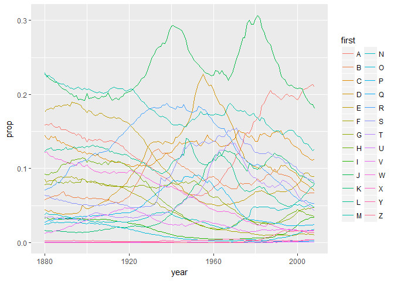

Lecture 12 for Hadley Wickham's STAT 405 at Rice Groupwise Operation
================
Mark Blackmore
2017-09-29

Getting started
---------------

``` r
library(ggplot2)
library(plyr)
library(stringr)
library(dplyr)
library(knitr)

options(stringsAsFactors = FALSE)
bnames <- read.csv("./data/bnames2.csv.bz2")
births <- read.csv("http://stat405.had.co.nz/data/births.csv")
kable(head(bnames))
```

|  year| name    |      prop| sex | soundex |
|-----:|:--------|---------:|:----|:--------|
|  1880| John    |  0.081541| boy | J500    |
|  1880| William |  0.080511| boy | W450    |
|  1880| James   |  0.050057| boy | J520    |
|  1880| Charles |  0.045167| boy | C642    |
|  1880| George  |  0.043292| boy | G620    |
|  1880| Frank   |  0.027380| boy | F652    |

``` r
kable(head(births))
```

|  year| sex |  births|
|-----:|:----|-------:|
|  1880| boy |  118405|
|  1881| boy |  108290|
|  1882| boy |  122034|
|  1883| boy |  112487|
|  1884| boy |  122745|
|  1885| boy |  115948|

### Join files

``` r
bnames2 <- join(bnames, births, type = "left")
```

    ## Joining by: year, sex

``` r
kable(head(bnames2))
```

|  year| name    |      prop| sex | soundex |  births|
|-----:|:--------|---------:|:----|:--------|-------:|
|  1880| John    |  0.081541| boy | J500    |  118405|
|  1880| William |  0.080511| boy | W450    |  118405|
|  1880| James   |  0.050057| boy | J520    |  118405|
|  1880| Charles |  0.045167| boy | C642    |  118405|
|  1880| George  |  0.043292| boy | G620    |  118405|
|  1880| Frank   |  0.027380| boy | F652    |  118405|

### Add `n` for counts, `first` for first letter of name, and `last` for last letter

``` r
bnames2 <- mutate(bnames2,
                  n = round(prop * births),
                  first = str_sub(name, 1, 1),
                  last = str_sub(name, -1, -1))
kable(head(bnames2))
```

|  year| name    |      prop| sex | soundex |  births|     n| first | last |
|-----:|:--------|---------:|:----|:--------|-------:|-----:|:------|:-----|
|  1880| John    |  0.081541| boy | J500    |  118405|  9655| J     | n    |
|  1880| William |  0.080511| boy | W450    |  118405|  9533| W     | m    |
|  1880| James   |  0.050057| boy | J520    |  118405|  5927| J     | s    |
|  1880| Charles |  0.045167| boy | C642    |  118405|  5348| C     | s    |
|  1880| George  |  0.043292| boy | G620    |  118405|  5126| G     | e    |
|  1880| Frank   |  0.027380| boy | F652    |  118405|  3242| F     | k    |

### Question

How do we compute the number of people with each name over all years ? It's pretty easy if you have a single name. (e.g. how many people with your name were born over the entire 128 years)

#### Using `dplyr`

``` r
sum_by_name <- bnames2 %>% group_by(name, sex) %>% summarise(count = sum(n))
kable(head(sum_by_name))
```

| name    | sex  |   count|
|:--------|:-----|-------:|
| Aaden   | boy  |     959|
| Aaliyah | girl |   39665|
| Aarav   | boy  |     219|
| Aaron   | boy  |  508094|
| Aaron   | girl |    1370|
| Ab      | boy  |      25|

#### Hadley's Solution

Split

``` r
pieces <- split(bnames2, list(bnames$name))
```

Apply

``` r
results <- vector("list", length(pieces))
for(i in seq_along(pieces)) {
  piece <- pieces[[i]]
  results[[i]] <- summarise(piece,
                            name = name[1], n = sum(n))
}
```

Combine

``` r
result <- do.call("rbind", results)
kable(head(result))
```

| name    |       n|
|:--------|-------:|
| Aaden   |     959|
| Aaliyah |   39665|
| Aarav   |     219|
| Aaron   |  509464|
| Ab      |      25|
| Abagail |    2682|

Or equivalently

``` r
counts <- ddply(bnames2, "name", summarise,
                n = sum(n))
kable(head(counts))
```

| name    |       n|
|:--------|-------:|
| Aaden   |     959|
| Aaliyah |   39665|
| Aarav   |     219|
| Aaron   |  509464|
| Ab      |      25|
| Abagail |    2682|

### Exercise

Repeat the same operation, but use soundex instead of name. What is the most common sound? What name does it correspond to?

#### Solution using `dplyr`

``` r
sound_by_name <- bnames2 %>% group_by(soundex) %>% summarise(count = sum(n)) %>%
  arrange(desc(count))
kable(head(sound_by_name))
```

| soundex |    count|
|:--------|--------:|
| J500    |  9991737|
| M240    |  5823791|
| M600    |  5553703|
| J520    |  5524958|
| R163    |  5047182|
| W450    |  4116109|

``` r
kable(head(subset(bnames, soundex == "L500"), 10))
```

|      |  year| name   |      prop| sex | soundex |
|------|-----:|:-------|---------:|:----|:--------|
| 114  |  1880| Leon   |  0.000997| boy | L500    |
| 193  |  1880| Lon    |  0.000541| boy | L500    |
| 223  |  1880| Lonnie |  0.000448| boy | L500    |
| 309  |  1880| Lynn   |  0.000253| boy | L500    |
| 547  |  1880| Lem    |  0.000101| boy | L500    |
| 623  |  1880| Lum    |  0.000084| boy | L500    |
| 780  |  1880| Len    |  0.000059| boy | L500    |
| 782  |  1880| Lonie  |  0.000059| boy | L500    |
| 1104 |  1881| Leon   |  0.001117| boy | L500    |
| 1158 |  1881| Lonnie |  0.000711| boy | L500    |

#### Hadley's solution

``` r
scounts <- ddply(bnames2, "soundex", summarise,
                 n = sum(n))
scounts <- arrange(scounts, desc(n))

# Combine with names
# When there are multiple possible matches,
# join picks the first

scounts <- join(
  scounts, bnames2[, c("soundex", "name")],
  by = "soundex")
kable(head(scounts, 10))
```

| soundex |        n| name    |
|:--------|--------:|:--------|
| J500    |  9991737| John    |
| J500    |  9991737| Jim     |
| J500    |  9991737| Juan    |
| J500    |  9991737| Jimmie  |
| J500    |  9991737| Johnnie |
| J500    |  9991737| Johnny  |
| J500    |  9991737| Johnie  |
| J500    |  9991737| Jean    |
| J500    |  9991737| June    |
| J500    |  9991737| Jonah   |

``` r
kable(head(subset(bnames, soundex == "L500"), 10))
```

|      |  year| name   |      prop| sex | soundex |
|------|-----:|:-------|---------:|:----|:--------|
| 114  |  1880| Leon   |  0.000997| boy | L500    |
| 193  |  1880| Lon    |  0.000541| boy | L500    |
| 223  |  1880| Lonnie |  0.000448| boy | L500    |
| 309  |  1880| Lynn   |  0.000253| boy | L500    |
| 547  |  1880| Lem    |  0.000101| boy | L500    |
| 623  |  1880| Lum    |  0.000084| boy | L500    |
| 780  |  1880| Len    |  0.000059| boy | L500    |
| 782  |  1880| Lonie  |  0.000059| boy | L500    |
| 1104 |  1881| Leon   |  0.001117| boy | L500    |
| 1158 |  1881| Lonnie |  0.000711| boy | L500    |

Or equivalently

``` r
scounts <- ddply(bnames2, "soundex", summarise,
                 n = sum(n))
```

Specialised function for (weighted) counts Faster, but only does one thing

``` r
scounts <- count(bnames2, "soundex", "n")
```

### Transformations

What about group-wise transformations? e.g. what if we want to compute the rank of a name within a sex and year? (John was the nth most popular boys name in 2008...) This task is easy if we have a single year & sex, but hard otherwise.

For only one group

``` r
one <- subset(bnames, sex == "boy" & year == 2008)
one$rank <- rank(-one$prop,
                 ties.method = "first")
# or
one <- mutate(one,
              rank = rank(-prop, ties.method = "min"))
kable(head(one))
```

|  year| name      |      prop| sex | soundex |  rank|
|-----:|:----------|---------:|:----|:--------|-----:|
|  2008| Jacob     |  0.010355| boy | J210    |     1|
|  2008| Michael   |  0.009437| boy | M240    |     2|
|  2008| Ethan     |  0.009301| boy | E350    |     3|
|  2008| Joshua    |  0.008799| boy | J200    |     4|
|  2008| Daniel    |  0.008702| boy | D540    |     5|
|  2008| Alexander |  0.008566| boy | A425    |     6|

Using `dplyr`

``` r
boys_2008 <- bnames %>% filter(sex == "boy" & year == 2008) %>% 
  mutate(rank = min_rank(-prop))
kable(head(boys_2008))
```

|  year| name      |      prop| sex | soundex |  rank|
|-----:|:----------|---------:|:----|:--------|-----:|
|  2008| Jacob     |  0.010355| boy | J210    |     1|
|  2008| Michael   |  0.009437| boy | M240    |     2|
|  2008| Ethan     |  0.009301| boy | E350    |     3|
|  2008| Joshua    |  0.008799| boy | J200    |     4|
|  2008| Daniel    |  0.008702| boy | D540    |     5|
|  2008| Alexander |  0.008566| boy | A425    |     6|

#### What if we want to mutate every sex and year?

Workflow
1. Extract a single group 2. Figure out how to solve it for just that group 3. Use ddply to solve it for all groups

``` r
bnames <- ddply(bnames, c("sex", "year"), mutate,
                rank = rank(-prop, ties.method = "min"))
```

ddply + mutate = group-wise transformation ddply + summarise = per-group summaries ddply + subset = per-group subsets

``` r
kable(head(bnames))
```

|  year| name    |      prop| sex | soundex |  rank|
|-----:|:--------|---------:|:----|:--------|-----:|
|  1880| John    |  0.081541| boy | J500    |     1|
|  1880| William |  0.080511| boy | W450    |     2|
|  1880| James   |  0.050057| boy | J520    |     3|
|  1880| Charles |  0.045167| boy | C642    |     4|
|  1880| George  |  0.043292| boy | G620    |     5|
|  1880| Frank   |  0.027380| boy | F652    |     6|

Challenges
----------

You now have all the tools to solve 95% of data manipulation problems in R. It's just a matter of figuring out which tools to use, and how to combine them. The following challenges will give you some practice. \#\#\# Warmups Which names were most popular in 1999?

``` r
bnames %>% filter(year == 1999) %>% arrange(desc(prop)) %>% head() %>% kable
```

|  year| name        |      prop| sex  | soundex |  rank|
|-----:|:------------|---------:|:-----|:--------|-----:|
|  1999| Jacob       |  0.017346| boy  | J210    |     1|
|  1999| Michael     |  0.016637| boy  | M240    |     2|
|  1999| Matthew     |  0.014928| boy  | M300    |     3|
|  1999| Emily       |  0.013645| girl | E540    |     1|
|  1999| Joshua      |  0.013375| boy  | J200    |     4|
|  1999| Christopher |  0.012631| boy  | C623    |     5|

Or

``` r
# subset(bnames, year == 1999 & rank < 10)
n1999 <- subset(bnames, year == 1999)
head(arrange(n1999, desc(prop)), 10) %>% kable
```

|  year| name        |      prop| sex  | soundex |  rank|
|-----:|:------------|---------:|:-----|:--------|-----:|
|  1999| Jacob       |  0.017346| boy  | J210    |     1|
|  1999| Michael     |  0.016637| boy  | M240    |     2|
|  1999| Matthew     |  0.014928| boy  | M300    |     3|
|  1999| Emily       |  0.013645| girl | E540    |     1|
|  1999| Joshua      |  0.013375| boy  | J200    |     4|
|  1999| Christopher |  0.012631| boy  | C623    |     5|
|  1999| Nicholas    |  0.012582| boy  | N242    |     6|
|  1999| Andrew      |  0.011705| boy  | A536    |     7|
|  1999| Joseph      |  0.011384| boy  | J210    |     8|
|  1999| Hannah      |  0.011134| girl | H500    |     2|

Work out the average yearly usage of each name.

``` r
bnames %>% group_by(name) %>% summarize(ave_yearly = mean(prop)) %>% head() %>% kable
```

| name    |  ave\_yearly|
|:--------|------------:|
| Aaden   |    0.0004420|
| Aaliyah |    0.0013165|
| Aarav   |    0.0001010|
| Aaron   |    0.0021239|
| Ab      |    0.0000436|
| Abagail |    0.0001326|

Or

``` r
# Average usage
overall <- ddply(bnames, "name", summarise,
                 prop1 = mean(prop),
                 prop2 = sum(prop) / 129)
kable(head(overall))
```

| name    |      prop1|      prop2|
|:--------|----------:|----------:|
| Aaden   |  0.0004420|  0.0000034|
| Aaliyah |  0.0013165|  0.0001531|
| Aarav   |  0.0001010|  0.0000008|
| Aaron   |  0.0021239|  0.0022721|
| Ab      |  0.0000436|  0.0000017|
| Abagail |  0.0001326|  0.0000103|

List the 10 names with the highest average proportions.

``` r
bnames %>% group_by(name) %>% summarize(ave_yearly = mean(prop)) %>% 
  arrange(desc(ave_yearly)) %>% 
  head(10) %>% kable
```

| name    |  ave\_yearly|
|:--------|------------:|
| John    |    0.0223545|
| Mary    |    0.0204239|
| James   |    0.0192211|
| William |    0.0186690|
| Robert  |    0.0163265|
| Michael |    0.0127792|
| Charles |    0.0113902|
| David   |    0.0111060|
| Joseph  |    0.0106967|
| George  |    0.0102795|

Or

``` r
head(arrange(overall, desc(prop1)), 10) %>% kable
```

| name    |      prop1|      prop2|
|:--------|----------:|----------:|
| John    |  0.0223545|  0.0412431|
| Mary    |  0.0204239|  0.0351482|
| James   |  0.0192211|  0.0356112|
| William |  0.0186690|  0.0342989|
| Robert  |  0.0163265|  0.0297420|
| Michael |  0.0127792|  0.0184259|
| Charles |  0.0113902|  0.0196017|
| David   |  0.0111060|  0.0167881|
| Joseph  |  0.0106967|  0.0178279|
| George  |  0.0102795|  0.0163356|

### Challenge 1

How has the total proportion of babies with names in the top 1000 changed over time?

``` r
top_oneK <- bnames %>% group_by(year, sex) %>% summarize(prop = sum(prop))
qplot(year, prop, data = top_oneK, colour = sex,
      geom = "line")
```


Or

``` r
sy <- ddply(bnames, c("year","sex"), summarise,
            prop = sum(prop),
            npop = sum(prop > 1/1000))
qplot(year, prop, data = sy, colour = sex,
      geom = "line")
```


``` r
# qplot(year, npop, data = sy, colour = sex,
#      geom = "line")  # does not work
```

How has the popularity of different initials changed over time?

``` r
first_init <- bnames2 %>% group_by(year, first) %>% summarise(prop = sum(prop))
qplot(year, prop, data = first_init, colour = first,
      geom = "line")
```



Or, Hadley's solution - different

``` r
init <- ddply(bnames2, c("year","first"), summarise,
              prop = sum(prop)/2) # divide by 2?
qplot(year, prop, data = init, colour = first,
      geom = "line")
```


### Challenge 2

For each name, find the year in which it was most popular, and the rank in that year. (Hint: you might find which.max useful). Print all names that have been the most popular name at least once.
